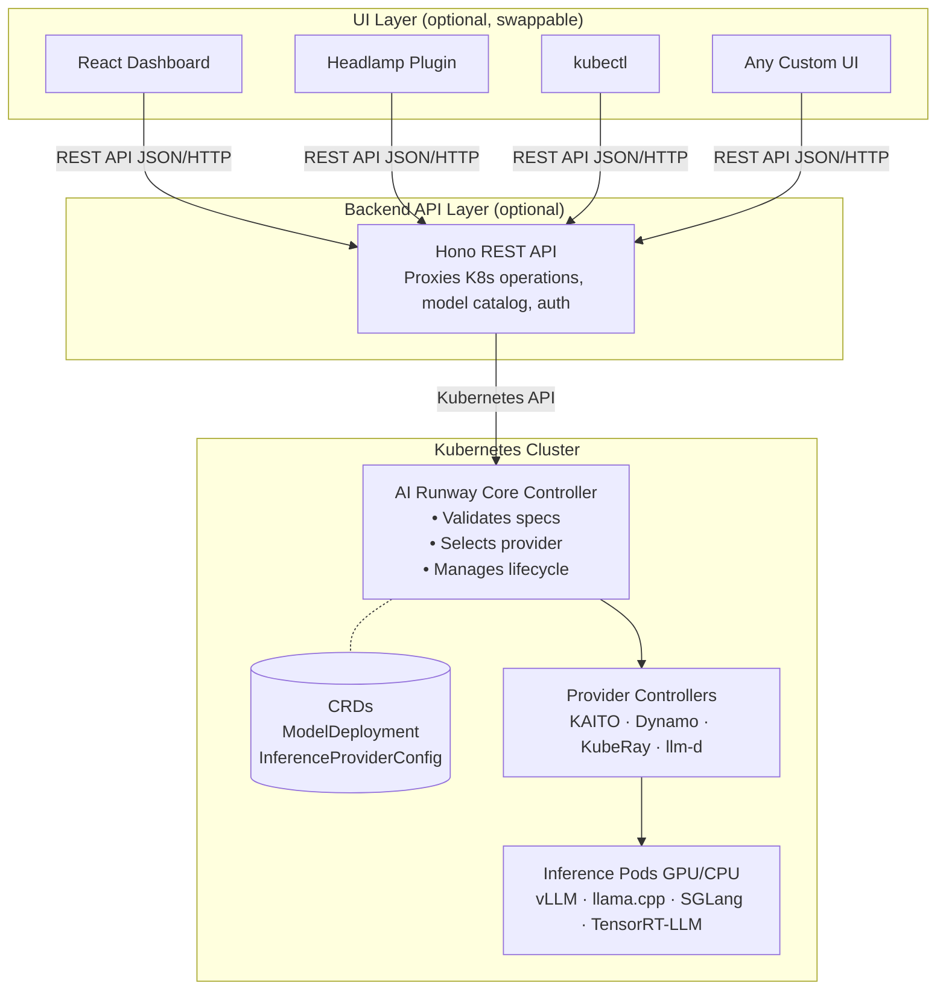

## Module 1: First Deployment & Core Concepts

**Duration:** ~7 minutes

**Objectives:**
By the end of this module, you will be able to:

- Deploy your first **ModelDeployment** from a manifest
- Explain how AI Runway separates model intent from provider-specific implementation
- Identify the purpose of **ModelDeployment** and **InferenceProviderConfig** CRDs
- Read deployment status conditions to understand what the controller is doing

We'll start a model deployment first, then walk through how AI Runway works while it's starting up. Model deployments take a few minutes to become ready while images pull and models load into memory, so we'll use that time to cover the architecture and core concepts.

### Quickstart: Deploy a CPU Model

Run the following command to create your first AI Runway ModelDeployment resource. This manifest deploys a small CPU-based Gemma2 model. It intentionally omits the provider and engine, letting AI Runway choose them automatically.

```bash
kubectl apply -f - <<EOF
apiVersion: airunway.ai/v1alpha1
kind: ModelDeployment
metadata:
  name: gemma2-2b-cpu
spec:
  image: ghcr.io/kaito-project/aikit/gemma2:2b
  model:
    id: gemma2:2b
    source: huggingface
  resources:
    cpu: "1"
EOF
```

Expected output:

```text
modeldeployment.airunway.ai/gemma2-2b-cpu created
```

> [!NOTE]
> This manifest includes **spec.image** because CPU-based models need a pre-built model server image. GPU-based models don't need this field since the provider handles image selection.

Confirm the resource exists:

```bash
kubectl get modeldeployment gemma2-2b-cpu
```

The deployment may not be ready yet. That's expected; the controller is still working through its startup lifecycle.

### How It Works

You've seen the "what" in the Overview. Now let's look at the "how." AI Runway works by separating your **intent** (the model, engine, and resources you want) from the **implementation** (which inference provider runs it and how). You describe what you want in a ModelDeployment, and the controller handles provider selection, resource creation, and gateway routing.

> [!NOTE]
> Think of it like a universal remote: one set of buttons (the **ModelDeployment** CRD) controls many different devices (inference providers).

The resource you just created is a good example: one Kubernetes object represents a full model deployment, regardless of which provider actually runs it.

### Architecture Overview

AI Runway has a fully decoupled design with three layers: the **Kubernetes cluster**, the **backend API**, and an **optional UI**.



**Key design principles:**

| Principle                                | What it means                                                                                                                           |
| ---------------------------------------- | --------------------------------------------------------------------------------------------------------------------------------------- |
| **Core controller is minimal**           | It validates specs, selects providers, manages routing, and updates status                                                              |
| **Provider controllers are out-of-tree** | Each provider (KAITO, Dynamo, etc.) has its own controller that can be versioned and released independently                             |
| **UI is optional**                       | The platform works entirely via kubectl and CRDs. The web dashboard is a convenience layer                                              |
| **Two-tier reconciliation**              | Follows the same separation as the Kubernetes Container Runtime Interface (CRI): the core defines the interface, providers implement it |

> [!NOTE]
> Just as the kubelet talks to containerd via the CRI interface (and doesn't care whether you use containerd or CRI-O), the AI Runway core controller talks to providers through a standard interface. You can swap providers without changing your ModelDeployment specs.

### The ModelDeployment CRD

**ModelDeployment** is the primary resource you work with. At its simplest, you describe **what model** to deploy and **what resources** it needs.

The model deployment you just applied requested a Gemma2 2B parameter model with 1 CPU. That's it. The AI Runway controller took care of the rest. It found an inference provider that supports CPU workloads, selected an appropriate engine, created the necessary Kubernetes resources (pods, services, gateway routing), and is now managing the deployment lifecycle.

### Providers: The Inference Backends

A **provider** in AI Runway is an inference backend that actually runs your model. Each provider is a separate project with its own strengths:

- **KAITO** (CNCF Sandbox): Automates LLM inference, fine-tuning, and RAG deployment in Kubernetes with GPU auto-provisioning, optimized engine configs, and support for any vLLM-compatible HuggingFace model
- **Dynamo** (NVIDIA): Open-source distributed inference framework that boosts throughput up to 30x via disaggregated serving, smart KV cache routing, and dynamic GPU scheduling across vLLM, SGLang, and TensorRT-LLM
- **KubeRay**: Open-source Kubernetes operator that manages Ray clusters (RayCluster, RayJob, RayService) for scalable AI workloads including LLM serving, batch inference, and distributed training
- **llm-d** (CNCF Sandbox): Kubernetes-native distributed inference stack with LLM-aware routing, KV cache management, disaggregated serving, and multi-hardware support (NVIDIA, AMD, TPU, Intel HPU) across vLLM and SGLang

You don't have to learn each provider's configuration format. The controller picks the right provider based on what you ask for.

### The InferenceProviderConfig CRD

Each provider registers itself with the cluster through an **InferenceProviderConfig**, a cluster-scoped resource that describes what the provider supports: which engines it can run, whether it handles CPU or GPU workloads, and which serving modes it offers.

View the registered providers:

```bash
kubectl get inferenceproviderconfigs
```

Expected output:

```text
NAME      READY   VERSION                   AGE
dynamo    true    dynamo-provider:v0.2.0    1h
kaito     true    kaito-provider:v0.1.0     1h
kuberay   true    kuberay-provider:v0.1.0   1h
llmd      true    llmd-provider:v0.1.0      1h
```

You should see all four providers with **READY=true**. This confirms the controller knows which runtimes are available and healthy.

To view the full spec of an InferenceProviderConfig, including capabilities and selection rules, run:

```bash
kubectl get inferenceproviderconfig kaito -o yaml
```

Expected output (key fields - annotations and metadata omitted for brevity):

```yaml
spec:
  capabilities:
    cpuSupport: true
    engines:
      - vllm
      - llamacpp
    gpuSupport: true
    servingModes:
      - aggregated
  selectionRules:
    - condition: "!has(spec.resources.gpu) || spec.resources.gpu.count == 0"
      priority: 100
    - condition: spec.engine.type == 'llamacpp'
      priority: 100
status:
  ready: true
  version: kaito-provider:v0.1.0
```

> [!NOTE]
> The key parts are **spec.capabilities** (what the provider supports) and **selectionRules** (when it gets auto-selected). Since your Gemma deployment requested CPU, the controller should select KAITO with the llama.cpp engine automatically.

### Watch the Deployment Status

Now look at what the controller decided for the Gemma model:

```bash
kubectl get modeldeployment gemma2-2b-cpu -o yaml | yq '.status'
```

You should see statuses like the following (key conditions shown, others omitted):

```yaml
conditions:
  - message: Engine llamacpp auto-selected from provider kaito
    status: "True"
    type: EngineSelected
  - message: Provider kaito auto-selected
    status: "True"
    type: ProviderSelected
  - message: Workspace created successfully
    status: "True"
    type: ResourceCreated
  - message: All replicas are ready
    status: "True"
    type: Ready
  - message: InferencePool and HTTPRoute created
    status: "True"
    type: GatewayReady
engine:
  type: llamacpp
phase: Running
provider:
  name: kaito
  resourceKind: Workspace
  selectedReason: "matched capabilities: engine=llamacpp, gpu=false, mode=aggregated"
replicas:
  available: 1
  desired: 1
  ready: 1
```

> [!TIP]
> Read **status.conditions** top to bottom. They trace the deployment lifecycle: validation → provider selection → resource creation → readiness → gateway. If your model isn't serving traffic, start here.

If the phase is not **Running** yet, wait for it to become ready:

```bash
kubectl get modeldeployment gemma2-2b-cpu -w
```

When you see **Running**, press **Ctrl+C** to stop watching.

### Test the Model Endpoint

The model exposes an OpenAI-compatible API. For now, use `kubectl port-forward` to test it directly.

In a **new terminal tab**, start a port-forward to the KAITO workspace service:

```bash
kubectl port-forward svc/gemma2-2b-cpu 8080:80
```

In **another terminal tab**, send a chat request:

```bash
curl -s http://localhost:8080/v1/chat/completions \
  -H "Content-Type: application/json" \
  -d '{
    "model": "gemma-2-2b-instruct",
    "messages": [{"role": "user", "content": "What are the benefits of running models on Kubernetes?"}],
    "max_tokens": 50
  }' | jq
```

You should see a JSON response with the model's reply. This confirms the model is running and serving an OpenAI-compatible API.

> [!NOTE]
> Later, you'll see how the Gateway API Inference Extension routes traffic to multiple models through a single shared endpoint.

When you're done, press **Ctrl+C** in the port-forward terminal to stop it. You can close the extra terminal tab.

**What you learned in this module:**

- A **ModelDeployment** describes what model you want, not the provider-specific details
- The core controller validates the request, chooses a provider and engine, and reports status through conditions
- Provider controllers do the provider-specific work (e.g., creating KAITO Workspaces)
- Status conditions trace the deployment lifecycle. Read them top to bottom
- Every deployed model exposes an OpenAI-compatible API

**Next up:** With a live model running, you'll launch the dashboard to see the same Kubernetes resources through a visual interface.

---

Next [Module 2: Dashboard Setup & Cluster Verification](2-dashboard.md)
 