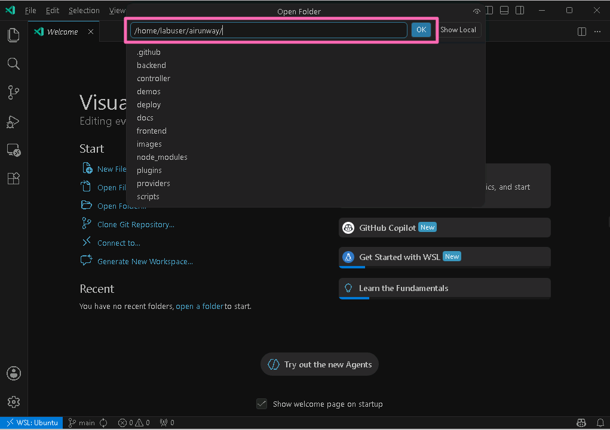
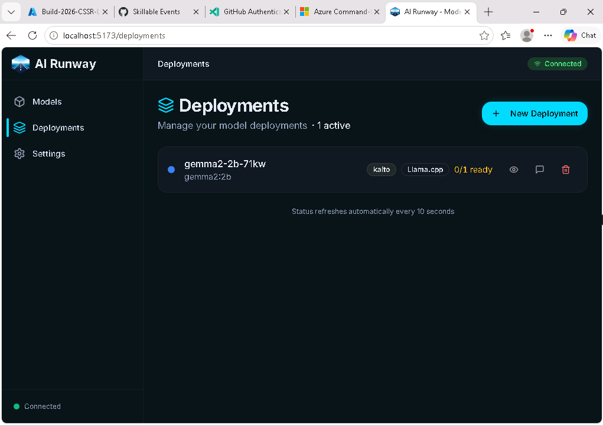
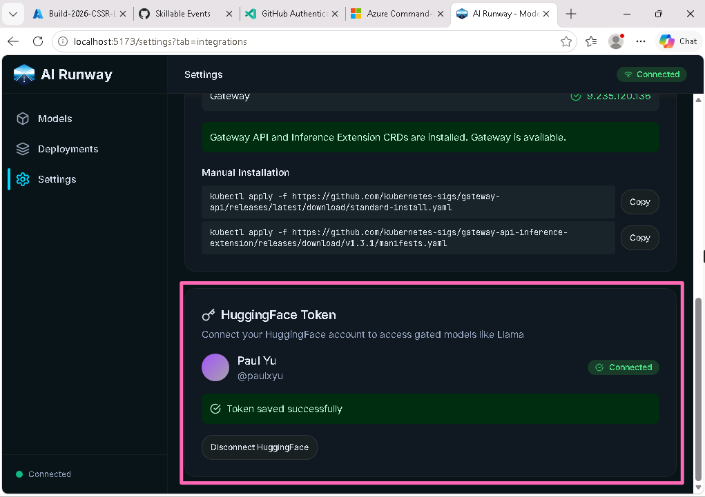

## Module 2: Dashboard Setup & Cluster Verification

**Duration:** ~7 minutes

**Objectives:**
By the end of this module, you will be able to:

- Launch the AI Runway web dashboard and inspect your live deployment
- Verify your AKS cluster has GPU resources available
- Confirm the inference gateway and AI Runway components are healthy

You deployed a model with kubectl. Now you'll set up the dashboard and run a quick health check on the cluster.

### Launch the AI Runway Dashboard

Not everyone on a platform team lives in the terminal. The AI Runway dashboard gives teams a visual way to browse available models, track deployment status, and verify cluster health without writing kubectl commands. It's especially useful for onboarding new team members or during incident triage when you need a quick overview of what's running.

The AI Runway dashboard is an optional web interface for visualizing and managing your deployments. It reads the same Kubernetes resources you create with kubectl. The dashboard can run locally during development or be deployed in-cluster for shared team access. For this workshop, you'll run it locally.

Clone the repository

```bash
cd ~ && git clone --branch v0.6.0 https://github.com/kaito-project/airunway.git
```

Navigate into the repo directory

```bash
cd airunway
```

Open the repository in VS Code by clicking **File --> Open Folder...**, type `/home/labuser/airunway` in the path, then click the **OK** button.



> [!NOTE]
> When VS Code opens the folder, all previous terminal sessions will be gone. You will need to open a new terminal to continue.

Install project dependencies and start the dashboard

```bash
bun install && bun run dev
```

> [!WARNING]
> The `bun run dev` command occupies this terminal. In VS Code, open a **new terminal tab** (click the **+** button in the terminal panel) for all remaining CLI commands in this workshop.

This launches both the frontend and backend. The backend API runs on port 3001 and the frontend UI runs on port 5173. Open `http://localhost:5173` in your browser.

> [!WARNING]
> Keep this tab open throughout the workshop.

### See Your Deployment in the Dashboard

Open the **Deployments** page in the left sidebar. You should see **gemma2-2b-cpu** from Module 1 listed with its phase and readiness status. Each row shows the deployment name, phase (Pending, Deploying, Running, Failed), provider, engine, replica counts, and age.



Click **gemma2-2b-cpu** to open the deployment details. You'll see the runtime (KAITO), engine (LLAMACPP), model name, gateway endpoint, an example curl command, metrics, and logs. This is the same information you queried with `kubectl get modeldeployment -o yaml`, presented visually.

### Explore the Settings Page

Click **Settings** in the left sidebar. The Settings page has three tabs that give you a full picture of your cluster's readiness.

**General** shows cluster connectivity and a runtime summary. Confirm it shows **Connected** to your AKS cluster with **4 of 4** runtimes installed.

**Runtimes** gives a full view of each provider's installation status, capabilities (engines, serving modes, hardware support), and version. It also shows prerequisite checks (GPU Operator, Gateway API CRDs) and cluster autoscaling status. This is the single place to confirm your cluster's inference stack is complete. If a provider shows as not installed, the auto-selection algorithm will skip it when matching deployments.

**Integrations** shows the status of external services like GPU Operator health, Gateway API CRDs, and Hugging Face OAuth. If you already have a Hugging Face account, click **Connect Hugging Face** and follow the OAuth flow. Once connected, you'll see your Hugging Face username and a **Connected** badge.




> [!TIP]
> Skip the Hugging Face connection if you do not already have an account. The rest of the workshop uses public models and does not require Hugging Face authentication.

### Browse the Model Catalog

Click **Models** in the left sidebar. This page is a catalog of models organized by engine compatibility. Each card shows the model name, parameter count, required GPU memory, and supported inference engines (vLLM, SGLang, TensorRT-LLM, llama.cpp). The **Deploy →** button on each card opens a guided deployment flow where you pick a runtime, engine, and resource allocation. In this workshop, we use kubectl manifests instead so you can see auto-selection at work.


### Quick Cluster Health Check

Now let's verify the cluster itself using the CLI. Open a new terminal tab and run the following command to confirm your cluster has the right node pools and GPU resources:

```bash
kubectl get nodes -o wide
```

You should see at least 3 nodes with **default** in the name (CPU pool, Standard_D4d_v4) and 1 node with **inference** in the name (GPU pool, Standard_NC48ads_A100_v4).

Check the GPU resources available:

```bash
kubectl get node -l agentpool=inference -o yaml | yq '.items[0].status.allocatable | pick(["cpu", "memory", "nvidia.com/gpu"])'
```

You should see **nvidia.com/gpu: "2"**, confirming 2 NVIDIA GPUs are available.

> [!NOTE]
> A GPU node pool with autoscaling is enabled for this workshop. On your own cluster, you'd provision the node pool and choose a VM SKU that fits your workload. See the [AKS docs](https://learn.microsoft.com/azure/aks/use-nvidia-gpu?tabs=add-ubuntu-gpu-node-pool) for details on GPU node pools.

Verify the inference gateway and AI Runway controllers are healthy:

```bash
kubectl get gateway -n istio-system && kubectl get pods -n airunway-system
```

The gateway should show **PROGRAMMED: True** with an external IP. All controller pods should be **Running**.

> [!NOTE]
> **Gateway API Inference Extension** extends the standard Gateway API for AI/ML workloads. It adds inference-aware routing and load balancing through components like InferencePool, Endpoint Picker Proxy (EPP), Body-Based Router (BBR), and HTTPRoute. AI Runway creates all of these automatically for each ModelDeployment that has gateway enabled. You'll see how the routing works in detail in Module 3.

### (Optional) Connect Hugging Face

If you already have a Hugging Face account, you can connect it now. In the **Settings** page, click the **Integrations** tab, then click **Connect Hugging Face** and follow the OAuth flow. Once connected, you'll see your Hugging Face username and a **Connected** badge.


> [!TIP]
> Skip this step if you do not already have an account. The rest of the workshop uses public models and does not require Hugging Face authentication.

**What you learned in this module:**

- The dashboard is an optional visual layer over the same Kubernetes resources you manage with **kubectl**
- Your cluster has CPU and GPU node pools (the GPU Operator is what makes `nvidia.com/gpu` appear as an allocatable resource), a working inference gateway powered by Istio, and all AI Runway controller pods running
- Four runtimes are available (KAITO, Dynamo, KubeRay, llm-d). This workshop focuses on KAITO and Dynamo

> [!TIP]
> All cluster components were bootstrapped using Argo CD and GitOps. You'll explore how that works in Module 6.

**Next up:** You'll deploy a GPU model with a minimal manifest and let AI Runway auto-select the provider and engine.

---

Next [Module 3: GPU Auto-Selection & Validation](3-gpu-autoselect.md)