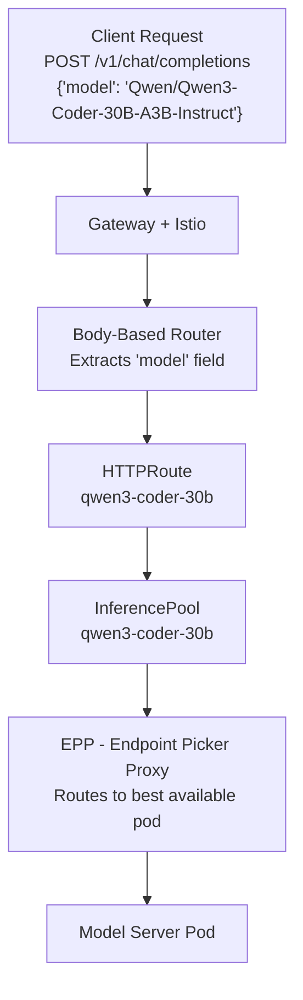

## Module 3: GPU Auto-Selection & Validation

**Duration:** ~10 minutes

**Objectives:**
By the end of this module, you will be able to:

- Deploy a GPU model with a minimal manifest
- Verify AI Runway auto-selects Dynamo and vLLM
- Understand how owner references chain resources together for automatic cleanup
- Compare GPU vs CPU inference speed
- Explain how the gateway routes requests to different models

The CPU model covered the basic flow. Now you'll deploy a GPU model with a minimal manifest and watch AI Runway pick the right runtime. Switch back to your terminal for the next steps.

> [!NOTE]
> The dashboard's guided deployment flow lets you choose a runtime and engine explicitly. This module uses kubectl so you can see auto-selection in action.

### Deploy a Small GPU Model

Apply this manifest. Notice it requests a GPU without naming a provider or engine:

```bash
kubectl apply -f - <<EOF
apiVersion: airunway.ai/v1alpha1
kind: ModelDeployment
metadata:
  name: qwen3-gpu
spec:
  model:
    id: Qwen/Qwen3-0.6B
    source: huggingface
  resources:
    gpu:
      count: 1
EOF
```

By requesting **spec.resources.gpu.count: 1**, the controller auto-selects **Dynamo** as the provider and **vLLM** as the engine (see [Appendix A](#appendix-a-provider-capability-matrix--selection-rules) for the full selection rules).

> [!TIP]
> This small **0.6B** model keeps deployment times short. You'll deploy a larger model in Module 4.

In the dashboard, click **Deployments**. You'll see **qwen3-gpu** appear and progress through lifecycle phases:


### Inspect the Auto-Selection Result

While the deployment starts up, check what the controller decided. The GPU deployment follows the same lifecycle as the CPU model, but auto-selection picks a different provider this time.

Check the result:

```bash
kubectl get modeldeployment qwen3-gpu -n default -o yaml | yq '.status.provider, .status.engine'
```

You may need to run the command above a few times to get the latest status updates. Expected output once selection completes:

```yaml
resourceKind: DynamoGraphDeployment
resourceName: qwen3-gpu
selectedReason: 'matched capabilities: engine=vllm, gpu=true, mode=aggregated'
selectedReason: auto-selected from provider dynamo capabilities
type: vllm
```

The manifest didn't mention Dynamo or vLLM anywhere. The controller matched the GPU request against each provider's capabilities and selected the best fit.

### How Auto-Selection Works

The controller follows a deterministic algorithm when **spec.provider.name** is omitted:

1. It collects all registered **InferenceProviderConfigs** in the cluster
2. It filters providers by the deployment's requirements: engine type, GPU/CPU, and serving mode
3. For each matching provider, it evaluates **selectionRules**, which are CEL expressions with priority scores
4. The provider with the highest matching priority wins. Ties are broken alphabetically by name

For this deployment:

- You requested GPU. Both KAITO and Dynamo support GPU, but Dynamo has a higher-priority rule for GPU workloads
- No engine was specified, so the controller auto-selected **vLLM** from Dynamo's supported engines
- The full selection reason is recorded in **status.provider.selectedReason** for transparency

> [!NOTE]
> This is a key difference from using providers directly. You don't necessarily need to know which provider to pick. Describe your requirements and the controller can match you to the right one.

### Understand Resource Ownership

When you delete a ModelDeployment, you want everything it created to go with it: the provider resource, the serving pods, the gateway routes. Without automatic cleanup, you'd end up with orphaned resources consuming GPU memory and cluster capacity after every delete. Kubernetes **owner references** solve this by chaining resources together so deletion cascades automatically.

While pods are starting, look at the resource chain the controllers created.

Check what the Dynamo provider deployed:

```bash
kubectl get modeldeployment qwen3-gpu -o yaml | yq '.status.provider'
```

The Dynamo provider created a **DynamoGraphDeployment** also named **qwen3-gpu** on your behalf. This is the provider-specific resource that represents your model deployment in Dynamo's world. The AI Runway controller set an owner reference from the DynamoGraphDeployment back to the ModelDeployment, which means Kubernetes understands that the DynamoGraphDeployment "belongs" to the ModelDeployment.

Check the ownership chain:

```bash
kubectl get dynamographdeployments qwen3-gpu -o yaml | yq '.metadata.ownerReferences'
```

This shows an owner reference pointing back to the **ModelDeployment**. The ownership works in layers:

- **AI Runway core controller** creates the ModelDeployment status and gateway resources (if needed)
- **AI Runway Dynamo provider** creates the DynamoGraphDeployment, linked to the ModelDeployment via owner reference
- **Dynamo operator** creates the serving pods, InferencePool, and EPP, linked to the DynamoGraphDeployment

This chain means deleting the ModelDeployment cascades through all layers, so provider resources, pods, and gateway routing are all cleaned up automatically.

### How Gateway Routing Works

You noticed that the ownership chain includes gateway resources. The controller doesn't just deploy your model; it also wires up the networking so the model is reachable through a shared gateway. But why does a gateway matter in the first place?

In production, platform teams typically serve multiple models. Different models serve different needs: a small CPU model handles lightweight tasks at low cost, a larger GPU model handles complex reasoning or code generation, and specialized models handle domain-specific workloads. Without a shared gateway, consumers would need to track separate endpoints for each model and update their configurations every time the platform team changes how a model is served.

A single inference gateway solves this. Consumers get one stable URL and specify which model they want in the request body. The gateway handles the routing, and the platform team can add, remove, or reconfigure models without breaking any client integrations.

You'll see this firsthand once the deployment finishes: two requests to the same URL, two different `model` values, two different backends. Here's how the routing works under the hood.

The **Gateway API Inference Extension** adds four components that work together to route inference traffic.

1. **Body-Based Router (BBR)**: Standard HTTP routers match on headers, paths, or query parameters. But LLM API requests specify the model in the JSON body, not the URL. The BBR solves this by inspecting the request body, reading the `model` field, and matching it to the correct HTTPRoute. Without it, you'd need a separate URL path per model, which breaks the OpenAI API contract.

2. **HTTPRoute**: Once the BBR identifies which model the request is for, the HTTPRoute forwards it to the correct InferencePool. This is the same HTTPRoute resource from the standard Gateway API, so existing networking policies and observability tools work with it out of the box.

3. **InferencePool**: Groups the serving pods for a specific model, similar to how a Kubernetes Service groups pods. The difference is that an InferencePool is inference-aware: it knows which pods are running which models and can expose metadata (like KV-cache state) that helps with smarter routing decisions.

4. **Endpoint Picker Proxy (EPP)**: A standard load balancer picks pods using round-robin or least-connections, which ignores what's happening inside the inference engine. The EPP makes routing decisions based on inference-specific signals. For example, it can route a follow-up request to the pod that already has the conversation's KV-cache in GPU memory, avoiding redundant prefill computation. Different providers can implement their own EPP with provider-specific optimizations.



AI Runway creates all of these gateway resources automatically for each ModelDeployment with gateway enabled. You don't need to set up the routing yourself.

<details>
<summary>How AI Runway handles gateway resources across providers</summary>

The InferencePool and EPP creation depends on the provider:

- **Providers with native gateway support** (like Dynamo): The provider controller creates a specialized InferencePool and EPP with advanced routing capabilities (like KV-cache affinity). The AI Runway core controller detects this through the provider's `InferenceProviderConfig` gateway capabilities and skips creating its own, avoiding duplication.
- **Providers without native gateway support** (like KAITO): The AI Runway core controller creates a generic InferencePool and deploys the upstream EPP.

Either way, the result is the same for consumers: one endpoint, one API format, body-based routing to the right model.

</details>

### Wait for the Deployment

Check the status of the pods:

```bash
kubectl get pods -l app.kubernetes.io/part-of=qwen3-gpu
```

> [!TIP]
> Inference pods can take a few minutes to start while the image pulls and the model loads into memory. Press **Ctrl+C** when the pod shows **Running**.

> [!TIP]
> **Pod not starting?** Here's what to check:
>
> - **Pending** with no events: Run `kubectl describe pod <pod-name>` and look at the **Events** section. Common causes: insufficient GPU quota, node pool not scaled up yet, or taints preventing scheduling.
> - **ContainerCreating** for a long time: The container image is likely still pulling. GPU inference images can be several gigabytes. Wait a few more minutes.
> - **CrashLoopBackOff** or **Error**: Check logs with `kubectl logs <pod-name>`. Common causes: out-of-memory errors (model too large for available GPU memory) or misconfigured engine arguments.
> - **ImagePullBackOff**: The container image couldn't be downloaded. Verify network connectivity and that the image reference is correct.

Once the pod is running, confirm the ModelDeployment is in **Running** phase:

```bash
watch kubectl get modeldeployment qwen3-gpu
```

When the phase changes to **Running**, press **Ctrl+C** to stop watching.

Verify that gateway resources were auto-created:

```bash
kubectl get inferencepool,httproute
```

You should see resources named after **qwen3-gpu**. The HTTPRoute connects the shared gateway to this model's InferencePool.

### Test Both Models Through the Gateway

You now have two models running: the CPU-based Gemma model from Module 1 and the GPU-based Qwen model you just deployed. Both are behind the same inference gateway. Let's test them both to see multi-model routing in action.

Get the gateway IP:

```bash
GATEWAY_IP=$(kubectl get gateway -n istio-system inference-gateway -o jsonpath='{.status.addresses[0].value}')
echo "Gateway IP: $GATEWAY_IP"
```

**Send a request to the GPU model**:

```bash
curl -s http://$GATEWAY_IP/v1/chat/completions \
  -H "Content-Type: application/json" \
  -d '{
    "model": "Qwen/Qwen3-0.6B",
    "messages": [{"role": "user", "content": "What are the benefits of running models on Kubernetes?"}],
    "max_tokens": 100
  }' | jq
```

You'll notice the GPU model responds noticeably faster than the CPU model from Module 1. That's GPU parallelism at work: a GPU processes thousands of matrix operations simultaneously during both prefill and decode phases, while a CPU processes them sequentially. For production workloads with many concurrent users, this difference becomes even more pronounced.

Now send a request to the CPU model through the same gateway endpoint:

```bash
curl -s http://$GATEWAY_IP/v1/chat/completions \
  -H "Content-Type: application/json" \
  -d '{
    "model": "gemma-2-2b-instruct",
    "messages": [{"role": "user", "content": "What are the benefits of running models on Kubernetes?"}],
    "max_tokens": 50
  }' | jq
```

Both requests went to the same URL. The only difference was the `model` field in the JSON body, and the gateway routed each request to the correct backend automatically.

> [!TIP]
> Look at the `"model"` field in each JSON response. The Qwen response shows `"Qwen/Qwen3-0.6B"` and the Gemma response shows `"gemma-2-2b-instruct"`. Same gateway, same API shape, but two completely different backends (one on GPU, one on CPU) handling the requests.

Go back to the dashboard and click on the **qwen3-gpu** deployment to see its details, including the runtime, engine, gateway endpoint, and metrics.

### Clean Up Deployments

On the dashboard, click the **Delete** button to delete both model deployments to free resources for the larger model in Module 4.

The Kubernetes **owner references** you saw earlier automatically cleaned up the provider resource, pods, and gateway routing.

**What you learned in this module:**

- The controller auto-selects provider and engine based on your spec: CPU only → KAITO + llama.cpp; GPU requested → Dynamo + vLLM
- Auto-selection uses CEL-based rules with priority scoring, and the selection reason is always recorded in status
- Owner references chain resources across controllers for automatic lifecycle cleanup
- GPU inference is significantly faster than CPU for the same workload
- The gateway uses body-based routing to direct requests to the right model based on the `model` field in the JSON body
- Multiple models (CPU and GPU) are reachable through the same gateway endpoint using body-based routing

**Next up:** You'll configure production serving with disaggregated scaling and shared model caching.

---

Next [Module 4: Production Serving Pattern](4-serving-patterns.md)