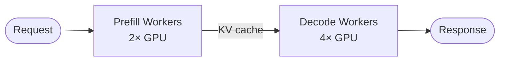
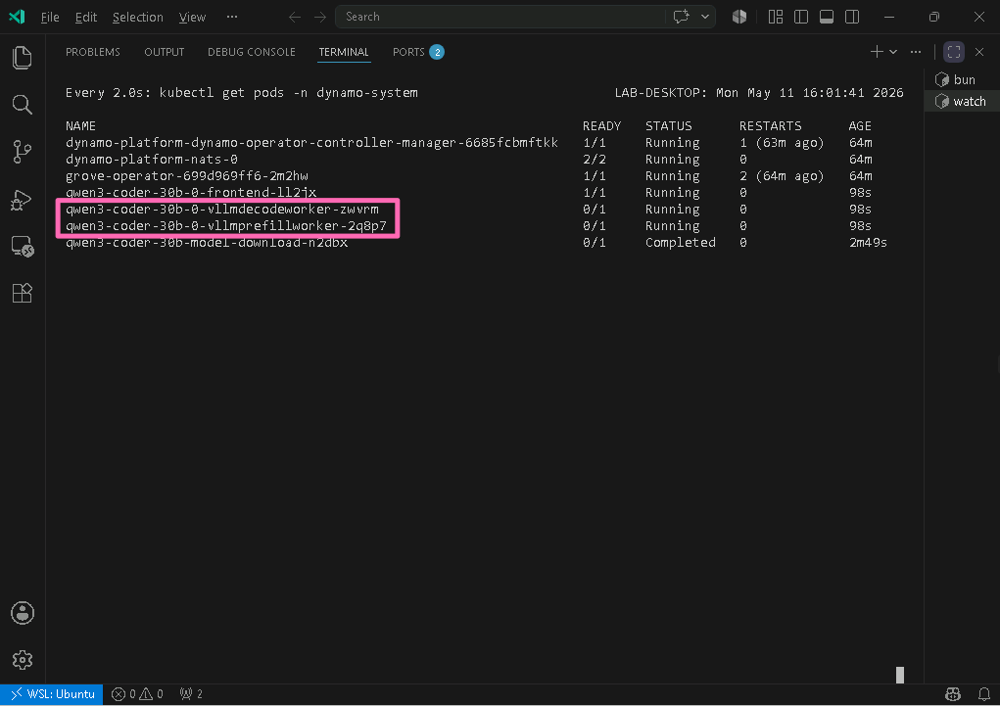

## Module 4: Production Serving Pattern

**Duration:** ~10 minutes

**Objectives:**
By the end of this module, you will be able to:

- Configure disaggregated prefill/decode scaling with Dynamo
- Set up model caching with Azure Managed Lustre for fast cold starts
- Understand how disaggregated serving improves scaling under load
- Verify that different serving patterns are transparent to consumers through the gateway

You've deployed individual models. Now you'll set up a deployment that looks more like a production service: split workloads that scale differently and cache model weights on shared storage. This is the first of three production concerns you'll work through in the remaining modules: serving reliably at scale, making models easy to consume, and operating the platform with confidence.

> [!NOTE]
> This is the first production concern: **reliable serving at scale**. A production platform needs to handle larger models, scale inference workloads independently, and avoid slow cold starts when pods restart.

### Understanding Disaggregated Prefill/Decode

As your inference platform scales to more users, a single GPU handling both prompt processing and token generation becomes a bottleneck. Long prompts block decode workers from generating responses for other users, and you can't scale the two workloads independently. Disaggregated serving addresses this by splitting inference into two phases that scale separately.

LLM inference goes through two phases: **prefill** (processing the input prompt, which is compute-intensive and parallelizable) and **decode** (generating output tokens one at a time, which is memory-bandwidth-intensive and sequential). In standard serving, one GPU handles both.

**Disaggregated serving** splits these into independent scaling groups:



This enables independent scaling, better GPU utilization, lower latency (decode workers aren't blocked waiting on long prompts), and KV-cache routing affinity.

> [!TIP]
> In production, you'd typically run more decode workers than prefill workers. Prefill processes the entire input prompt in a single parallel forward pass and finishes quickly. Decode stays busy for the full response because it generates tokens one at a time (a 500-token response means 500 sequential forward passes). Under load, decode workers stay occupied longer per request, so you need more of them to handle concurrent users. To keep costs manageable in the lab, we use one GPU each for prefill and decode.

### Deploy with Disaggregated Serving and Model Caching

Scaling model deployments across multiple GPU nodes can lead to longer startup times due to model weight loading. To mitigate this, you can use shared storage for model caching. In this lab, we use a pre-provisioned [Azure Managed Lustre](https://learn.microsoft.com/azure/azure-managed-lustre/amlfs-overview) PVC for model caching. Lustre delivers up to 500 MB/s per TiB with **ReadWriteMany** access, letting multiple pods share cached model weights without downloading them again.

Before applying the manifest, switch back to your terminal and confirm the shared model cache disk exists in the Dynamo namespace:

```bash
kubectl get pvc dynamo-pvc -n dynamo-system
```

Next, deploy the [Qwen/Qwen3-Coder-30B-A3B-Instruct](https://huggingface.co/Qwen/Qwen3-Coder-30B-A3B-Instruct) model from Hugging Face using Dynamo with disaggregated prefill/decode and Lustre-backed caching.

```bash
kubectl apply -f - <<EOF
apiVersion: airunway.ai/v1alpha1
kind: ModelDeployment
metadata:
  name: qwen3-coder-30b
  namespace: dynamo-system
spec:
  model:
    id: Qwen/Qwen3-Coder-30B-A3B-Instruct
    source: huggingface
    storage:
      volumes:
        - name: model-cache
          claimName: dynamo-pvc
          purpose: modelCache
  provider:
    name: dynamo
  engine:
    type: vllm
    contextLength: 131072
    args:
      dyn-tool-call-parser: "qwen3_coder"
  serving:
    mode: disaggregated
  scaling:
    prefill:
      replicas: 1
      gpu:
        count: 1
    decode:
      replicas: 1
      gpu:
        count: 1
EOF
```

<details>
<summary>Using a Hugging Face token for authenticated downloads</summary>

If you connected Hugging Face through the dashboard in Module 2, a Kubernetes secret named **hf-token-secret** was automatically created in all provider namespaces. To use it, add the `secrets` field to your ModelDeployment spec:

```yaml
secrets:
  huggingFaceToken: hf-token-secret
```

The lab path uses a public model that doesn't require authentication, so this is optional.

</details>

The disaggregated deployment creates two pods (one prefill + one decode) and may take 5-7 minutes. Start watching the pods while we walk through some of the key fields in the manifest:

```bash
watch kubectl get pods -n dynamo-system
```

This deployment takes longer than the previous one because of the larger model size. The first pod you'll see is **qwen3-coder-30b-model-download-\***, which downloads model weights to the Lustre-backed PVC. Once it finishes, it shows **0/1** READY with **Completed** status, and the prefill and decode pods start up.

While that runs, here are the key fields in this manifest and what they do:

- **model.storage.volumes**: Mounts the pre-provisioned Azure Managed Lustre PVC. Multiple pods share the same cached weights, so the model only needs to download once.
- **serving.mode: disaggregated**: Splits prefill and decode into separate scaling groups, each with its own GPU allocation.
- **engine.args**: Passes provider-specific flags. Here, **dyn-tool-call-parser: "qwen3_coder"** configures vLLM's [tool calling](https://docs.nvidia.com/dynamo/user-guides/tool-calling) parser for this model.

> [!WARNING]
> Tool call parsers vary by model family _and_ by provider. Choosing the wrong one can break function calling entirely: the model may fail to emit tool calls or produce malformed output. Always check your model's documentation and the provider's documentation for the correct parser name before deploying.

- **engine.contextLength**: Sets the maximum number of tokens the model can process in a single request (prompt + response combined). AI Runway maps this to the engine-specific flag (for example, `--max-model-len` in vLLM). The value **131072** here matches the Qwen3-Coder model's supported context window. Setting this too high for the available GPU memory causes out-of-memory errors at startup. Setting it too low limits the length of conversations or documents the model can handle. When omitted, the engine uses the model's default, which may be lower than its maximum capability.

Continue watching the deployment. You'll eventually see separate prefill and decode pods come online. Once all **qwen3-coder-30b** pods show **Running**, press **Ctrl+C** to stop the watch.



> [!TIP]
> If you want to see what's happening under the hood while you wait, open a **new terminal tab** and watch the decode worker logs for model loading progress:
>
> ```bash
> kubectl logs -n dynamo-system --selector app.kubernetes.io/name=qwen3-coder-30b-0-vllmdecodeworker -f
> ```
>
> Press **Ctrl+C** when done, then close this tab.

Once the pods are running, check the ModelDeployment and make sure its phase is **Running**:

```bash
kubectl get modeldeployment qwen3-coder-30b -n dynamo-system
```

### Test the Production Deployment

With Qwen Coder running, confirm it's reachable through the gateway. You already understand how the routing works from Module 3. Now you're verifying the production deployment serves traffic correctly.

Get the inference gateway IP address:

```bash
GATEWAY_IP=$(kubectl get gateway -n istio-system inference-gateway -o jsonpath='{.status.addresses[0].value}')
echo "Gateway IP: $GATEWAY_IP"
```

Send a request to the disaggregated Qwen Coder model:

```bash
curl -s http://$GATEWAY_IP/v1/chat/completions \
  -H "Content-Type: application/json" \
  -d '{
    "model": "Qwen/Qwen3-Coder-30B-A3B-Instruct",
    "messages": [{"role": "user", "content": "What are the benefits of disaggregated serving?"}],
    "max_tokens": 200
  }' | jq
```

> [!NOTE]
> At this scale, you won't see a dramatic difference from disaggregation. The benefits show up under high traffic, when prefill and decode can scale independently.

The disaggregated deployment is reachable through the same gateway as every other model. The backend serving pattern changed entirely, but consumers see the same API.

**What you learned in this module:**

- Disaggregated serving splits prefill (compute-heavy) and decode (memory-heavy) into independently scalable groups
- Azure Managed Lustre provides high-throughput shared model caching: download once, share across all pods
- Different serving patterns are transparent to consumers behind the same gateway

**Next up:** You'll use the gateway endpoint the way an application team would, plugging it into developer tools as an OpenAI-compatible service.

---

Next [Module 5: Platform Consumer Path](5-platform-consumers.md)