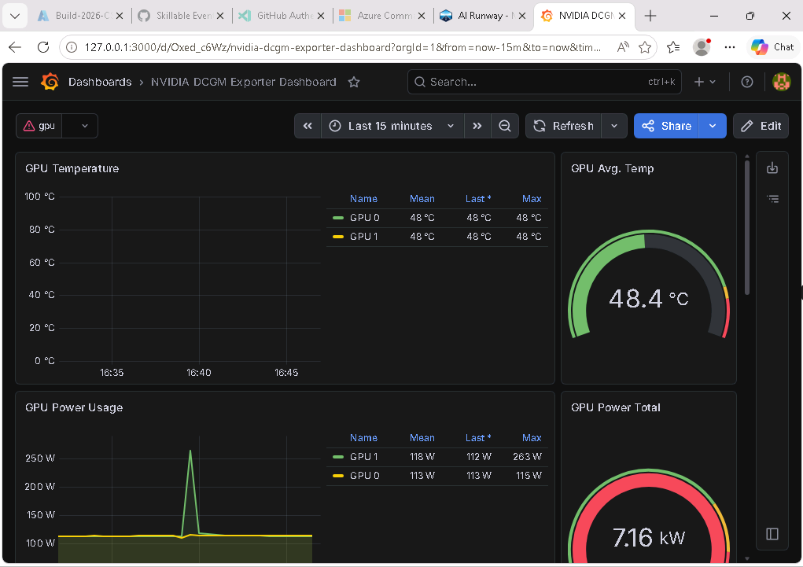

## Module 6: Operate the Platform

**Duration:** ~7 minutes

**Objectives:**
By the end of this module, you will be able to:

- Explain how this lab was bootstrapped with GitOps and the Argo CD App of Apps pattern
- Understand why declarative CRDs like ModelDeployment are a natural fit for GitOps
- Review AI Runway controller metrics and DORA indicators in Grafana

This module covers how platform teams keep things repeatable and observable: GitOps for managing rollout state, and Prometheus for tracking delivery metrics.

> [!NOTE]
> This is the third of three production concerns: **operational confidence**. A production platform needs declarative rollout, visible health, and measurable reliability.

### How This Lab Was Built: GitOps with Argo CD

Everything running in this cluster (the AI Runway controller, provider controllers, Gateway API, GPU Operator, Prometheus, and even the Lustre CSI driver) was deployed using the Argo CD **App of Apps** pattern.

A single "root" Argo CD Application points to a directory of child Application manifests. Argo CD discovers and syncs all of them, with **sync waves** controlling the order: CRDs and storage first (wave -1), then the AI Runway controller (wave 0), then provider operators (wave 1).

Verify for yourself. Switch back to your terminal and start a port-forward to the Argo CD server. This will occupy the terminal:

```bash
kubectl port-forward svc/argo-cd-argocd-server -n argocd 9000:80
```

Open a **new terminal tab**, retrieve the Argo CD admin password, and log in:

```bash
ARGOCD_PWD=$(kubectl -n argocd get secret argocd-initial-admin-secret -o jsonpath="{.data.password}" | base64 -d)
argocd login localhost:9000 --username admin --password "$ARGOCD_PWD" --insecure
```

Then list all applications:

```bash
argocd app list
```

All applications should show **Synced** and **Healthy**.

> [!TIP]
> You may see the **airunway** application show **OutOfSync** while still being **Healthy**. This is normal. It means the next reconciliation cycle hasn't run yet, or a resource in the cluster has drifted slightly from what's in Git (for example, a controller-managed field was updated at runtime). As long as the health status is **Healthy**, the platform is working correctly. Argo CD will reconcile the drift on its next sync.

This is where ModelDeployment's declarative design pays off for GitOps. Each manifest is a self-contained YAML file that fully describes the desired state of a model deployment: model ID, engine, resources, serving mode, and gateway configuration. That makes them versionable in Git, diffable in pull requests, and reviewable before anything touches the cluster. If Argo CD detects drift (someone manually edits a resource), it reconciles back to what's in Git. And if a deployment breaks, rolling back is just reverting a commit.

> [!TIP]
> See [Appendix B](appendix-b.md) for the complete App of Apps pattern, sync wave ordering, and root Application YAML.

### AI Runway Controller Metrics & DORA Indicators

GitOps tells you what _should_ be running. Metrics tell you what's _actually_ happening. You can't improve rollout speed, catch failing deployments, or justify GPU spend without data. The AI Runway controller exposes Prometheus metrics that give platform teams visibility into provider activity, deployment health, and rollout timing:

| Metric                                         | Description                                                                                      |
| ---------------------------------------------- | ------------------------------------------------------------------------------------------------ |
| airunway_reconciliation_errors_total           | Reconciliation errors by controller and provider, useful for spotting repeated failures          |
| airunway_provider_selection_total              | Provider selection counts, showing which runtimes are being chosen by auto-selection             |
| airunway_deployment_status                     | Status for each ModelDeployment by provider and phase                                            |
| airunway_deployment_provision_duration_seconds | Provider resource provisioning time, tracked separately from model startup and gateway readiness |

The dashboard also surfaces key metrics that map to [DORA metrics](https://dora.dev/guides/dora-metrics-four-keys/):

| Metric                                      | Description                                                                |
| ------------------------------------------- | -------------------------------------------------------------------------- |
| airunway_deployment_ready_duration_seconds  | **Lead time**: CR creation → Running                                       |
| airunway_deployment_phase_transitions_total | Phase transitions for **deployment frequency** and **change failure rate** |
| airunway_reconciliation_duration_seconds    | Reconciliation loop latency by provider                                    |
| airunway_deployment_replicas                | Replica counts (desired, ready, available)                                 |

The AI Runway controller metrics are collected by Prometheus and visualized in Grafana dashboards. This gives platform teams visibility into how many deployments are running, which providers are being used, whether deployments are healthy, and how long rollouts take.

### Import the Platform Overview Dashboard

First, get the Grafana admin password:

```bash
kubectl get secret --namespace monitoring -l app.kubernetes.io/component=admin-secret -o jsonpath="{.items[0].data.admin-password}" | base64 --decode ; echo
```

Now start a port-forward to Grafana. This will occupy the terminal:

```bash
kubectl port-forward svc/prometheus-grafana -n monitoring 3000:80
```

In a new browser tab navigate to `http://localhost:3000`.

Log in using `admin` as the username and paste the password that was printed in the previous terminal.

Navigate to the **Dashboard import page** at `http://localhost:3000/dashboard/import`.

Use the dashboard JSON file included in the repo: **demos/observability/sample-dashboard.json**.

Click in the **Upload dashboard JSON file** area then locate the `sample-dashboard.json` in your file system. Click on the file, then click the **Open** button.

> [!TIP]
> If the browser file picker cannot browse to your WSL files, open **demos/observability/sample-dashboard.json** in VS Code, copy the full contents, paste it into the **Import via dashboard JSON model** text box, then click **Load**.

Select the **Prometheus** data source and click **Import**.

The dashboard is organized into five rows:

1. **Deployment Status** - Stat tiles for total deployments by phase, deployments over time, provider breakdown, and replica health (ready vs desired)
2. **Reconciliation Performance** - Reconciliation duration percentiles (p50/p95/p99), rate, and errors by provider
3. **DORA Metrics** - Deployment Frequency (24h), Lead Time (p95), Change Failure Rate, Currently Failed Deployments, plus lead time and provision duration time series
4. **Provider Activity** - Reconciliations by provider and a deployment status table
5. **Inference Engine Metrics** - Active/queued requests, time to first token, KV-cache GPU utilization, and token throughput from `vllm:*` metrics

> [!NOTE]
> The DORA row ties platform engineering to AI inference operations. **Deployment Frequency** shows how actively teams ship models. **Lead Time** measures the gap from `kubectl apply` to serving traffic; the provision duration chart below isolates whether delays come from queue time or GPU scheduling. **Change Failure Rate** highlights spec validation gaps or provider issues. **Currently Failed Deployments** is a quick health check. These are the same signals SRE teams track for microservices, applied to your inference platform.

<details>
<summary>Optional: Import the NVIDIA DCGM GPU dashboard</summary>

The NVIDIA GPU Operator (which was installed as part of the cluster bootstrap) includes the **DCGM Exporter**, a component that exposes GPU metrics like utilization, memory usage, and temperature. Since we already configured Prometheus to scrape metrics from all namespaces, those GPU metrics are already being collected. All you need is a dashboard to visualize them.

Import the [NVIDIA DCGM Exporter Dashboard](https://grafana.com/grafana/dashboards/12219-nvidia-dcgm-exporter-dashboard/): in Grafana, go to **Dashboards → New → Import**, enter dashboard ID `12219`, click **Load**, select the **Prometheus** data source, and click **Import**.



</details>

**What you learned in this module:**

- GitOps provides a repeatable way to install and update an AI inference platform
- Prometheus and Grafana show whether model rollouts are healthy, slow, or failing
- DORA-style indicators bring the same delivery metrics used for application platforms to AI operations

---

Next [Summary](7-summary.md)
