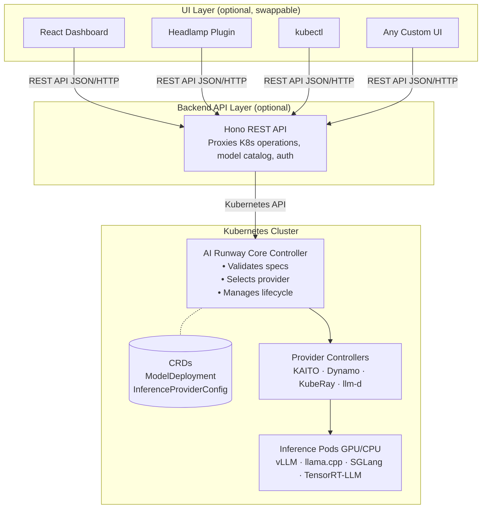
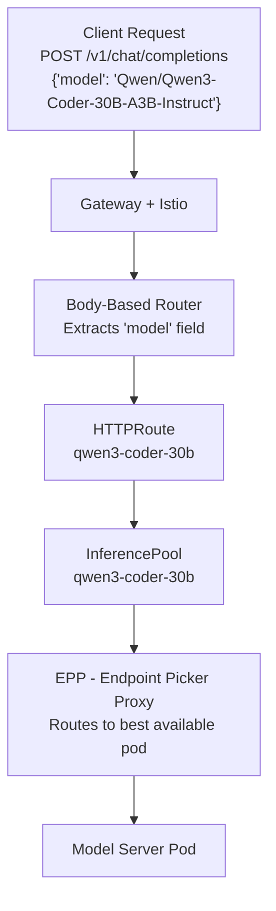
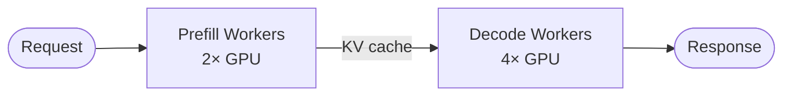
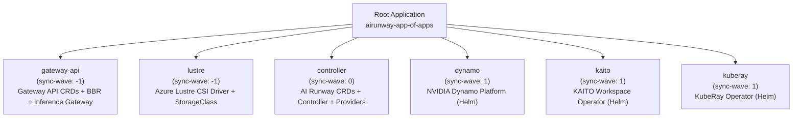

## Overview

AI Runway is an open-source project that treats model deployments as native Kubernetes resources. It gives you a single interface that works across multiple inference backends.

In this workshop, you'll deploy large language models (LLMs) on Azure Kubernetes Service (AKS) using both CPU and GPU nodes, configure production serving patterns, set up monitoring, and manage everything through GitOps with Argo CD.

## Why AI Runway?

Deploying LLMs in production means working with multiple inference providers, each with its own configuration format. AI Runway simplifies this with:

- **One interface for all providers**: Describe _what_ you want to deploy (model, engine, resources) and AI Runway figures out _how_.
- **Less operational overhead**: AI/ML teams focus on models, not infrastructure details.
- **Automatic provider and engine selection**: The controller picks the right inference provider and engine based on your spec.
- **Production patterns built in**: GitOps workflows, monitoring, and scalable deployment are supported out of the box.

The table below compares the traditional approach to deploying models on Kubernetes with the AI Runway approach:

| Without AI Runway                                                                                                 | With AI Runway                                                        |
| ----------------------------------------------------------------------------------------------------------------- | --------------------------------------------------------------------- |
| Learn each provider's CRDs and configuration (KAITO Workspaces, Dynamo DynamoGraphDeployments, RayServices, etc.) | One ModelDeployment CustomResourceDefinition (CRD) for all providers  |
| Manually match models to the right provider and engine                                                            | Auto-selects provider and engine based on your spec                   |
| Configure gateway routing (InferencePool, HTTPRoute, EPP) per model                                               | Gateway resources created and cleaned up automatically                |
| Separate monitoring and status tracking per provider                                                              | Unified status conditions and Prometheus metrics across all providers |
| Write provider-specific YAML for each new deployment                                                              | Describe what you want; the controller handles how                    |

> [!NOTE]
> AI Runway doesn't replace inference providers. It sits on top of them and gives you one interface for all of them.

## Prerequisites

This workshop assumes you have:

- **Foundational Kubernetes knowledge**: You're comfortable with pods, deployments, services, namespaces, and kubectl commands
- **Basic AKS familiarity**: You've worked with AKS before (provisioning, connecting, node pools)
- **A Hugging Face account** (optional): If you already have one, you can connect it to improve download reliability and access gated models. Don't create a new account during the lab. The main path uses public models and works without one.

Everything else (GPU operators, inference engines, Gateway API, Argo CD) is covered as you go.

### Required Tools

The lab VM comes pre-installed with the following tools:

| Tool                                                                      | Purpose                                                             |
| ------------------------------------------------------------------------- | ------------------------------------------------------------------- |
| [Azure CLI](https://learn.microsoft.com/cli/azure/install-azure-cli)      | Manage Azure resources and AKS credentials                          |
| [kubectl](https://kubernetes.io/docs/tasks/tools/)                        | Interact with Kubernetes clusters                                   |
| [Bun](https://bun.sh)                                                     | Run the AI Runway dashboard (frontend + backend)                    |
| [Helm](https://helm.sh/docs/intro/install/)                               | Used by the dashboard for runtime installation                      |
| [jq](https://jqlang.org/)                                                 | Parse JSON output from kubectl and curl                             |
| [yq](https://github.com/mikefarah/yq)                                     | Parse YAML output from kubectl                                      |
| [Git](https://git-scm.com/)                                               | Clone the AI Runway repository                                      |
| [Argo CD CLI](https://argo-cd.readthedocs.io/en/stable/cli_installation/) | Optional GitOps tooling to check on Argo CD application deployments |
| [GitHub Copilot CLI](https://github.com/features/copilot/cli/)            | GitHub-native terminal agent (requires version 1.0.44 or higher)    |
| [Visual Studio Code](https://code.visualstudio.com/download)              | Open source code editor (requires version 1.120.0 or higher)        |

### Lab infrastructure setup

You can provision the necessary infrastructure using the Terraform configuration in this repository.

Start by opening a terminal and log in to your Azure account:

```bash
az login
```

Clone this repo, then navigate to the Terraform directory and apply the configuration:

```bash
cd src/infra
terraform init
terraform apply
```

This creates a resource group, an AKS cluster (with CPU and GPU node pools), Azure Managed Lustre storage, and bootstraps the AI Runway application components via Argo CD. Once complete, grab the outputs and connect to the cluster:

```bash
RG_NAME=$(terraform output -raw rg_name)
AKS_NAME=$(terraform output -raw aks_name)

az aks get-credentials \
--resource-group $RG_NAME \
--name $AKS_NAME \
--overwrite
```

> [!NOTE]
> The Terraform configuration requires an Azure subscription with GPU quota (Standard_NC48ads_A100_v4). Request quota increases in advance — GPU quota approvals can take time.

Verify the connection:

```bash
kubectl cluster-info
```

You should see the Kubernetes control plane and CoreDNS endpoints listed, confirming a successful connection to the cluster.

---

## Module 1: First Deployment & Core Concepts

**Duration:** ~7 minutes

**Objectives:**
By the end of this module, you will be able to:

- Deploy your first **ModelDeployment** from a manifest
- Explain how AI Runway separates model intent from provider-specific implementation
- Identify the purpose of **ModelDeployment** and **InferenceProviderConfig** CRDs
- Read deployment status conditions to understand what the controller is doing

We'll start a model deployment first, then walk through how AI Runway works while it's starting up. Model deployments take a few minutes to become ready while images pull and models load into memory, so we'll use that time to cover the architecture and core concepts.

### Quickstart: Deploy a CPU Model

Run the following command to create your first AI Runway ModelDeployment resource. This manifest deploys a small CPU-based Gemma2 model. It intentionally omits the provider and engine, letting AI Runway choose them automatically.

```bash
kubectl apply -f - <<EOF
apiVersion: airunway.ai/v1alpha1
kind: ModelDeployment
metadata:
  name: gemma2-2b-cpu
spec:
  image: ghcr.io/kaito-project/aikit/gemma2:2b
  model:
    id: gemma2:2b
    source: huggingface
  resources:
    cpu: "1"
EOF
```

Expected output:

```text
modeldeployment.airunway.ai/gemma2-2b-cpu created
```

> [!NOTE]
> This manifest includes **spec.image** because CPU-based models need a pre-built model server image. GPU-based models don't need this field since the provider handles image selection.

Confirm the resource exists:

```bash
kubectl get modeldeployment gemma2-2b-cpu
```

The deployment may not be ready yet. That's expected; the controller is still working through its startup lifecycle.

### How It Works

You've seen the "what" in the Overview. Now let's look at the "how." AI Runway works by separating your **intent** (the model, engine, and resources you want) from the **implementation** (which inference provider runs it and how). You describe what you want in a ModelDeployment, and the controller handles provider selection, resource creation, and gateway routing.

> [!NOTE]
> Think of it like a universal remote: one set of buttons (the **ModelDeployment** CRD) controls many different devices (inference providers).

The resource you just created is a good example: one Kubernetes object represents a full model deployment, regardless of which provider actually runs it.

### Architecture Overview

AI Runway has a fully decoupled design with three layers: the **Kubernetes cluster**, the **backend API**, and an **optional UI**.



**Key design principles:**

| Principle                                | What it means                                                                                                                           |
| ---------------------------------------- | --------------------------------------------------------------------------------------------------------------------------------------- |
| **Core controller is minimal**           | It validates specs, selects providers, manages routing, and updates status                                                              |
| **Provider controllers are out-of-tree** | Each provider (KAITO, Dynamo, etc.) has its own controller that can be versioned and released independently                             |
| **UI is optional**                       | The platform works entirely via kubectl and CRDs. The web dashboard is a convenience layer                                              |
| **Two-tier reconciliation**              | Follows the same separation as the Kubernetes Container Runtime Interface (CRI): the core defines the interface, providers implement it |

> [!NOTE]
> Just as the kubelet talks to containerd via the CRI interface (and doesn't care whether you use containerd or CRI-O), the AI Runway core controller talks to providers through a standard interface. You can swap providers without changing your ModelDeployment specs.

### The ModelDeployment CRD

**ModelDeployment** is the primary resource you work with. At its simplest, you describe **what model** to deploy and **what resources** it needs.

The model deployment you just applied requested a Gemma2 2B parameter model with 1 CPU. That's it. The AI Runway controller took care of the rest. It found an inference provider that supports CPU workloads, selected an appropriate engine, created the necessary Kubernetes resources (pods, services, gateway routing), and is now managing the deployment lifecycle.

### Providers: The Inference Backends

A **provider** in AI Runway is an inference backend that actually runs your model. Each provider is a separate project with its own strengths:

- **KAITO** (CNCF Sandbox): Automates LLM inference, fine-tuning, and RAG deployment in Kubernetes with GPU auto-provisioning, optimized engine configs, and support for any vLLM-compatible HuggingFace model
- **Dynamo** (NVIDIA): Open-source distributed inference framework that boosts throughput up to 30x via disaggregated serving, smart KV cache routing, and dynamic GPU scheduling across vLLM, SGLang, and TensorRT-LLM
- **KubeRay**: Open-source Kubernetes operator that manages Ray clusters (RayCluster, RayJob, RayService) for scalable AI workloads including LLM serving, batch inference, and distributed training
- **llm-d** (CNCF Sandbox): Kubernetes-native distributed inference stack with LLM-aware routing, KV cache management, disaggregated serving, and multi-hardware support (NVIDIA, AMD, TPU, Intel HPU) across vLLM and SGLang

You don't have to learn each provider's configuration format. The controller picks the right provider based on what you ask for.

### The InferenceProviderConfig CRD

Each provider registers itself with the cluster through an **InferenceProviderConfig**, a cluster-scoped resource that describes what the provider supports: which engines it can run, whether it handles CPU or GPU workloads, and which serving modes it offers.

View the registered providers:

```bash
kubectl get inferenceproviderconfigs
```

Expected output:

```text
NAME      READY   VERSION                   AGE
dynamo    true    dynamo-provider:v0.2.0    1h
kaito     true    kaito-provider:v0.1.0     1h
kuberay   true    kuberay-provider:v0.1.0   1h
llmd      true    llmd-provider:v0.1.0      1h
```

You should see all four providers with **READY=true**. This confirms the controller knows which runtimes are available and healthy.

To view the full spec of an InferenceProviderConfig, including capabilities and selection rules, run:

```bash
kubectl get inferenceproviderconfig kaito -o yaml
```

Expected output (key fields - annotations and metadata omitted for brevity):

```yaml
spec:
  capabilities:
    cpuSupport: true
    engines:
      - vllm
      - llamacpp
    gpuSupport: true
    servingModes:
      - aggregated
  selectionRules:
    - condition: "!has(spec.resources.gpu) || spec.resources.gpu.count == 0"
      priority: 100
    - condition: spec.engine.type == 'llamacpp'
      priority: 100
status:
  ready: true
  version: kaito-provider:v0.1.0
```

> [!NOTE]
> The key parts are **spec.capabilities** (what the provider supports) and **selectionRules** (when it gets auto-selected). Since your Gemma deployment requested CPU, the controller should select KAITO with the llama.cpp engine automatically.

### Watch the Deployment Status

Now look at what the controller decided for the Gemma model:

```bash
kubectl get modeldeployment gemma2-2b-cpu -o yaml | yq '.status'
```

You should see statuses like the following (key conditions shown, others omitted):

```yaml
conditions:
  - message: Engine llamacpp auto-selected from provider kaito
    status: "True"
    type: EngineSelected
  - message: Provider kaito auto-selected
    status: "True"
    type: ProviderSelected
  - message: Workspace created successfully
    status: "True"
    type: ResourceCreated
  - message: All replicas are ready
    status: "True"
    type: Ready
  - message: InferencePool and HTTPRoute created
    status: "True"
    type: GatewayReady
engine:
  type: llamacpp
phase: Running
provider:
  name: kaito
  resourceKind: Workspace
  selectedReason: "matched capabilities: engine=llamacpp, gpu=false, mode=aggregated"
replicas:
  available: 1
  desired: 1
  ready: 1
```

> [!TIP]
> Read **status.conditions** top to bottom. They trace the deployment lifecycle: validation → provider selection → resource creation → readiness → gateway. If your model isn't serving traffic, start here.

If the phase is not **Running** yet, wait for it to become ready:

```bash
kubectl get modeldeployment gemma2-2b-cpu -w
```

When you see **Running**, press **Ctrl+C** to stop watching.

### Test the Model Endpoint

The model exposes an OpenAI-compatible API. For now, use `kubectl port-forward` to test it directly.

In a **new terminal tab**, start a port-forward to the KAITO workspace service:

```bash
kubectl port-forward svc/gemma2-2b-cpu 8080:80
```

In **another terminal tab**, send a chat request:

```bash
curl -s http://localhost:8080/v1/chat/completions \
  -H "Content-Type: application/json" \
  -d '{
    "model": "gemma-2-2b-instruct",
    "messages": [{"role": "user", "content": "What are the benefits of running models on Kubernetes?"}],
    "max_tokens": 50
  }' | jq
```

You should see a JSON response with the model's reply. This confirms the model is running and serving an OpenAI-compatible API.

> [!NOTE]
> Later, you'll see how the Gateway API Inference Extension routes traffic to multiple models through a single shared endpoint.

When you're done, press **Ctrl+C** in the port-forward terminal to stop it. You can close the extra terminal tab.

**What you learned in this module:**

- A **ModelDeployment** describes what model you want, not the provider-specific details
- The core controller validates the request, chooses a provider and engine, and reports status through conditions
- Provider controllers do the provider-specific work (e.g., creating KAITO Workspaces)
- Status conditions trace the deployment lifecycle. Read them top to bottom
- Every deployed model exposes an OpenAI-compatible API

**Next up:** With a live model running, you'll launch the dashboard to see the same Kubernetes resources through a visual interface.

---

## Module 2: Dashboard Setup & Cluster Verification

**Duration:** ~7 minutes

**Objectives:**
By the end of this module, you will be able to:

- Launch the AI Runway web dashboard and inspect your live deployment
- Verify your AKS cluster has GPU resources available
- Confirm the inference gateway and AI Runway components are healthy

You deployed a model with kubectl. Now you'll set up the dashboard and run a quick health check on the cluster.

### Launch the AI Runway Dashboard

Not everyone on a platform team lives in the terminal. The AI Runway dashboard gives teams a visual way to browse available models, track deployment status, and verify cluster health without writing kubectl commands. It's especially useful for onboarding new team members or during incident triage when you need a quick overview of what's running.

The AI Runway dashboard is an optional web interface for visualizing and managing your deployments. It reads the same Kubernetes resources you create with kubectl. The dashboard can run locally during development or be deployed in-cluster for shared team access. For this workshop, you'll run it locally.

Clone the repository

```bash
cd ~ && git clone --branch v0.5.0 https://github.com/kaito-project/airunway.git
```

Navigate into the repo directory

```bash
cd airunway
```

Open the repository in VS Code by clicking **File --> Open Folder...**, type `/home/labuser/airunway` in the path, then click the **OK** button.


> [!NOTE]
> When VS Code opens the folder, all previous terminal sessions will be gone. You will need to open a new terminal to continue.

Install project dependencies and start the dashboard

```bash
bun install && bun run dev
```

> [!WARNING]
> The `bun run dev` command occupies this terminal. In VS Code, open a **new terminal tab** (click the **+** button in the terminal panel) for all remaining CLI commands in this workshop.

This launches both the frontend and backend. The backend API runs on port 3001 and the frontend UI runs on port 5173. Open `http://localhost:5173` in your browser.

> [!WARNING]
> Keep this tab open throughout the workshop.

### See Your Deployment in the Dashboard

Open the **Deployments** page in the left sidebar. You should see **gemma2-2b-cpu** from Module 1 listed with its phase and readiness status. Each row shows the deployment name, phase (Pending, Deploying, Running, Failed), provider, engine, replica counts, and age.


Click **gemma2-2b-cpu** to open the deployment details. You'll see the runtime (KAITO), engine (LLAMACPP), model name, gateway endpoint, an example curl command, metrics, and logs. This is the same information you queried with `kubectl get modeldeployment -o yaml`, presented visually.

### Explore the Settings Page

Click **Settings** in the left sidebar. The Settings page has three tabs that give you a full picture of your cluster's readiness.

**General** shows cluster connectivity and a runtime summary. Confirm it shows **Connected** to your AKS cluster with **4 of 4** runtimes installed.

**Runtimes** gives a full view of each provider's installation status, capabilities (engines, serving modes, hardware support), and version. It also shows prerequisite checks (GPU Operator, Gateway API CRDs) and cluster autoscaling status. This is the single place to confirm your cluster's inference stack is complete. If a provider shows as not installed, the auto-selection algorithm will skip it when matching deployments.

**Integrations** shows the status of external services like GPU Operator health, Gateway API CRDs, and Hugging Face OAuth. If you already have a Hugging Face account, click **Connect Hugging Face** and follow the OAuth flow. Once connected, you'll see your Hugging Face username and a **Connected** badge.


> [!TIP]
> Skip the Hugging Face connection if you do not already have an account. The rest of the workshop uses public models and does not require Hugging Face authentication.

### Browse the Model Catalog

Click **Models** in the left sidebar. This page is a catalog of models organized by engine compatibility. Each card shows the model name, parameter count, required GPU memory, and supported inference engines (vLLM, SGLang, TensorRT-LLM, llama.cpp). The **Deploy →** button on each card opens a guided deployment flow where you pick a runtime, engine, and resource allocation. In this workshop, we use kubectl manifests instead so you can see auto-selection at work.


### Quick Cluster Health Check

Now let's verify the cluster itself using the CLI. Open a new terminal tab and run the following command to confirm your cluster has the right node pools and GPU resources:

```bash
kubectl get nodes -o wide
```

You should see at least 3 nodes with **default** in the name (CPU pool, Standard_D4d_v4) and 1 node with **inference** in the name (GPU pool, Standard_NC48ads_A100_v4).

Check the GPU resources available:

```bash
kubectl get node -l agentpool=inference -o yaml | yq '.items[0].status.allocatable | pick(["cpu", "memory", "nvidia.com/gpu"])'
```

You should see **nvidia.com/gpu: "2"**, confirming 2 NVIDIA GPUs are available.

> [!NOTE]
> A GPU node pool with autoscaling is enabled for this workshop. On your own cluster, you'd provision the node pool and choose a VM SKU that fits your workload. See the [AKS docs](https://learn.microsoft.com/azure/aks/use-nvidia-gpu?tabs=add-ubuntu-gpu-node-pool) for details on GPU node pools.

Verify the inference gateway and AI Runway controllers are healthy:

```bash
kubectl get gateway -n istio-system && kubectl get pods -n airunway-system
```

The gateway should show **PROGRAMMED: True** with an external IP. All controller pods should be **Running**.

> [!NOTE]
> **Gateway API Inference Extension** extends the standard Gateway API for AI/ML workloads. It adds inference-aware routing and load balancing through components like InferencePool, Endpoint Picker Proxy (EPP), Body-Based Router (BBR), and HTTPRoute. AI Runway creates all of these automatically for each ModelDeployment that has gateway enabled. You'll see how the routing works in detail in Module 3.

### (Optional) Connect Hugging Face

If you already have a Hugging Face account, you can connect it now. In the **Settings** page, click the **Integrations** tab, then click **Connect Hugging Face** and follow the OAuth flow. Once connected, you'll see your Hugging Face username and a **Connected** badge.


> [!TIP]
> Skip this step if you do not already have an account. The rest of the workshop uses public models and does not require Hugging Face authentication.

**What you learned in this module:**

- The dashboard is an optional visual layer over the same Kubernetes resources you manage with **kubectl**
- Your cluster has CPU and GPU node pools (the GPU Operator is what makes `nvidia.com/gpu` appear as an allocatable resource), a working inference gateway powered by Istio, and all AI Runway controller pods running
- Four runtimes are available (KAITO, Dynamo, KubeRay, llm-d). This workshop focuses on KAITO and Dynamo

> [!TIP]
> All cluster components were bootstrapped using Argo CD and GitOps. You'll explore how that works in Module 6.

**Next up:** You'll deploy a GPU model with a minimal manifest and let AI Runway auto-select the provider and engine.

---

## Module 3: GPU Auto-Selection & Validation

**Duration:** ~10 minutes

**Objectives:**
By the end of this module, you will be able to:

- Deploy a GPU model with a minimal manifest
- Verify AI Runway auto-selects Dynamo and vLLM
- Understand how owner references chain resources together for automatic cleanup
- Compare GPU vs CPU inference speed
- Explain how the gateway routes requests to different models

The CPU model covered the basic flow. Now you'll deploy a GPU model with a minimal manifest and watch AI Runway pick the right runtime. Switch back to your terminal for the next steps.

> [!NOTE]
> The dashboard's guided deployment flow lets you choose a runtime and engine explicitly. This module uses kubectl so you can see auto-selection in action.

### Deploy a Small GPU Model

Apply this manifest. Notice it requests a GPU without naming a provider or engine:

```bash
kubectl apply -f - <<EOF
apiVersion: airunway.ai/v1alpha1
kind: ModelDeployment
metadata:
  name: qwen3-gpu
spec:
  model:
    id: Qwen/Qwen3-0.6B
    source: huggingface
  resources:
    gpu:
      count: 1
EOF
```

By requesting **spec.resources.gpu.count: 1**, the controller auto-selects **Dynamo** as the provider and **vLLM** as the engine (see [Appendix A](#appendix-a-provider-capability-matrix--selection-rules) for the full selection rules).

> [!TIP]
> This small **0.6B** model keeps deployment times short. You'll deploy a larger model in Module 4.

In the dashboard, click **Deployments**. You'll see **qwen3-gpu** appear and progress through lifecycle phases:


### Inspect the Auto-Selection Result

While the deployment starts up, check what the controller decided. The GPU deployment follows the same lifecycle as the CPU model, but auto-selection picks a different provider this time.

Check the result:

```bash
kubectl get modeldeployment qwen3-gpu -n default -o yaml | yq '.status.provider, .status.engine'
```

You may need to run the command above a few times to get the latest status updates. Expected output once selection completes:

```yaml
resourceKind: DynamoGraphDeployment
resourceName: qwen3-gpu
selectedReason: 'matched capabilities: engine=vllm, gpu=true, mode=aggregated'
selectedReason: auto-selected from provider dynamo capabilities
type: vllm
```

The manifest didn't mention Dynamo or vLLM anywhere. The controller matched the GPU request against each provider's capabilities and selected the best fit.

### How Auto-Selection Works

The controller follows a deterministic algorithm when **spec.provider.name** is omitted:

1. It collects all registered **InferenceProviderConfigs** in the cluster
2. It filters providers by the deployment's requirements: engine type, GPU/CPU, and serving mode
3. For each matching provider, it evaluates **selectionRules**, which are CEL expressions with priority scores
4. The provider with the highest matching priority wins. Ties are broken alphabetically by name

For this deployment:

- You requested GPU. Both KAITO and Dynamo support GPU, but Dynamo has a higher-priority rule for GPU workloads
- No engine was specified, so the controller auto-selected **vLLM** from Dynamo's supported engines
- The full selection reason is recorded in **status.provider.selectedReason** for transparency

> [!NOTE]
> This is a key difference from using providers directly. You don't necessarily need to know which provider to pick. Describe your requirements and the controller can match you to the right one.

### Understand Resource Ownership

When you delete a ModelDeployment, you want everything it created to go with it: the provider resource, the serving pods, the gateway routes. Without automatic cleanup, you'd end up with orphaned resources consuming GPU memory and cluster capacity after every delete. Kubernetes **owner references** solve this by chaining resources together so deletion cascades automatically.

While pods are starting, look at the resource chain the controllers created.

Check what the Dynamo provider deployed:

```bash
kubectl get modeldeployment qwen3-gpu -o yaml | yq '.status.provider'
```

The Dynamo provider created a **DynamoGraphDeployment** also named **qwen3-gpu** on your behalf. This is the provider-specific resource that represents your model deployment in Dynamo's world. The AI Runway controller set an owner reference from the DynamoGraphDeployment back to the ModelDeployment, which means Kubernetes understands that the DynamoGraphDeployment "belongs" to the ModelDeployment.

Check the ownership chain:

```bash
kubectl get dynamographdeployments qwen3-gpu -o yaml | yq '.metadata.ownerReferences'
```

This shows an owner reference pointing back to the **ModelDeployment**. The ownership works in layers:

- **AI Runway core controller** creates the ModelDeployment status and gateway resources (if needed)
- **AI Runway Dynamo provider** creates the DynamoGraphDeployment, linked to the ModelDeployment via owner reference
- **Dynamo operator** creates the serving pods, InferencePool, and EPP, linked to the DynamoGraphDeployment

This chain means deleting the ModelDeployment cascades through all layers, so provider resources, pods, and gateway routing are all cleaned up automatically.

### How Gateway Routing Works

You noticed that the ownership chain includes gateway resources. The controller doesn't just deploy your model; it also wires up the networking so the model is reachable through a shared gateway. But why does a gateway matter in the first place?

In production, platform teams typically serve multiple models. Different models serve different needs: a small CPU model handles lightweight tasks at low cost, a larger GPU model handles complex reasoning or code generation, and specialized models handle domain-specific workloads. Without a shared gateway, consumers would need to track separate endpoints for each model and update their configurations every time the platform team changes how a model is served.

A single inference gateway solves this. Consumers get one stable URL and specify which model they want in the request body. The gateway handles the routing, and the platform team can add, remove, or reconfigure models without breaking any client integrations.

You'll see this firsthand once the deployment finishes: two requests to the same URL, two different `model` values, two different backends. Here's how the routing works under the hood.

The **Gateway API Inference Extension** adds four components that work together to route inference traffic.

1. **Body-Based Router (BBR)**: Standard HTTP routers match on headers, paths, or query parameters. But LLM API requests specify the model in the JSON body, not the URL. The BBR solves this by inspecting the request body, reading the `model` field, and matching it to the correct HTTPRoute. Without it, you'd need a separate URL path per model, which breaks the OpenAI API contract.

2. **HTTPRoute**: Once the BBR identifies which model the request is for, the HTTPRoute forwards it to the correct InferencePool. This is the same HTTPRoute resource from the standard Gateway API, so existing networking policies and observability tools work with it out of the box.

3. **InferencePool**: Groups the serving pods for a specific model, similar to how a Kubernetes Service groups pods. The difference is that an InferencePool is inference-aware: it knows which pods are running which models and can expose metadata (like KV-cache state) that helps with smarter routing decisions.

4. **Endpoint Picker Proxy (EPP)**: A standard load balancer picks pods using round-robin or least-connections, which ignores what's happening inside the inference engine. The EPP makes routing decisions based on inference-specific signals. For example, it can route a follow-up request to the pod that already has the conversation's KV-cache in GPU memory, avoiding redundant prefill computation. Different providers can implement their own EPP with provider-specific optimizations.



AI Runway creates all of these gateway resources automatically for each ModelDeployment with gateway enabled. You don't need to set up the routing yourself.

<details>
<summary>How AI Runway handles gateway resources across providers</summary>

The InferencePool and EPP creation depends on the provider:

- **Providers with native gateway support** (like Dynamo): The provider controller creates a specialized InferencePool and EPP with advanced routing capabilities (like KV-cache affinity). The AI Runway core controller detects this through the provider's `InferenceProviderConfig` gateway capabilities and skips creating its own, avoiding duplication.
- **Providers without native gateway support** (like KAITO): The AI Runway core controller creates a generic InferencePool and deploys the upstream EPP.

Either way, the result is the same for consumers: one endpoint, one API format, body-based routing to the right model.

</details>

### Wait for the Deployment

Check the status of the pods:

```bash
kubectl get pods -l app.kubernetes.io/part-of=qwen3-gpu
```

> [!TIP]
> Inference pods can take a few minutes to start while the image pulls and the model loads into memory. Press **Ctrl+C** when the pod shows **Running**.

> [!TIP]
> **Pod not starting?** Here's what to check:
>
> - **Pending** with no events: Run `kubectl describe pod <pod-name>` and look at the **Events** section. Common causes: insufficient GPU quota, node pool not scaled up yet, or taints preventing scheduling.
> - **ContainerCreating** for a long time: The container image is likely still pulling. GPU inference images can be several gigabytes. Wait a few more minutes.
> - **CrashLoopBackOff** or **Error**: Check logs with `kubectl logs <pod-name>`. Common causes: out-of-memory errors (model too large for available GPU memory) or misconfigured engine arguments.
> - **ImagePullBackOff**: The container image couldn't be downloaded. Verify network connectivity and that the image reference is correct.

Once the pod is running, confirm the ModelDeployment is in **Running** phase:

```bash
watch kubectl get modeldeployment qwen3-gpu
```

When the phase changes to **Running**, press **Ctrl+C** to stop watching.

Verify that gateway resources were auto-created:

```bash
kubectl get inferencepool,httproute
```

You should see resources named after **qwen3-gpu**. The HTTPRoute connects the shared gateway to this model's InferencePool.

### Test Both Models Through the Gateway

You now have two models running: the CPU-based Gemma model from Module 1 and the GPU-based Qwen model you just deployed. Both are behind the same inference gateway. Let's test them both to see multi-model routing in action.

Get the gateway IP:

```bash
GATEWAY_IP=$(kubectl get gateway -n istio-system inference-gateway -o jsonpath='{.status.addresses[0].value}')
echo "Gateway IP: $GATEWAY_IP"
```

**Send a request to the GPU model**:

```bash
curl -s http://$GATEWAY_IP/v1/chat/completions \
  -H "Content-Type: application/json" \
  -d '{
    "model": "Qwen/Qwen3-0.6B",
    "messages": [{"role": "user", "content": "What are the benefits of running models on Kubernetes?"}],
    "max_tokens": 100
  }' | jq
```

You'll notice the GPU model responds noticeably faster than the CPU model from Module 1. That's GPU parallelism at work: a GPU processes thousands of matrix operations simultaneously during both prefill and decode phases, while a CPU processes them sequentially. For production workloads with many concurrent users, this difference becomes even more pronounced.

Now send a request to the CPU model through the same gateway endpoint:

```bash
curl -s http://$GATEWAY_IP/v1/chat/completions \
  -H "Content-Type: application/json" \
  -d '{
    "model": "gemma-2-2b-instruct",
    "messages": [{"role": "user", "content": "What are the benefits of running models on Kubernetes?"}],
    "max_tokens": 50
  }' | jq
```

Both requests went to the same URL. The only difference was the `model` field in the JSON body, and the gateway routed each request to the correct backend automatically.

> [!TIP]
> Look at the `"model"` field in each JSON response. The Qwen response shows `"Qwen/Qwen3-0.6B"` and the Gemma response shows `"gemma-2-2b-instruct"`. Same gateway, same API shape, but two completely different backends (one on GPU, one on CPU) handling the requests.

Go back to the dashboard and click on the **qwen3-gpu** deployment to see its details, including the runtime, engine, gateway endpoint, and metrics.

### Clean Up Deployments

On the dashboard, click the **Delete** button to delete both model deployments to free resources for the larger model in Module 4.

The Kubernetes **owner references** you saw earlier automatically cleaned up the provider resource, pods, and gateway routing.

**What you learned in this module:**

- The controller auto-selects provider and engine based on your spec: CPU only → KAITO + llama.cpp; GPU requested → Dynamo + vLLM
- Auto-selection uses CEL-based rules with priority scoring, and the selection reason is always recorded in status
- Owner references chain resources across controllers for automatic lifecycle cleanup
- GPU inference is significantly faster than CPU for the same workload
- The gateway uses body-based routing to direct requests to the right model based on the `model` field in the JSON body
- Multiple models (CPU and GPU) are reachable through the same gateway endpoint using body-based routing

**Next up:** You'll configure production serving with disaggregated scaling and shared model caching.

---

## Module 4: Production Serving Pattern

**Duration:** ~10 minutes

**Objectives:**
By the end of this module, you will be able to:

- Configure disaggregated prefill/decode scaling with Dynamo
- Set up model caching with Azure Managed Lustre for fast cold starts
- Understand how disaggregated serving improves scaling under load
- Verify that different serving patterns are transparent to consumers through the gateway

You've deployed individual models. Now you'll set up a deployment that looks more like a production service: split workloads that scale differently and cache model weights on shared storage. This is the first of three production concerns you'll work through in the remaining modules: serving reliably at scale, making models easy to consume, and operating the platform with confidence.

> [!NOTE]
> This is the first production concern: **reliable serving at scale**. A production platform needs to handle larger models, scale inference workloads independently, and avoid slow cold starts when pods restart.

### Understanding Disaggregated Prefill/Decode

As your inference platform scales to more users, a single GPU handling both prompt processing and token generation becomes a bottleneck. Long prompts block decode workers from generating responses for other users, and you can't scale the two workloads independently. Disaggregated serving addresses this by splitting inference into two phases that scale separately.

LLM inference goes through two phases: **prefill** (processing the input prompt, which is compute-intensive and parallelizable) and **decode** (generating output tokens one at a time, which is memory-bandwidth-intensive and sequential). In standard serving, one GPU handles both.

**Disaggregated serving** splits these into independent scaling groups:



This enables independent scaling, better GPU utilization, lower latency (decode workers aren't blocked waiting on long prompts), and KV-cache routing affinity.

> [!TIP]
> In production, you'd typically run more decode workers than prefill workers. Prefill processes the entire input prompt in a single parallel forward pass and finishes quickly. Decode stays busy for the full response because it generates tokens one at a time (a 500-token response means 500 sequential forward passes). Under load, decode workers stay occupied longer per request, so you need more of them to handle concurrent users. To keep costs manageable in the lab, we use one GPU each for prefill and decode.

### Deploy with Disaggregated Serving and Model Caching

Scaling model deployments across multiple GPU nodes can lead to longer startup times due to model weight loading. To mitigate this, you can use shared storage for model caching. In this lab, we use a pre-provisioned [Azure Managed Lustre](https://learn.microsoft.com/azure/azure-managed-lustre/amlfs-overview) PVC for model caching. Lustre delivers up to 500 MB/s per TiB with **ReadWriteMany** access, letting multiple pods share cached model weights without downloading them again.

Before applying the manifest, switch back to your terminal and confirm the shared model cache disk exists in the Dynamo namespace:

```bash
kubectl get pvc dynamo-pvc -n dynamo-system
```

Next, deploy the [Qwen/Qwen3-Coder-30B-A3B-Instruct](https://huggingface.co/Qwen/Qwen3-Coder-30B-A3B-Instruct) model from Hugging Face using Dynamo with disaggregated prefill/decode and Lustre-backed caching.

```bash
kubectl apply -f - <<EOF
apiVersion: airunway.ai/v1alpha1
kind: ModelDeployment
metadata:
  name: qwen3-coder-30b
  namespace: dynamo-system
spec:
  model:
    id: Qwen/Qwen3-Coder-30B-A3B-Instruct
    source: huggingface
    storage:
      volumes:
        - name: model-cache
          claimName: dynamo-pvc
          purpose: modelCache
  provider:
    name: dynamo
  engine:
    type: vllm
    contextLength: 131072
    args:
      dyn-tool-call-parser: "qwen3_coder"
  serving:
    mode: disaggregated
  scaling:
    prefill:
      replicas: 1
      gpu:
        count: 1
    decode:
      replicas: 1
      gpu:
        count: 1
  gateway:
    enabled: true
EOF
```

<details>
<summary>Using a Hugging Face token for authenticated downloads</summary>

If you connected Hugging Face through the dashboard in Module 2, a Kubernetes secret named **hf-token-secret** was automatically created in all provider namespaces. To use it, add the `secrets` field to your ModelDeployment spec:

```yaml
secrets:
  huggingFaceToken: hf-token-secret
```

The lab path uses a public model that doesn't require authentication, so this is optional.

</details>

The disaggregated deployment creates two pods (one prefill + one decode) and may take 5-7 minutes. Start watching the pods while we walk through some of the key fields in the manifest:

```bash
watch kubectl get pods -n dynamo-system
```

This deployment takes longer than the previous one because of the larger model size. The first pod you'll see is **qwen3-coder-30b-model-download-\***, which downloads model weights to the Lustre-backed PVC. Once it finishes, it shows **0/1** READY with **Completed** status, and the prefill and decode pods start up.

While that runs, here are the key fields in this manifest and what they do:

- **model.storage.volumes**: Mounts the pre-provisioned Azure Managed Lustre PVC. Multiple pods share the same cached weights, so the model only needs to download once.
- **serving.mode: disaggregated**: Splits prefill and decode into separate scaling groups, each with its own GPU allocation.
- **engine.args**: Passes provider-specific flags. Here, **dyn-tool-call-parser: "qwen3_coder"** configures vLLM's [tool calling](https://docs.nvidia.com/dynamo/user-guides/tool-calling) parser for this model.

> [!WARNING]
> Tool call parsers vary by model family _and_ by provider. Choosing the wrong one can break function calling entirely: the model may fail to emit tool calls or produce malformed output. Always check your model's documentation and the provider's documentation for the correct parser name before deploying.

- **engine.contextLength**: Sets the maximum number of tokens the model can process in a single request (prompt + response combined). AI Runway maps this to the engine-specific flag (for example, `--max-model-len` in vLLM). The value **131072** here matches the Qwen3-Coder model's supported context window. Setting this too high for the available GPU memory causes out-of-memory errors at startup. Setting it too low limits the length of conversations or documents the model can handle. When omitted, the engine uses the model's default, which may be lower than its maximum capability.

Continue watching the deployment. You'll eventually see separate prefill and decode pods come online. Once all **qwen3-coder-30b** pods show **Running**, press **Ctrl+C** to stop the watch.


> [!TIP]
> If you want to see what's happening under the hood while you wait, open a **new terminal tab** and watch the decode worker logs for model loading progress:
>
> ```bash
> kubectl logs -n dynamo-system --selector app.kubernetes.io/name=qwen3-coder-30b-0-vllmdecodeworker -f
> ```
>
> Press **Ctrl+C** when done, then close this tab.

Once the pods are running, check the ModelDeployment and make sure its phase is **Running**:

```bash
kubectl get modeldeployment qwen3-coder-30b -n dynamo-system
```

### Test the Production Deployment

With Qwen Coder running, confirm it's reachable through the gateway. You already understand how the routing works from Module 3. Now you're verifying the production deployment serves traffic correctly.

Get the inference gateway IP address:

```bash
GATEWAY_IP=$(kubectl get gateway -n istio-system inference-gateway -o jsonpath='{.status.addresses[0].value}')
echo "Gateway IP: $GATEWAY_IP"
```

Send a request to the disaggregated Qwen Coder model:

```bash
curl -s http://$GATEWAY_IP/v1/chat/completions \
  -H "Content-Type: application/json" \
  -d '{
    "model": "Qwen/Qwen3-Coder-30B-A3B-Instruct",
    "messages": [{"role": "user", "content": "What are the benefits of disaggregated serving?"}],
    "max_tokens": 200
  }' | jq
```

> [!NOTE]
> At this scale, you won't see a dramatic difference from disaggregation. The benefits show up under high traffic, when prefill and decode can scale independently.

The disaggregated deployment is reachable through the same gateway as every other model. The backend serving pattern changed entirely, but consumers see the same API.

**What you learned in this module:**

- Disaggregated serving splits prefill (compute-heavy) and decode (memory-heavy) into independently scalable groups
- Azure Managed Lustre provides high-throughput shared model caching: download once, share across all pods
- Different serving patterns are transparent to consumers behind the same gateway

**Next up:** You'll use the gateway endpoint the way an application team would, plugging it into developer tools as an OpenAI-compatible service.

---

## Module 5: Platform Consumer Path

**Duration:** ~5 minutes

**Objectives:**
By the end of this module, you will be able to:

- Configure GitHub Copilot in the terminal or VS Code to use your self-hosted models
- Understand how any OpenAI-compatible client can consume your AKS-hosted inference endpoints

With models running in your cluster, it's time to see this from the consumer side. In Module 4, you were the platform team building the serving layer. Now you're an application team using it.

> [!NOTE]
> This is the second of three production concerns: **easy consumption**. Internal teams should only need a base URL, a model name, and the standard OpenAI API format. No Kubernetes knowledge required.

### Integrate with Developer Tooling

A practical use case for self-hosted LLMs is **private, low-latency inference** for developer tools. Both [GitHub Copilot CLI](https://docs.github.com/en/copilot/how-tos/copilot-cli/customize-copilot/use-byok-models#model-requirements) and [VS Code](https://code.visualstudio.com/docs/copilot/customization/language-models) support bring-your-own-model (BYOM) configurations that point at any OpenAI-compatible endpoint. This is useful when:

- External model access is blocked by geographic or organizational policies
- API quota limits are reached
- Data sovereignty requires models to run within your own infrastructure
- You need predictable latency without internet round-trips

Since AI Runway exposes **OpenAI-compatible endpoints**, any tool that speaks this API can use your self-hosted models. The platform team handles the runtime complexity; consumers just point at a stable URL.

> [!WARNING]
> **Choose ONE of the two options below.** Both achieve the same result. Pick whichever workflow you prefer.

<details>
<summary>Option A: GitHub Copilot CLI</summary>

In the terminal, make sure you are in the root of the AI Runway repository. If not, run:

```bash
cd ~/airunway
```

GitHub Copilot CLI supports custom model providers through environment variables. Set these to point Copilot at your AKS-hosted model:

Get the inference gateway IP address:

```bash
GATEWAY_IP=$(kubectl get gateway -n istio-system inference-gateway -o jsonpath='{.status.addresses[0].value}')
```

Environment variables for custom model provider configuration:

```bash
export COPILOT_PROVIDER_BASE_URL=http://$GATEWAY_IP/v1
export COPILOT_PROVIDER_TYPE=openai
export COPILOT_MODEL=Qwen/Qwen3-Coder-30B-A3B-Instruct
export COPILOT_PROVIDER_MAX_PROMPT_TOKENS=128000
export COPILOT_PROVIDER_MAX_OUTPUT_TOKENS=16000
```

With these set, Copilot routes all completions through your self-hosted model instead of the public API. Inference stays private and within your network.

> [!TIP]
> You can run `copilot help providers` to see a full list of available options.

Then use Copilot with your local model:

```bash
copilot
```

When GitHub Copilot CLI loads, grant it permissions to access files in the current folder (**~/airunway**).

You should see that the Copilot CLI has loaded agent instructions from the AI Runway repo and has a few skills available.

Enter the following prompt: `Tell me everything I need to know about AI Runway`


</details>

<details>
<summary>Option B: VS Code</summary>

VS Code supports [custom language model configurations](https://code.visualstudio.com/docs/copilot/customization/language-models) that let Copilot use your self-hosted models.

Run the following command in your WSL terminal to get the gateway IP:

```bash
GATEWAY_IP=$(kubectl get gateway -n istio-system inference-gateway -o jsonpath='{.status.addresses[0].value}')
echo "Gateway IP: $GATEWAY_IP"
```

Then write the VS Code language model configuration file with your gateway IP filled in:

```bash
cat > "/mnt/c/Users/LabUser/AppData/Roaming/Code - Insiders/User/chatLanguageModels.json" <<EOF
[
  {
    "name": "OpenAI Compatible",
    "vendor": "customoai",
    "models": [
      {
        "id": "Qwen/Qwen3-Coder-30B-A3B-Instruct",
        "name": "Qwen/Qwen3-Coder-30B-A3B-Instruct",
        "url": "http://$GATEWAY_IP/v1",
        "toolCalling": true,
        "vision": true,
        "maxInputTokens": 128000,
        "maxOutputTokens": 16000
      }
    ]
  }
]
EOF
```

> [!TIP]
> The path above points to the VS Code settings folder on the Windows filesystem, accessed from WSL via `/mnt/c/`. If you're running VS Code natively on Linux or macOS, the path would be different (for example, `~/.config/Code/User/` on Linux).

This tells VS Code where to find your self-hosted model so Copilot can use it instead of the default cloud-hosted models. No manual editing needed.

In VS Code, click the Copilot icon in the editor to toggle open the Copilot pane. Click on **Auto** to open the model selector.


Click on the model selector and select **Other Models** to expand the options.


You should see your custom model (**Qwen/Qwen3-Coder-30B-A3B-Instruct**) listed under the **OpenAI Compatible** provider. Click it.


Now Copilot in VS Code routes all completions through your self-hosted model running in AKS.

Enter the following prompt: `Tell me everything I need to know about AI Runway`


</details>

> [!TIP]
> The first response from a self-hosted model may take longer than you're used to from cloud APIs. This is normal. The model is running on your cluster's GPUs, and the first request warms up the inference pipeline.

### Try These Prompts

Now that your developer tool is connected to the self-hosted model, try these prompts to explore what it can do with the AI Runway codebase. Each one tests a different capability:

**Codebase understanding:** Ask the model to explain how a core component works.

`How does the AI Runway controller decide which provider to use for a ModelDeployment?`

This tests whether the model can read the codebase, find the selection logic, and explain it clearly. Compare the answer to what you learned about auto-selection in Module 3.

**Code generation:** Ask it to write something new based on existing patterns.

`Write a ModelDeployment manifest that deploys deepseek-ai/DeepSeek-Coder-V2-Lite-Instruct on a single GPU using the vLLM engine`

Check whether the output follows the same CRD structure you've been using. Does it include the right apiVersion? Does the resource spec make sense given what you know about the fields?

**Tool calling:** Ask it to run a command and interpret the result.

`What ModelDeployments are currently running in my cluster? Show me their providers and engines.`

This tests tool calling: the model should invoke kubectl, parse the output, and summarize it. You'll see the same deployments you created in earlier modules.

**Architecture reasoning:** Push it with a design question.

`If I wanted to add a new inference provider to AI Runway, what would I need to implement? Walk me through the steps.`

This tests whether the model can synthesize information across multiple files (the provider interface, registration pattern, and controller logic) into a coherent answer.

> [!TIP]
> These prompts are optional. Feel free to try as many as you like, or move on to the next module if you're running short on time. Responses from a 30B parameter model running on 2 GPUs won't match the speed of cloud-hosted frontier models. That's expected. The point here is that inference stays entirely within your network, and the same OpenAI-compatible API works regardless of where the model runs.

**What you learned in this module:**

- AI Runway exposes **OpenAI-compatible endpoints**, so any tool that supports the OpenAI API can use your self-hosted models
- Both GitHub Copilot CLI and VS Code support bring-your-own-model configurations pointing at your gateway endpoint
- Self-hosted inference addresses data sovereignty, quota limits, and network locality requirements

> [!NOTE]
> **Checkpoint:** You've addressed two of three production concerns: reliable serving at scale and easy consumption. If time allows, continue with the optional operations module to complete the set with operational confidence.

---

## Module 6: Optional - Operate the Platform

**Duration:** ~7 minutes (optional)

> [!TIP]
> This module is optional. It adds operational context for GitOps and metrics. The core workflow is already complete.

**Objectives:**
By the end of this module, you will be able to:

- Explain how this lab was bootstrapped with GitOps and the Argo CD App of Apps pattern
- Understand why declarative CRDs like ModelDeployment are a natural fit for GitOps
- Review AI Runway controller metrics and DORA indicators in Grafana

This module covers how platform teams keep things repeatable and observable: GitOps for managing rollout state, and Prometheus for tracking delivery metrics.

> [!NOTE]
> This is the third of three production concerns: **operational confidence**. A production platform needs declarative rollout, visible health, and measurable reliability.

### How This Lab Was Built: GitOps with Argo CD

Everything running in this cluster (the AI Runway controller, provider controllers, Gateway API, GPU Operator, Prometheus, and even the Lustre CSI driver) was deployed using the Argo CD **App of Apps** pattern.

A single "root" Argo CD Application points to a directory of child Application manifests. Argo CD discovers and syncs all of them, with **sync waves** controlling the order: CRDs and storage first (wave -1), then the AI Runway controller (wave 0), then provider operators (wave 1).

Verify for yourself. Switch back to your terminal and start a port-forward to the Argo CD server. This will occupy the terminal:

```bash
kubectl port-forward svc/argo-cd-argocd-server -n argocd 9000:80
```

Open a **new terminal tab**, retrieve the Argo CD admin password, and log in:

```bash
ARGOCD_PWD=$(kubectl -n argocd get secret argocd-initial-admin-secret -o jsonpath="{.data.password}" | base64 -d)
argocd login localhost:9000 --username admin --password "$ARGOCD_PWD" --insecure
```

Then list all applications:

```bash
argocd app list
```

All applications should show **Synced** and **Healthy**.

> [!TIP]
> You may see the **airunway** application show **OutOfSync** while still being **Healthy**. This is normal. It means the next reconciliation cycle hasn't run yet, or a resource in the cluster has drifted slightly from what's in Git (for example, a controller-managed field was updated at runtime). As long as the health status is **Healthy**, the platform is working correctly. Argo CD will reconcile the drift on its next sync.

This is where ModelDeployment's declarative design pays off for GitOps. Each manifest is a self-contained YAML file that fully describes the desired state of a model deployment: model ID, engine, resources, serving mode, and gateway configuration. That makes them versionable in Git, diffable in pull requests, and reviewable before anything touches the cluster. If Argo CD detects drift (someone manually edits a resource), it reconciles back to what's in Git. And if a deployment breaks, rolling back is just reverting a commit.

> [!TIP]
> See [Appendix B](#appendix-b-reproduce-this-lab-in-your-own-environment) for the complete App of Apps pattern, sync wave ordering, and root Application YAML.

### AI Runway Controller Metrics & DORA Indicators

GitOps tells you what _should_ be running. Metrics tell you what's _actually_ happening. You can't improve rollout speed, catch failing deployments, or justify GPU spend without data. The AI Runway controller exposes Prometheus metrics that give platform teams visibility into provider activity, deployment health, and rollout timing:

| Metric                                         | Description                                                                                      |
| ---------------------------------------------- | ------------------------------------------------------------------------------------------------ |
| airunway_reconciliation_errors_total           | Reconciliation errors by controller and provider, useful for spotting repeated failures          |
| airunway_provider_selection_total              | Provider selection counts, showing which runtimes are being chosen by auto-selection             |
| airunway_deployment_phase                      | Current phase for each ModelDeployment (pending, running, failed)                                |
| airunway_deployment_provision_duration_seconds | Provider resource provisioning time, tracked separately from model startup and gateway readiness |

The dashboard also surfaces key metrics that map to [DORA metrics](https://dora.dev/guides/dora-metrics-four-keys/):

| Metric                                      | Description                                                                |
| ------------------------------------------- | -------------------------------------------------------------------------- |
| airunway_deployment_ready_duration_seconds  | **Lead time**: CR creation → Running                                       |
| airunway_deployment_phase_transitions_total | Phase transitions for **deployment frequency** and **change failure rate** |
| airunway_reconciliation_duration_seconds    | Reconciliation loop latency by provider                                    |
| airunway_deployment_replicas                | Replica counts (desired, ready, available)                                 |

The AI Runway controller metrics are collected by Prometheus and visualized in Grafana dashboards. This gives platform teams visibility into how many deployments are running, which providers are being used, whether deployments are healthy, and how long rollouts take.

### Import the Platform Overview Dashboard

First, get the Grafana admin password:

```bash
kubectl get secret --namespace monitoring -l app.kubernetes.io/component=admin-secret -o jsonpath="{.items[0].data.admin-password}" | base64 --decode ; echo
```

Now start a port-forward to Grafana. This will occupy the terminal:

```bash
kubectl port-forward svc/prometheus-grafana -n monitoring 3000:80
```

In a new browser tab navigate to `http://localhost:3000`.

Log in using `admin` as the username and paste the password that was printed in the previous terminal.

Navigate to the **Dashboard import page** at `http://localhost:3000/dashboard/import`.

Use the dashboard JSON file included in the repo: **demos/observability/sample-dashboard.json**.

Click in the **Upload dashboard JSON file** area then type `\\\wsl.localhost\Ubuntu\home\labuser\airunway\demos\observability` in the Windows Explorer address bar then press **enter**. You should see the `sample-dashboard.json` file. Click on the file, then click the **Open** button.

!IMAGE[c94yu7sx.png](instructions342912/c94yu7sx.png)

> [!TIP]
> If the browser file picker cannot browse to your WSL files, open **demos/observability/sample-dashboard.json** in VS Code, copy the full contents, paste it into the **Import via dashboard JSON model** text box, then click **Load**.

Select the **Prometheus** data source and click **Import**.

The dashboard is organized into five rows:

1. **Deployment Status** - Stat tiles for total deployments by phase, deployments over time, provider breakdown, and replica health (ready vs desired)
2. **Reconciliation Performance** - Reconciliation duration percentiles (p50/p95/p99), rate, and errors by provider
3. **DORA Metrics** - Deployment Frequency (24h), Lead Time (p95), Change Failure Rate, Currently Failed Deployments, plus lead time and provision duration time series
4. **Provider Activity** - Reconciliations by provider and a deployment status table
5. **Inference Engine Metrics** - Active/queued requests, time to first token, KV-cache GPU utilization, and token throughput from `vllm:*` metrics

> [!NOTE]
> The DORA row ties platform engineering to AI inference operations. **Deployment Frequency** shows how actively teams ship models. **Lead Time** measures the gap from `kubectl apply` to serving traffic; the provision duration chart below isolates whether delays come from queue time or GPU scheduling. **Change Failure Rate** highlights spec validation gaps or provider issues. **Currently Failed Deployments** is a quick health check. These are the same signals SRE teams track for microservices, applied to your inference platform.

<details>
<summary>Optional: Import the NVIDIA DCGM GPU dashboard</summary>

The NVIDIA GPU Operator (which was installed as part of the cluster bootstrap) includes the **DCGM Exporter**, a component that exposes GPU metrics like utilization, memory usage, and temperature. Since we already configured Prometheus to scrape metrics from all namespaces, those GPU metrics are already being collected. All you need is a dashboard to visualize them.

Import the [NVIDIA DCGM Exporter Dashboard](https://grafana.com/grafana/dashboards/12219-nvidia-dcgm-exporter-dashboard/): in Grafana, go to **Dashboards → New → Import**, enter dashboard ID `12219`, click **Load**, select the **Prometheus** data source, and click **Import**.


</details>

**What you learned in this module:**

- GitOps provides a repeatable way to install and update an AI inference platform
- Prometheus and Grafana show whether model rollouts are healthy, slow, or failing
- DORA-style indicators bring the same delivery metrics used for application platforms to AI operations

---

## Summary

### What You Built

You started with a single CPU model and a blank cluster. You ended with a multi-model inference platform that addresses all three production concerns:

**Reliable serving at scale.** Your Qwen Coder deployment runs disaggregated prefill and decode on separate GPUs, backed by shared Lustre storage so model weights download once and are available to every pod instantly. You deployed models across different hardware (CPU on KAITO with llama.cpp, GPU on Dynamo with vLLM) without writing any provider-specific configuration.

**Easy consumption.** Application teams hit one URL and specify a model name. The gateway handles body-based routing, inference-aware pod selection, and provider-specific optimizations like KV-cache affinity. You connected GitHub Copilot or VS Code to your self-hosted models with no external API calls and no data leaving your network.

**Operational confidence.** Prometheus metrics, Grafana dashboards, and DORA indicators show deployment health, rollout speed, and provider activity in real time. GitOps keeps everything declarative and repeatable.

> [!NOTE]
> Every pattern you used here carries over to production: declarative manifests, GitOps-managed rollout, shared gateway routing, and observable metrics. See [Appendix B](#appendix-b-reproduce-this-lab-in-your-own-environment) for a starting point you can adapt for your own environment.

### Get Involved

AI Runway is open source and still early. The patterns you just learned put you in a great position to shape where the project goes next. Here's how to stay connected:

- **Star the repo**: [github.com/kaito-project/airunway](https://github.com/kaito-project/airunway)
- **File issues**: Found a bug or have a feature request? Open an issue on GitHub
- **Reproduce this lab**: Use the Terraform and GitOps templates in [Appendix B](#appendix-b-reproduce-this-lab-in-your-own-environment) to stand up AI Runway in your own environment
- **Join the community**: Connect with other users and contributors in the [#airunway channel](https://cloud-native.slack.com/archives/C0AQBU447QX) on CNCF Slack

### Additional Resources

- [AI Runway GitHub Repository](https://github.com/kaito-project/airunway)
- [KAITO Project (CNCF Sandbox)](https://github.com/kaito-project/kaito)
- [Gateway API Inference Extension](https://gateway-api-inference-extension.sigs.k8s.io/)
- [Deploy AI models on AKS with KAITO](https://learn.microsoft.com/azure/aks/ai-toolchain-operator)
- [Use GPU-based workloads on AKS](https://learn.microsoft.com/azure/architecture/reference-architectures/containers/aks-gpu/gpu-aks)
- [Azure Managed Lustre CSI Driver](https://learn.microsoft.com/azure/azure-managed-lustre/use-csi-driver-kubernetes)
- [Argo CD Documentation](https://argo-cd.readthedocs.io/en/stable/)

The appendixes that follow cover the full provider capability matrix, troubleshooting tips, and a guide for reproducing this setup in your own environment.

> [!WARNING]
> When you're finished, click the **End** button in the upper right to delete all resources. The temporary Azure subscription, cluster, and virtual machine are automatically cleaned up. If you don't end the lab manually, it will be deleted when time elapses.

---

## Appendix A: Provider Capability Matrix & Selection Rules

This reference covers the full provider capability matrix and auto-selection algorithm. The workshop focused on the two most common paths (CPU → KAITO, GPU → Dynamo). Here's the complete picture.

### Provider Capability Matrix

| Capability                   | KAITO   | Dynamo            | KubeRay       | llm-d         |
| ---------------------------- | ------- | ----------------- | ------------- | ------------- |
| CPU inference                | Yes     | No                | No            | No            |
| GPU inference                | Yes     | **Yes**           | Yes           | Yes           |
| vLLM engine                  | Yes     | **Yes**           | Yes           | Yes           |
| SGLang engine                | No      | **Yes**           | No            | No            |
| TensorRT-LLM engine          | No      | **Yes**           | No            | No            |
| llama.cpp engine             | **Yes** | No                | No            | No            |
| Disaggregated prefill/decode | No      | **Yes**           | Yes           | Yes           |
| Auto-selection               | Yes     | Yes (default GPU) | No (explicit) | No (explicit) |

### Complete Auto-Selection Algorithm

When you omit **spec.provider.name**, the controller evaluates these rules in order:

1. **No GPU requested** → KAITO (only CPU-capable provider), engine auto-selected to **llamacpp**
2. **Engine is trtllm or SGLang** → Dynamo (only provider supporting these)
3. **Engine is llamacpp** → KAITO (only llamacpp provider)
4. **Disaggregated mode** → Dynamo (best disaggregated support)
5. **Default (GPU + vllm + aggregated)** → Dynamo (GPU inference default)

The selection reason is always recorded in **status.provider.selectedReason** for observability.

---

## Appendix B: Reproduce This Lab in Your Own Environment

This lab was pre-provisioned so you could focus on AI Runway rather than infrastructure setup. This appendix walks through what was provisioned and how, so you can reproduce the pattern in your own environment. The workshop source code lives in the [`demos/workshop/`](https://github.com/kaito-project/airunway/tree/main/demos/workshop) directory of the AI Runway repository.

### What the Infrastructure Looks Like

The Terraform code in `demos/workshop/infra/main.tf` provisions the full Azure foundation:

| Resource                               | Purpose                                                                                                                   |
| -------------------------------------- | ------------------------------------------------------------------------------------------------------------------------- |
| **Resource group**                     | Contains all lab resources                                                                                                |
| **Virtual network** with three subnets | Separates Lustre storage (`10.21.1.0/24`), default CPU nodes (`10.21.2.0/24`), and GPU inference nodes (`10.21.3.0/24`)   |
| **AKS cluster**                        | Kubernetes 1.35, system-assigned identity, default CPU node pool (Standard_D4d_v4, 3-6 nodes with autoscaling)            |
| **GPU node pool**                      | Standard_NC48ads_A100_v4 (2x A100 GPUs), GPU driver set to `None` because the NVIDIA GPU Operator manages drivers instead |
| **Azure Managed Lustre**               | 4 TiB `AMLFS-Durable-Premium-500` filesystem for shared model caching                                                     |

Terraform also installs the base platform services directly via Helm releases before Argo CD takes over:

| Helm Release            | Chart                     | Purpose                                                                                                                   |
| ----------------------- | ------------------------- | ------------------------------------------------------------------------------------------------------------------------- |
| **NVIDIA GPU Operator** | `gpu-operator` v26.3.1    | Manages GPU drivers, device plugins, and monitoring on GPU nodes                                                          |
| **Istio**               | `base` + `istiod` v1.29.2 | Gateway implementation for the inference gateway. Istiod is configured with `ENABLE_GATEWAY_API_INFERENCE_EXTENSION=true` |
| **Argo CD**             | `argo-cd` v9.5.4          | GitOps engine that reconciles all remaining components from Git                                                           |

Once Argo CD is running, Terraform applies the root App of Apps manifest, which hands control to GitOps for everything else.

### How GitOps Bootstraps the Platform

Instead of deploying each component individually, a single "root" Argo CD Application points to a directory of child Application manifests. Argo CD discovers and syncs all of them automatically:



Each child Application can pull from a different source: plain YAML in a Git repo for custom manifests, or upstream Helm charts for third-party operators like Dynamo, KAITO, and KubeRay. Argo CD unifies them into a single reconciliation loop.

The root Application is defined in [`demos/workshop/manifests/app-of-apps.yaml`](https://github.com/kaito-project/airunway/tree/main/demos/workshop/manifests/app-of-apps.yaml). It points at the `demos/workshop/manifests/argocd/apps/` directory, where each child Application YAML lives. Terraform applies this manifest automatically after installing Argo CD (see `kubectl_manifest.argo_cd_app` in `main.tf`).

This means you can bootstrap an entire inference platform on a fresh cluster with a single manifest:

```bash
kubectl apply -f app-of-apps.yaml
```

Argo CD handles the rest, using **sync waves** to control deployment order so dependencies are satisfied before anything references them. Each child Application is defined in [`demos/workshop/manifests/argocd/apps/`](https://github.com/kaito-project/airunway/tree/main/demos/workshop/manifests/argocd/apps):

| Wave   | Application  | What It Deploys                                                                                                                                                                                       |
| ------ | ------------ | ----------------------------------------------------------------------------------------------------------------------------------------------------------------------------------------------------- |
| **-1** | `gateway`    | Gateway API CRDs, GAIE CRDs, and the Body-Based Router Helm chart for Istio. These must exist before anything references them                                                                         |
| **-1** | `lustre`     | Azure Lustre CSI driver, RBAC, and DaemonSets so Lustre-backed PVCs can be mounted                                                                                                                    |
| **-1** | `prometheus` | `kube-prometheus-stack` Helm chart with Prometheus, Grafana, and monitoring CRDs. Configured to discover monitors from all namespaces                                                                  |
| **0**  | `airunway`   | The AI Runway core controller, all four provider controllers (Dynamo, KAITO, KubeRay, llm-d), the shared inference Gateway, ServiceMonitors, PodMonitors, and the Lustre-backed PVC for model caching |
| **1**  | `dynamo`     | NVIDIA Dynamo operator and its CRDs                                                                                                                                                                   |
| **1**  | `kaito`      | KAITO workspace operator (with node auto-provisioning, NFD, and local CSI disabled since the GPU Operator handles those)                                                                              |
| **1**  | `kuberay`    | KubeRay operator for Ray-based inference workloads                                                                                                                                                    |

Chart names, versions, and Helm values are specified in each child Application YAML. Review the files directly for the most current configuration.

### What the AI Runway Manifests Include

The [`demos/workshop/manifests/airunway/`](https://github.com/kaito-project/airunway/tree/main/demos/workshop/manifests/airunway) directory contains three subdirectories that the `airunway` Argo CD Application deploys together:

- **`controller/`**: The core AI Runway controller, including namespace (`airunway-system`), RBAC, Deployment, Kustomize overlay for image pinning, and ServiceMonitors for Prometheus scraping
- **`providers/`**: Out-of-tree provider controllers (Dynamo, KAITO, KubeRay, llm-d), each with its own namespace, RBAC, and Deployment. Also includes PodMonitors for inference engine metrics and a Lustre-backed PVC (`dynamo-pvc`) for shared model weight caching
- **`gateway/`**: The shared inference Gateway resource in `istio-system`, configured for all-namespace HTTPRoute discovery

### Adapting This for Your Environment

Use these files as a starting point, not a production baseline. Before deploying outside the lab:

- **Azure region and quotas**: The Terraform defaults to `brazilsouth`. Update `var.location` and confirm you have quota for the GPU VM SKU you need. The list of supported regions is constrained by Azure Managed Lustre availability.
- **GPU node pool sizing**: The lab uses a single Standard_NC48ads_A100_v4 node (2x A100). Adjust the VM SKU, node count, and autoscaling range for your workload.
- **Repository URLs**: The Argo CD applications currently point at a separate repository. Update `repoURL` and `path` in `app-of-apps.yaml` and each child Application in `argocd/apps/` to point at your own fork or repository.
- **Secrets strategy**: The lab uses a GitHub App for Argo CD repository access. Replace with your organization's Git authentication method.
- **Provider selection**: Install only the inference providers your teams need. Remove unused provider manifests and their Argo CD applications.
- **Image tags**: The Kustomize overlays pin specific image tags. Update these to released versions from `ghcr.io/kaito-project/airunway/`.
- **Lustre storage**: If you don't need high-throughput shared model caching, replace the Lustre PVC with a standard Azure Disk or Azure Files PVC.

### Suggested Rollout Path

1. **Provision infrastructure with Terraform.** This creates the resource group, virtual network, AKS cluster, GPU node pool, Azure Managed Lustre, and installs the GPU Operator, Istio, and Argo CD.
2. **Apply the App of Apps manifest.** Argo CD discovers and syncs all child applications in wave order: CRDs and storage first (wave -1), then the AI Runway controller and providers (wave 0), then inference operators (wave 1).
3. **Verify the platform is healthy.** Check that all Argo CD applications show Synced and Healthy, all provider controllers are Running in the `airunway-system` namespace, and `kubectl get inferenceproviderconfigs` shows your providers as Ready.
4. **Commit your first ModelDeployment to Git.** Let Argo CD reconcile it. Watch `status.conditions` progress through ProviderSelected, EngineSelected, ResourceCreated, Ready, and GatewayReady.
5. **Validate the endpoint.** Confirm the gateway IP is reachable and send an OpenAI-compatible `/v1/chat/completions` request before handing the platform to application teams.

---

## Appendix C: Troubleshooting Tips

### No Gateway Endpoint?

If your deployment is running but no Gateway Endpoint appears, the gateway resources (InferencePool, HTTPRoute) may have failed to create. Check the Argo CD application status to confirm.

Port-forward to the Argo CD API server (this will occupy the terminal):

```bash
kubectl port-forward svc/argo-cd-argocd-server -n argocd 9000:80
```

Open a **new terminal tab**, retrieve the Argo CD password, and log in:

```bash
ARGOCD_PWD=$(kubectl -n argocd get secret argocd-initial-admin-secret -o jsonpath="{.data.password}" | base64 -d)
argocd login localhost:9000 --username admin --password "$ARGOCD_PWD" --insecure
```

> [!TIP]
> You can also open a web browser and navigate to <http://localhost:9000> to access the Argo CD dashboard with the same credentials.

Check the gateway-api application:

```bash
argocd app get gateway-api
```

If it's not Synced and Healthy, sync it manually:

```bash
argocd app sync gateway-api --prune
```

Confirm the app is now healthy and synced:

```bash
argocd app get gateway-api
```

If a model needs its gateway endpoint re-enabled:

```bash
MD_NAME=$(kubectl get modeldeployment -n dynamo-system -o jsonpath='{.items[0].metadata.name}')
kubectl patch modeldeployment $MD_NAME -n dynamo-system \
--type='merge' \
-p '{"spec":{"gateway":{"enabled":true}}}'
```
