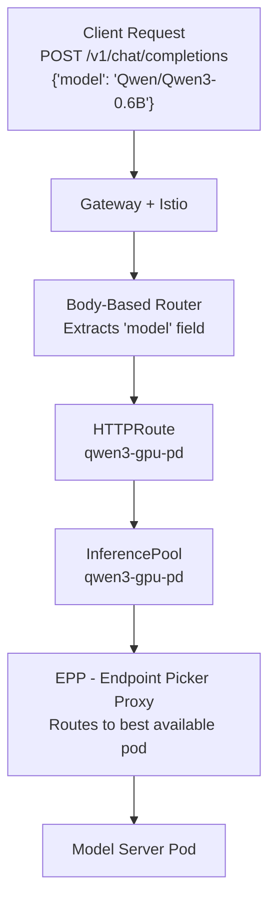
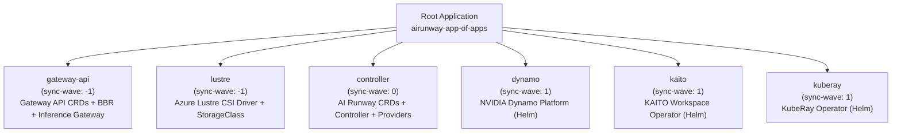

## Overview

AI Runway is an open-source accelerator that simplifies deploying LLMs on Kubernetes. By treating models as native Kubernetes resources, AI Runway offers a single interface that adapts to multiple inference backends. In this workshop, you will deploy LLMs on Azure Kubernetes Service (AKS) CPU nodes and GPU nodes, implement custom resources for scaling and networking, configure GPU and latency monitoring, and show one potential option of integrating it into CI/CD pipelines with GitOps and Argo CD.

## Prerequisites

This workshop assumes you have:

- **Foundational Kubernetes knowledge** - You're comfortable with concepts like pods, deployments, services, namespaces, and kubectl commands
- **Basic AKS familiarity** - You've worked with Azure Kubernetes Service before (provisioning, connecting, node pools)
- **A HuggingFace account** (recommended) - Required only if you want to deploy gated models (e.g., Meta Llama) but recommended to avoid throttling. You can create one at [huggingface.co/join](https://huggingface.co/join)

Everything else - GPU operators, inference engines, Gateway API, Argo CD - will be explained as you encounter it.

### Required Tools

Before you proceed with the lab environment, ensure you have the following:

| Tool                                                                 | Purpose                                          |
| -------------------------------------------------------------------- | ------------------------------------------------ |
| [Azure CLI](https://learn.microsoft.com/cli/azure/install-azure-cli) | Manage Azure resources and AKS credentials       |
| [kubectl](https://kubernetes.io/docs/tasks/tools/)                   | Interact with Kubernetes clusters                |
| [Bun](https://bun.sh)                                                | Run the AI Runway dashboard (frontend + backend) |
| [Helm](https://helm.sh/docs/intro/install/)                          | Used by the dashboard for runtime installation   |
| [jq](https://jqlang.org/)                                            | Parse JSON output from kubectl and curl          |
| [Git](https://git-scm.com/)                                          | Clone the AI Runway repository                   |
| [AI Configurator](https://example.com)                               | Optimizing NVIDIA Dynamo deployments             |

### Self-Provisioning (Outside the Lab)

You can provision the necessary infrastructure using the Terraform configuration in this repository.

Start by opening a terminal and log in to your Azure account:

```bash
az login
```

Then navigate to the Terraform directory and apply the configuration:

```bash
cd src/infra/terraform
terraform init
terraform apply
```

This creates a resource group, an AKS cluster (with CPU and GPU node pools), Azure Managed Lustre storage, and bootstraps the AI Runway application components via Argo CD. Once complete, grab the outputs and connect to the cluster:

```bash
RG_NAME=$(terraform output -raw rg_name)
AKS_NAME=$(terraform output -raw aks_name)

az aks get-credentials \
--resource-group $RG_NAME \
--name $AKS_NAME \
--overwrite
```

> [!NOTE]
> The Terraform configuration requires an Azure subscription with GPU quota (Standard_NC48ads_A100_v4). Request quota increases in advance — GPU quota approvals can take time.

**Verify the connection** — confirm you can reach the cluster:

```bash
kubectl cluster-info
```

You should see nodes listed - you'll inspect them more closely in Module 2.

---

## Module 1: Architecture & Core Concepts

**Duration:** ~10 minutes

**Objectives:**
By the end of this module, you will be able to:

- Describe AI Runway's decoupled architecture and how each component communicates
- Explain the role of the core controller, provider controllers, and the optional UI layer
- Identify the purpose of **ModelDeployment** and **InferenceProviderConfig** CRDs

Let's explore how AI Runway works under the hood.

### What is AI Runway?

AI Runway is an open-source platform that lets you deploy and manage machine learning models on Kubernetes using a single, unified interface. Instead of learning the specifics of each inference provider (KAITO, Dynamo, KubeRay, llm-d), you describe **what** you want to deploy - the model, engine, and resources - and AI Runway handles the **how**.

Think of it like a universal remote: one set of buttons (the **ModelDeployment** CRD) controls many different devices (inference providers) behind the scenes.

### Architecture Overview

AI Runway follows a **fully decoupled** design with three layers:


**Key design principles:**

| Principle                                | What it means                                                                                                         |
| ---------------------------------------- | --------------------------------------------------------------------------------------------------------------------- |
| **Core controller is minimal**           | It only validates specs, selects providers, and updates status - it never creates provider-specific resources         |
| **Provider controllers are out-of-tree** | Each provider (KAITO, Dynamo, etc.) has its own controller that can be versioned and released independently           |
| **UI is optional**                       | The platform works entirely via kubectl and CRDs. The web dashboard or Headlamp plugin are convenience layers         |
| **Two-tier reconciliation**              | Inspired by the Kubernetes Container Runtime Interface (CRI) - the core defines the interface, providers implement it |

> [!note]
> Just as the kubelet talks to containerd via the CRI interface (and doesn't care whether you use containerd or CRI-O), the AI Runway core controller talks to providers via the InferenceProviderConfig interface. Swap providers without changing your ModelDeployment specs.

### The ModelDeployment CRD

**ModelDeployment** is the primary resource you interact with. At its simplest, you describe **what model** to deploy and **what resources** it needs:

```yaml
apiVersion: airunway.ai/v1alpha1
kind: ModelDeployment
metadata:
  name: my-model
  namespace: default
spec:
  model:
    id: "Qwen/Qwen3-0.6B"
    source: huggingface
  resources:
    gpu:
      count: 1
```

That's it - just a model ID and resource requirements. The controller handles the rest: auto-selecting the best engine and provider, configuring serving mode, and creating gateway routes. You'll see additional fields like **engine**, **serving**, and **gateway** when we use them in Modules 3 and 4.

### The InferenceProviderConfig CRD

**InferenceProviderConfig** is a cluster-scoped resource that each provider controller registers at startup. Think of it as a provider's resume - it tells the core controller what it can do so the controller can match deployments to the right provider automatically.

```yaml
apiVersion: airunway.ai/v1alpha1
kind: InferenceProviderConfig
metadata:
  name: kaito
spec:
  capabilities:
    engines: [vllm, llamacpp]
    servingModes: [aggregated]
    cpuSupport: true
    gpuSupport: true
```

Each provider also declares **selectionRules** (omitted above) - [CEL expressions](https://kubernetes.io/docs/reference/using-api/cel/) that control when it should be auto-selected. You'll see the results when you deploy models in Module 3. For the full spec, see [Appendix A](#appendix-a-provider-capability-matrix--selection-rules).

### How Provider Selection Works

When you omit **spec.provider.name**, the controller auto-selects a provider based on your spec. The two rules you'll see in action during this workshop:

- **No GPU requested** → KAITO (CPU-capable, uses **llamacpp** engine)
- **GPU requested** → Dynamo (GPU-optimized, uses **vllm** engine)

The selection reason is always recorded in **status.provider.selectedReason** for full observability. You'll see this first-hand when you deploy models in Module 3.

> [!note]
> For the full provider capability matrix and complete selection algorithm (including disaggregated mode, sglang, and TRT-LLM rules), see [Appendix A](#appendix-a-provider-capability-matrix--selection-rules) at the end of this guide.

### Explore the CRDs in Your Cluster

Open a new terminal tab and run the following command to verify the CRDs are installed:

```bash
kubectl get crd | grep airunway
```

Expected output:

```text
inferenceproviderconfigs.airunway.ai                   2026-05-04T21:52:08Z
modeldeployments.airunway.ai                           2026-05-04T21:52:08Z
```

View the registered providers:

```bash
kubectl get inferenceproviderconfigs
```

Expected output:

```text
NAME      READY   VERSION                   AGE
dynamo    true    dynamo-provider:v0.2.0    1h
kaito     true    kaito-provider:v0.1.0     1h
kuberay   true    kuberay-provider:v0.1.0   1h
llmd      true    llmd-provider:v0.1.0      1h
```

> [!note]
> For this workshop, all four supported providers are installed for you to explore. When setting this up on your own cluster, you can choose which providers to install based on your needs.

#### Inspect provider capabilities

To view the full spec of an InferenceProviderConfig, including capabilities and selection rules, run:

```bash
kubectl get inferenceproviderconfig kaito -o yaml
```

Expected output:

```yaml
apiVersion: airunway.ai/v1alpha1
kind: InferenceProviderConfig
metadata:
  annotations:
    airunway.ai/documentation: https://github.com/kaito-project/airunway/tree/main/docs/providers/kaito.md
    airunway.ai/installation:
      '{"description":"Kubernetes AI Toolchain Operator for
      simplified model deployment","defaultNamespace":"kaito-workspace","helmRepos":[{"name":"kaito","url":"https://kaito-project.github.io/kaito/charts/kaito"}],"helmCharts":[{"name":"kaito-workspace","chart":"kaito/workspace","version":"0.10.0","namespace":"kaito-workspace","createNamespace":true}],"steps":[{"title":"Add
      KAITO Helm Repository","command":"helm repo add kaito https://kaito-project.github.io/kaito/charts/kaito","description":"Add
      the KAITO Helm repository."},{"title":"Update Helm Repositories","command":"helm
      repo update","description":"Update local Helm repository cache."},{"title":"Install
      KAITO Workspace Operator","command":"helm upgrade --install kaito-workspace
      kaito/workspace --version 0.10.0 -n kaito-workspace --create-namespace --set
      featureGates.disableNodeAutoProvisioning=true --set nvidiaDevicePlugin.enabled=false
      --set localCSIDriver.useLocalCSIDriver=false --set gpu-feature-discovery.gfd.enabled=false
      --set gpu-feature-discovery.nfd.master.deploy=false --set gpu-feature-discovery.nfd.worker.deploy=false
      --wait","description":"Install the KAITO workspace operator v0.10.0 with Node
      Auto-Provisioning disabled (BYO nodes mode), and sub-chart dependencies disabled."}]}'
  creationTimestamp: "2026-05-04T21:52:19Z"
  generation: 1
  name: kaito
  resourceVersion: "836003"
  uid: 503b526b-7427-483f-84fe-c8e3dc8c82af
spec:
  capabilities:
    cpuSupport: true
    engines:
      - vllm
      - llamacpp
    gpuSupport: true
    servingModes:
      - aggregated
  selectionRules:
    - condition: "!has(spec.resources.gpu) || spec.resources.gpu.count == 0"
      priority: 100
    - condition: spec.engine.type == 'llamacpp'
      priority: 100
status:
  lastHeartbeat: "2026-05-05T19:16:19Z"
  ready: true
  upstreamCRDVersion: kaito.sh/v1beta1
  version: kaito-provider:v0.1.0
```

**What you learned in this module:**

- AI Runway separates _what_ you want (**ModelDeployment**) from _how_ it's implemented (provider controllers)
- The core controller is minimal - it validates, selects a provider, and delegates. Provider controllers do the heavy lifting
- Auto-selection means you don't need to know provider internals - just describe what you want

**Next up:** Now that you understand the architecture conceptually, you'll verify these components are actually running in your cluster and explore the dashboard you'll use for deployments.

---

## Module 2: Environment Validation & UI Exploration

**Duration:** ~10 minutes

**Objectives:**
By the end of this module, you will be able to:

- Verify your AKS cluster and GPU node pool are healthy
- Launch the AI Runway web dashboard and navigate its features
- Explore the model catalog and provider settings

Now that you understand the architecture and CRDs, let's verify that all the pieces are running in your cluster, launch the dashboard, and explore its features before deploying any models.

### Verify AKS Cluster Status

Confirm your cluster connection and node pool status:

```bash
kubectl get nodes -o wide
```

You should see at least:

- 3 nodes in the **default** pool (Standard_D4d_v4 - CPU)
- 1 node in the **inference** pool (Standard_NC48ads_A100_v4 - GPU)

Check that the GPU node is ready and has GPU resources:

```bash
kubectl get node -l agentpool=inference -o yaml | yq '.items[0].status.allocatable'
```

Look for **nvidia.com/gpu** in the allocatable resources.

### Verify Pre-installed Components

Run the following commands one at a time to confirm all infrastructure is healthy.

**Check the NVIDIA GPU Operator pods:**

```bash
kubectl get pods -n gpu-operator
```

**Check the Istio control plane:**

```bash
kubectl get pods -n istio-system
```

**Check the AI Runway controller and provider controllers:**

```bash
kubectl get pods -n airunway-system
```

All pods should be **Running**.

**Check Gateway API CRDs:**

```bash
kubectl get crd | grep networking.k8s.io
```

**Check the inference gateway:**

```bash
kubectl get gateway -n istio-system
```

The gateway should show **PROGRAMMED: True** with an external IP address - note this **ADDRESS**, it's the unified endpoint you'll use for all model inference calls later.

### Launch the AI Runway Dashboard

Clone the repository and install dependencies

```bash
git clone https://github.com/kaito-project/airunway.git
cd airunway
bun install
```

Open the terminal and run the following command to run the AI Runway dashboard

```bash
bun run dev
```

This launches both the frontend dashboard and the backend API. Open [http://localhost:5173](http://localhost:5173) in your browser. You should see the AI Runway home page - keep this tab open throughout the workshop.

> [!note]
> AI Runway also offers a [Headlamp plugin](https://github.com/kaito-project/airunway/tree/main/plugins/headlamp) for teams already using Headlamp as their Kubernetes dashboard. In this workshop, we'll use the React dashboard.

### Explore the Dashboard

The dashboard has three main pages accessible from the left sidebar: **Models**, **Deployments**, and **Settings**. Take a few minutes to click through each one.

#### Models Page

This is the landing page. It shows a curated catalog of models organized by engine compatibility (vLLM, SGLang, TensorRT-LLM, Llama.cpp). You can filter by engine type using the tabs at the top, or switch to the **HuggingFace Hub** tab to search for any public model.


Each model card shows the model size, GPU memory requirements, supported engines, and a **Deploy →** button you'll use in the next module.

#### Deployments Page

Click **Deployments** in the sidebar. This page shows all active **ModelDeployment** resources in your cluster with their current status, provider, engine, and replica counts. It should be empty - you'll see it populate when you deploy your first model in Module 3.


#### Settings Page

Click **Settings** in the sidebar and skim the three tabs:

- **General** - Verify it shows **Connected** and **4 of 4** runtimes installed
- **Runtimes** - Confirm **Dynamo**, **KAITO**, **KubeRay**, and **llm-d** are all marked as installed. We'll use KAITO and Dynamo in this workshop; KubeRay and llm-d are available for you to explore on your own
- **Integrations** - Check that the GPU Operator, Gateway API (with the gateway endpoint address), and HuggingFace Token sections are visible

> [!note]
> The Runtimes tab also includes a Prerequisites section that checks whether tools like Helm CLI are available — these are needed when AI Runway installs components into your cluster. There's also a Cluster Autoscaling section that shows whether your cluster is optimally configured for hosting LLMs at scale, including cluster autoscaler enablement and GPU node pool availability.


You'll revisit these tabs as we use each feature in later modules.

### (Recommended) Connect HuggingFace

Some models (e.g., Meta Llama) require accepting a license on HuggingFace before downloading. In the **Settings** page, click the **Integrations** tab, then click **Connect HuggingFace** and follow the OAuth flow. Once connected, you'll see your HuggingFace username and a **Connected** badge.


> [!help] Even if you don't plan to use gated models, connecting HuggingFace can improve download speeds — unauthenticated users are more likely to be rate-limited.

**What you learned in this module:**

- Your cluster has CPU and GPU node pools, with the GPU Operator, Istio, Gateway API, and all AI Runway components pre-installed
- The dashboard provides a visual layer over the same Kubernetes resources you can access via **kubectl**
- Four runtimes are available (KAITO, Dynamo, KubeRay, llm-d) — we'll use KAITO and Dynamo in this workshop
- All cluster components were bootstrapped using Argo CD and GitOps — you'll explore how that works in Module 5

**Next up:** With everything verified and the dashboard open, you'll deploy your first model and see auto-selection in action.

---

## Module 3: Core Deployment & Validation

**Duration:** ~10 minutes

**Objectives:**
By the end of this module, you will be able to:

- Deploy a model to CPU using KAITO with the **llamacpp** engine
- Deploy a model to GPU using Dynamo with the **vllm** engine
- Validate deployments using status conditions, logs, and OpenAI-compatible endpoints
- Observe how the Gateway automatically creates routing resources

Your cluster is healthy and the dashboard is running - time to deploy your first models.

> [!alert] Model deployments take several minutes to become ready while container images pull and the model loads into memory. Use the wait time to read the explanations and inspect status conditions in the terminal.

### Deploy a Small Model to CPU via the Dashboard

Instead of writing YAML by hand, use the AI Runway dashboard to deploy your first model. This lets you see all the options visually and understand what each field controls.

#### Find the Model

In the dashboard, navigate to the **Models** page and search for **Gemma 2 2B (GGUF)**. Click **Deploy** to open the deployment form.


#### Configure the Deployment

In the deployment form, make sure the following are set:

- **Runtime**: KAITO
- **Compute Type**: CPU
- **Resource Type**: Workspace


You can click the **Manifest Preview** tab to expand and see the generated YAML manifest based on your selections. This is what will be applied to the cluster when you click Deploy.

You can also click the **Estimated Cost** tab to see an estimate of the hourly cost of running this model based on the resources it will consume.

Click **Deploy Model**.

> [!knowledge] Notice you selected a provider. The UI will be more deliberate with the provider selection but you don't really need to be.
> You could have also deployed a model using the following manifest
>
> ```yaml
> apiVersion: airunway.ai/v1alpha1
> kind: ModelDeployment
> metadata:
>   name: gemma2-2b-cpu
> spec:
>   image: ghcr.io/kaito-project/aikit/gemma2:2b
>   model:
>     id: gemma2:2b
>     source: huggingface
>   serving:
>     mode: aggregated
>   resources:
>     cpu: "1"
> ```
>
> The core controller validates it, auto-selects engine=llamacpp and provider=kaito, and the KAITO provider creates the inference pod.

### Watch It Come to Life

Switch to the **Deployments** page in the dashboard. You'll see **gemma2-2b-** appear with its status updating in real time:


Now look behind the curtain - in your terminal, check the Kubernetes resources that were created:

```bash
kubectl get modeldeployment -n kaito-workspace -o yaml | yq '.items[0].status'
```

You should see conditions like:

```yaml
conditions:
  - lastTransitionTime: "2026-05-06T14:52:27Z"
    message: Engine llamacpp auto-selected from provider kaito
    observedGeneration: 1
    reason: AutoSelected
    status: "True"
    type: EngineSelected
  - lastTransitionTime: "2026-05-06T14:52:27Z"
    message: Schema validation passed
    observedGeneration: 2
    reason: ValidationPassed
    status: "True"
    type: Validated
  - lastTransitionTime: "2026-05-06T14:52:27Z"
    message: Provider kaito auto-selected
    observedGeneration: 1
    reason: AutoSelected
    status: "True"
    type: ProviderSelected
  - lastTransitionTime: "2026-05-06T14:52:27Z"
    message: Configuration compatible with KAITO
    observedGeneration: 2
    reason: CompatibilityVerified
    status: "True"
    type: ProviderCompatible
  - lastTransitionTime: "2026-05-06T14:52:27Z"
    message: Workspace created successfully
    observedGeneration: 2
    reason: ResourceCreated
    status: "True"
    type: ResourceCreated
  - lastTransitionTime: "2026-05-06T14:52:58Z"
    message: All replicas are ready
    observedGeneration: 2
    reason: DeploymentReady
    status: "True"
    type: Ready
  - lastTransitionTime: "2026-05-06T15:25:18Z"
    message: InferencePool and HTTPRoute created
    observedGeneration: 2
    reason: GatewayConfigured
    status: "True"
    type: GatewayReady
endpoint:
  port: 80
  service: gemma2-2b-cpu
engine:
  selectedReason: auto-selected from provider kaito capabilities
  type: llamacpp
gateway:
  endpoint: 74.163.119.23
  gatewayNamespace: istio-system
  modelName: gemma-2-2b-instruct
message: Workspace created, waiting for pods to be ready
observedGeneration: 2
phase: Running
provider:
  name: kaito
  resourceKind: Workspace
  resourceName: gemma2-2b-cpu
  selectedReason: "matched capabilities: engine=llamacpp, gpu=false, mode=aggregated"
replicas:
  available: 1
  desired: 1
  ready: 1
```

> [!hint] You can read the **status** and **status.conditions** like a book - it tells the story of the deployment lifecycle, from validation to provider selection to resource creation and finally readiness. The last condition shows that the gateway resources were created successfully. So if you ever wonder why your model isn't serving traffic, the conditions are the first place to check for clues.

### Verify Gateway Resources Were Auto-Created

Back in the dashboard, click on the deployment that starts with **gemma2-2b-** to see its detail view. Notice the **Access Model** section showing the auto-created routing resources:


When Gateway API CRDs are detected, AI Runway automatically creates three resources to route traffic from the gateway to your model pods:

- An **InferencePool** - selects your model's pods using a label selector and points to the EPP for intelligent routing decisions
- An **HTTPRoute** - tells the Gateway which requests belong to this model and where to send them
- An **EPP (Endpoint Picker Proxy)** - a sidecar deployment that makes per-request routing decisions (e.g., KV-cache affinity) before forwarding to a model pod

Inspect each one:

```bash
# Check the InferencePool
kubectl describe inferencepool -n kaito-workspace
```

Expected output (key fields):

```text
Spec:
  Selector:
    Match Labels:
      airunway.ai/model-deployment: gemma2-2b-<suffix>  # selects your model pods
  Endpoint Picker Ref:
    Name: gemma2-2b-<suffix>-epp                        # delegates routing to the EPP
    Port: 9002
  Target Ports:
    Number: 5000                                         # the port your model server listens on
Status:
  Parents:
    Conditions:
      Type: Accepted   Status: True    # the Gateway accepted this pool
      Type: ResolvedRefs Status: True  # the EPP service reference resolved successfully
    Parent Ref:
      Kind: Gateway
      Name: inference-gateway          # attached to the shared inference gateway
```

Two `Status.Conditions` with `Status: True` confirm the pool is wired up correctly: the Gateway accepted it, and the EPP reference resolved. If either were `False`, traffic wouldn't reach your model pods.

```bash
# Check the HTTPRoute
kubectl describe httproute -n kaito-workspace
```

Expected output (key fields):

```text
Spec:
  Parent Refs:
    Name: inference-gateway            # attached to the same shared gateway
    Namespace: istio-system
  Rules:
    Matches:
      Headers:
        Name: X-Gateway-Model-Name
        Value: gemma-2-2b-instruct     # routes requests for this model name
    Backend Refs:
      Kind: InferencePool
      Name: gemma2-2b-<suffix>         # forwards to the InferencePool above
    Timeouts:
      Request: 300s                    # generous timeout for long LLM generations
Status:
  Parents:
    Conditions:
      Type: Accepted   Status: True    # route is valid
      Type: ResolvedRefs Status: True  # InferencePool reference resolved
    Controller Name: istio.io/gateway-controller
```

The HTTPRoute matches on the `X-Gateway-Model-Name` header (set by the Body-Based Router from the `model` field in your request JSON) and forwards to the InferencePool. Both conditions `True` means traffic can flow end-to-end.

```bash
# Check the EPP deployment
EPP_NAME=$(kubectl get deploy -n kaito-workspace | grep epp | awk '{print $1}')
kubectl describe deployment -n kaito-workspace $EPP_NAME
```

Expected output (key fields):

```text
Replicas: 1 desired | 1 updated | 1 total | 1 available | 0 unavailable
Containers:
  epp:
    Image: registry.k8s.io/gateway-api-inference-extension/epp:v1.3.1
    Args:
      --pool-name gemma2-2b-<suffix>   # watches this specific InferencePool
      --pool-namespace kaito-workspace
    Liveness/Readiness: grpc :9003     # health checks via gRPC
Conditions:
  Available: True                      # EPP is healthy and ready to route
```

The EPP is a standard Kubernetes Deployment managed by AI Runway (note `app.kubernetes.io/managed-by=airunway` in the labels). It runs a single replica, watches the InferencePool for pod membership changes, and makes routing decisions over gRPC on port 9002 before the gateway forwards requests to model pods on port 5000.

### Test the OpenAI-compatible endpoint

Once the deployment shows **PHASE=Running** and the Gateway Endpoint is available, copy the **Example Request** and run it in your terminal to test it via the Gateway.


The Body-Based Router (BBR) in the gateway reads the **model** field from the request body and routes to the correct InferencePool - this is how multiple models share a single gateway endpoint.

You can also test directly via the model's service (bypassing the gateway):

```bash
# Get the deployment name and service from the ModelDeployment status
MD_NAME=$(kubectl get modeldeployment -n kaito-workspace -o jsonpath='{.items[0].metadata.name}')
SVC_NAME=$(kubectl get modeldeployment $MD_NAME -n kaito-workspace -o jsonpath='{.status.endpoint.service}')

# Port-forward to the model service
kubectl port-forward -n kaito-workspace svc/$SVC_NAME 8080:80 &

# Test the model directly via the service endpoint
curl -s http://localhost:8080/v1/chat/completions \
  -H "Content-Type: application/json" \
  -d '{
    "model": "gemma-2-2b-instruct",
    "messages": [{"role": "user", "content": "When does model serving on Kubernetes make sense?"}],
    "max_tokens": 100
  }' | jq

# Stop the port-forward
kill %1
```

### Deploy a GPU Model (Autoselect Provider & Engine)

Now deploy a GPU model - this time using **kubectl** directly, so you can see how the same result is achieved with YAML. The expectation is that the controller will auto-select Dynamo and vLLM (see [Appendix A](#appendix-a-provider-capability-matrix--selection-rules) for selection rules).

```bash
kubectl apply -f - <<EOF
apiVersion: airunway.ai/v1alpha1
kind: ModelDeployment
metadata:
  name: qwen3-gpu
spec:
  model:
    id: "Qwen/Qwen3-0.6B"
    source: huggingface
  serving:
    mode: aggregated
  scaling:
    replicas: 1
  resources:
    gpu:
      count: 1
EOF
```

Switch to the dashboard's **Deployments** page - you'll see **qwen3-gpu** appear, progressing through the same lifecycle phases:


While you wait for the deployment to become ready, inspect the status in the terminal:

```bash
kubectl get modeldeployment qwen3-gpu -o yaml | yq '.status'
```

When you see the **GatewayReady** showing a status of **True**, head back to the dashboard and click on the **qwen3-gpu** deployment to see its details.

Copy the example request and test the GPU model via the gateway endpoint - notice the faster response time due to GPU acceleration.

### Explore the Resource Ownership Chain

When you create a **ModelDeployment**, the core controller and provider controller each create child resources — and Kubernetes **owner references** link them all together. This is how cascading cleanup works: delete the ModelDeployment, and everything it owns gets garbage-collected automatically.

Let's trace what **qwen3-gpu** created, starting from the ModelDeployment status.

**Discover what the provider created — the ModelDeployment status tells you the resource kind and name:**

```bash
kubectl get modeldeployment qwen3-gpu -o yaml | yq '.status.provider'
```

Expected output:

```yaml
name: dynamo
resourceKind: DynamoGraphDeployment
resourceName: qwen3-gpu
selectedReason: "matched capabilities: engine=vllm, gpu=true, mode=aggregated"
```

You didn't need to know about DynamoGraphDeployments — the status tells you exactly what the provider controller created on your behalf.

Verify that resource exists and is owned by the **ModelDeployment**:

```bash
kubectl get dynamographdeployment qwen3-gpu -o yaml | yq '.metadata.ownerReferences'
```

Check the downstream pods and confirm they have been scheduled on GPU nodes.

```bash
kubectl get po -o wide
```

The pods also have owner references:

```bash
kubectl get po -o yaml | yq '.items[].metadata.ownerReferences'
```

Once the pods are running, check the gateway resources the core controller created — **InferencePool**:

```bash
kubectl get inferencepool qwen3-gpu -o yaml | yq '.metadata.ownerReferences'
```

And the **HTTPRoute**:

```bash
kubectl get httproute qwen3-gpu -o yaml | yq '.metadata.ownerReferences'
```

Each of these should show an owner reference pointing back to the **ModelDeployment**:

```yaml
- apiVersion: airunway.ai/v1alpha1
  blockOwnerDeletion: true
  controller: true
  kind: ModelDeployment
  name: qwen3-gpu
  uid: <some-uuid>
```

This demonstrates the two-tier architecture in action: the **core controller** creates gateway resources (InferencePool, HTTPRoute, EPP) while the **provider controller** creates the inference resources (DynamoGraphDeployment, which in turn creates the pods and services). Both set owner references back to the ModelDeployment, so deleting it triggers a full cascading cleanup.

### Clean Up the GPU Deployment

Delete the GPU deployment to free resources for the next module:

```bash
kubectl delete modeldeployment qwen3-gpu
```

Refresh the **Deployments** page in the dashboard - **qwen3-gpu** disappears. Behind the scenes, Kubernetes **owner references** automatically garbage-collected the provider resource (DynamoGraphDeployment) and all gateway resources (InferencePool, HTTPRoute, EPP).

**What you learned in this module:**

- Deploying from the dashboard and **kubectl** produce identical **ModelDeployment** resources
- The controller auto-selects provider and engine based on your spec (no GPU → KAITO + llamacpp; GPU → Dynamo + vLLM)
- Gateway resources (InferencePool, HTTPRoute, EPP) are auto-created and auto-cleaned via owner references
- The core controller and provider controllers use server-side apply to own separate parts of the status

**Next up:** You've seen the basics work - now you'll unlock production patterns like disaggregated serving for independent scaling, model caching for fast cold starts, and multi-model gateway routing.

---

## Module 4: Advanced Inference Patterns

**Duration:** ~20 minutes

**Objectives:**
By the end of this module, you will be able to:

- Configure disaggregated prefill/decode scaling with Dynamo
- Set up model caching with Azure Managed Lustre for fast cold starts (avoid downloading large models multiple times)
- Validate body-based routing across multiple models through a single gateway
- Understand KV-cache routing for optimized token generation

You've seen how easy it is to deploy models with basic settings. Now let's unlock more powerful patterns - disaggregated serving for independent scaling and high-throughput model caching for faster cold starts.

### Understanding Disaggregated Prefill/Decode

In standard (aggregated) LLM inference, a single GPU handles both:

- **Prefill** - processing the input prompt (compute-intensive, parallelizable)
- **Decode** - generating output tokens one at a time (memory-bandwidth-intensive, sequential)

**Disaggregated serving** separates these into independent scaling groups:


!IMAGE[2sq4acxe.png](instructions342912/2sq4acxe.png)

**Why disaggregate?**

- **Independent scaling** - Scale prefill and decode workers separately based on workload
- **Better GPU utilization** - Prefill workers can use larger GPUs; decode workers benefit from more memory bandwidth
- **Lower latency** - Decode workers aren't blocked by long prompt processing
- **KV-cache routing** - Route decode requests to workers that already have the conversation's KV cache in memory

### Verify Pre-provisioned Model Cache

Large models can take significant time to download from HuggingFace on first deployment. Your lab environment has an Azure Managed Lustre filesystem with a StorageClass and PVC pre-provisioned to solve this.

Verify the StorageClass is available:

```bash
kubectl get sc azurelustre-static
```

Verify the CSI driver pods for Azure Lustre are running:

```bash
kubectl get po -n kube-system -l app=csi-azurelustre-controller
kubectl get po -n kube-system -l app=csi-azurelustre-node
```

> [!knowledge] The Lustre CSI driver runs a controller on the master node and a daemonset on all nodes to manage volume attachments. This allows any pod in the cluster to mount the Lustre filesystem, which is ideal for sharing large model weights across multiple inference pods. See the [Use Azure Lustre CSI driver for Kubernetes](https://learn.microsoft.com/azure/azure-managed-lustre/use-csi-driver-kubernetes) documentation for more details.

Finally, check the PVC that will be used as the model cache:

```bash
kubectl get pvc -n dynamo-system dynamo-pvc
```

You should see a **Bound** PVC with **RWX** access mode - this means it can be mounted by multiple pods simultaneously. This Azure Managed Lustre backing this PVC delivers up to 500 MB/s per TiB of throughput, which means:

- Multiple pods across nodes read the same cached model simultaneously
- Cold starts are near-instant after the first download
- No redundant downloads when scaling replicas

### Deploy with Disaggregated Serving and Model Caching

Let's deploy a [Qwen/Qwen3-Coder-30B-A3B-Instruct](https://huggingface.co/Qwen/Qwen3-Coder-30B-A3B-Instruct) model from HuggingFace using Dynamo with disaggregated prefill/decode and Lustre-backed model caching.

```bash
kubectl apply -f - <<EOF
apiVersion: airunway.ai/v1alpha1
kind: ModelDeployment
metadata:
  name: qwen3-coder-30b
  namespace: dynamo-system
spec:
  model:
    id: Qwen/Qwen3-Coder-30B-A3B-Instruct
    source: huggingface
    storage:
      volumes:
        - name: model-cache
          claimName: dynamo-pvc
          purpose: modelCache
  provider:
    name: dynamo
  engine:
    type: vllm
    contextLength: 131072
    args:
      dyn-tool-call-parser: "qwen3_coder"
  serving:
    mode: disaggregated
  scaling:
    prefill:
      replicas: 1
      gpu:
        count: 1
    decode:
      replicas: 1
      gpu:
        count: 1
EOF
```

The disaggregated deployment creates 2 pods (1 prefill + 1 decode) and may take 3-5 minutes. While you wait, run the following command to inspect the different pods created by this deployment:

```bash
watch kubectl get pods -n dynamo-system
```

This deployment can take a bit longer to become ready due to the larger model size and the initial download time. While you wait, let's break down the manifest and understand what each section does, especially the new fields related to disaggregation and model caching.

This model deployment manifest includes several advanced configurations:

- **model.storage.volumes** - This section defines a volume that uses the pre-provisioned Azure Managed Lustre PVC (`dynamo-pvc`) for model caching. By specifying `purpose: modelCache`, you're telling the provider to use this volume for storing downloaded model weights. This allows multiple pods to share the same cache, significantly reducing cold start times when scaling replicas.
- **serving.mode: disaggregated** - This tells the controller that the prefill and decode components should be deployed separately, allowing for independent scaling and optimized resource allocation.
- **provider.name: dynamo** - This explicitly selects the Dynamo provider, which supports disaggregated serving and has built-in optimizations for tool call parsing and reasoning with vLLM.
- **engine.type: vllm** - This selects the vLLM engine, which is optimized for high-performance LLM inference and supports features like KV-cache routing.
- **engine.contextLength: 131072** - This configures vLLM to use a larger context length, which is beneficial for models that can take advantage of it. The optimal context length depends on the model architecture and your specific workload, so refer to the engine documentation for guidance on tuning this parameter.
- **engine.args** - This passes arguments to the downstream engine for further customization/optimization. In this case, `dyn-tool-call-parser: "qwen3_coder"` configures vLLM to use a tool call parser so that the model can make use of tools effectively. Different models may have different optimal settings here, and different engines will have different flag names so refer to the documentation for details. With Dynamo, you can pass [tool calling](https://docs.nvidia.com/dynamo/user-guides/tool-calling) and [reasoning](https://docs.nvidia.com/dynamo/user-guides/reasoning) related flags to optimize for specific workloads.
- **scaling.prefill** and **scaling.decode** - These sections configure the number of replicas and GPU resources for the prefill and decode components independently. In this example, both are set to 1 replica with 1 GPU each, but in a production scenario, you might have more decode workers than prefill since decoding is often the bottleneck.

> [!hint] To keep cost manageable in the lab environment, we're using 1 GPU for prefill and 1 GPU for decode. In production, you might have more decode workers than prefill since decoding is often the bottleneck.

Watch the deployment progress in the dashboard - the **Deployments** page now shows **qwen3-coder-30b** with separate prefill and decode component status:


Once you see the model deployment status is **Running** and the Gateway endpoint is available, test the model via the gateway - you should see similar response times to the previous GPU deployment, but now with the benefits of disaggregation and caching.

### Test Body-Based Routing

The Body-Based Router (BBR) extracts the **model** field from the JSON request body and routes to the correct InferencePool. Test with both models deployed (gemma-cpu and qwen3-gpu-pd) using the same gateway endpoint:

```bash
GATEWAY_IP=$(kubectl get gateway inference-gateway -o jsonpath='{.status.addresses[0].value}')

# Route to the CPU model (gemma)
curl -s http://$GATEWAY_IP/v1/chat/completions \
  -H "Content-Type: application/json" \
  -d '{
    "model": "gemma-2-2b-instruct",
    "messages": [{"role": "user", "content": "Say hello"}],
    "max_tokens": 50
  }' | jq

# Route to the GPU model (qwen3 disaggregated)
curl -s http://$GATEWAY_IP/v1/chat/completions \
  -H "Content-Type: application/json" \
  -d '{
    "model": "Qwen/Qwen3-0.6B",
    "messages": [{"role": "user", "content": "Say hello"}],
    "max_tokens": 50
  }' | jq
```

Both requests hit the **same gateway IP** - the BBR component routes them to different InferencePools based on the **model** field. This is the Gateway API Inference Extension in action.

### How Gateway Routing Works



**What you learned in this module:**

- Disaggregated serving separates prefill (compute-heavy) and decode (memory-heavy) into independently scalable components
- Azure Managed Lustre provides high-throughput shared model caching - no redundant downloads when scaling
- Body-based routing lets multiple models share a single gateway endpoint, with the **model** field in the request body determining which InferencePool receives the request
- KV-cache routing optimizes decode performance by routing requests to workers that already hold the relevant cache

**Next up:** You'll put these models to practical use - connecting developer tools for private inference, reviewing production metrics, and seeing how GitOps patterns bring this all to production.

---

## Module 5: Real-World Integration & Cleanup

**Duration:** ~20 minutes

**Objectives:**
By the end of this module, you will be able to:

- Configure VS Code Insiders, GitHub Copilot in the terminal, or any OpenAI-compatible client to use your self-hosted models
- Review Prometheus metrics and deployment logs for GPU utilization and latency
- Understand how GitOps patterns enable production platform engineering for AI inference
- Clean up all resources and describe next steps for production adoption

With advanced inference patterns running in your cluster, let's put them to practical use - connecting developer tools to your self-hosted models, reviewing production observability, and seeing how this all scales to production with GitOps.

### Integrate with Developer Tooling

One of the most powerful use cases for self-hosted LLMs is providing **private, low-latency inference** for developer tools. This addresses real-world scenarios where:

- External model access is blocked by geographic or organizational policies
- API quota limits are reached or plans change
- Data sovereignty requires models to run within your own infrastructure
- You need predictable latency without internet round-trips

Since AI Runway exposes **OpenAI-compatible endpoints**, any tool that supports custom OpenAI API endpoints can use your self-hosted models.

#### Option A: GitHub Copilot in the Terminal

If you are comfortable working from the terminal, configure GitHub Copilot CLI to use your self-hosted model as an alternative endpoint:

```bash
GATEWAY_IP=$(kubectl get gateway inference-gateway -o jsonpath='{.status.addresses[0].value}')

export COPILOT_PROVIDER_BASE_URL=http://$GATEWAY_IP/v1
export COPILOT_PROVIDER_TYPE=openai
export COPILOT_MODEL=Qwen/Qwen3-0.6B
```

Then use Copilot with your local model:

```bash
copilot
```

In the Copilot startup output, you should see it detected your custom provider with the following message:

```text
! Model "Qwen/Qwen3-0.6B" is not in the built-in catalog.
```

This routes Copilot completions through your AKS-hosted model instead of the public API - same quality, but private and within your network.

#### Option B: Configure VS Code Insiders

If you are more comfortable working in a graphical interface, open VS Code Insiders, open the **Command Pallette** (Ctrl+Shift+P), and search for **Chat: Open Language Models (JSON)**. This opens the settings page where you can add your custom model configuration:


Add the following JSON, replacing the model name and gateway URL as needed:

```json
[
  {
    "name": "OpenAI Compatible",
    "vendor": "customoai",
    "models": [
      {
        "name": "Qwen3-0.6B",
        "modelId": "Qwen/Qwen3-0.6B",
        "baseUrl": "http://<GATEWAY_IP>/v1",
        "apiKey": "none",
        "toolCalling": true,
        "vision": false
      }
    ]
  }
]
```

Replace **<GATEWAY_IP>** with your gateway's external IP:

```bash
echo "Gateway IP: $(kubectl get gateway inference-gateway -o jsonpath='{.status.addresses[0].value}')"
```

Save the file and restart VS Code Insiders.

Click the Copilot icon in the editor to toggle open the Copilot pane.


Click on the model selector and select **Other Models** to expand the options. You should see your custom model (Qwen3-0.6B) listed under the **OpenAI Compatible** provider. Select it.


Now you can use Copilot in VS Code Insiders, and all completions will be served by your self-hosted model running in AKS instead of the public API.

### Review Prometheus Metrics

AI Runway exposes Prometheus metrics for observability. The controller and inference engines provide:

**Controller metrics:**

| Metric                                   | Description                                 |
| ---------------------------------------- | ------------------------------------------- |
| airunway_modeldeployment_total           | Count of deployments by namespace and phase |
| airunway_reconciliation_duration_seconds | Reconciliation latency by provider          |
| airunway_reconciliation_errors_total     | Error count by provider and error type      |
| airunway_provider_selection              | Provider selection events with reasons      |

**Inference engine metrics (vLLM):**

| Metric                                    | Description                     |
| ----------------------------------------- | ------------------------------- |
| vllm:num_requests_running                 | Currently processing requests   |
| vllm:num_requests_waiting                 | Queued requests                 |
| vllm:gpu_cache_usage_perc                 | KV-cache GPU memory utilization |
| vllm:avg_generation_throughput_toks_per_s | Token generation throughput     |
| vllm:e2e_request_latency_seconds          | End-to-end request latency      |

Access Grafana to view pre-built dashboards:

```bash
# Get Grafana admin password
kubectl get secret --namespace prometheus -l app.kubernetes.io/component=admin-secret -o jsonpath="{.items[0].data.admin-password}" | base64 --decode ; echo

# Port-forward Grafana
kubectl port-forward svc/prometheus-grafana -n prometheus 3000:80 &
```

Navigate to the **AI Runway** dashboard to see:

- GPU utilization per model
- Request latency (p50, p95, p99)
- Token throughput
- Queue depth and scaling events


### From Prototype to Production

Here's the key insight: everything you've deployed in this workshop is **declarative Kubernetes YAML**. **ModelDeployment** resources are no different from any other Kubernetes manifest - which means you can build platform engineering capabilities around them using the same tools your team already knows.

The pattern is straightforward:

1. Store **ModelDeployment** YAMLs in a Git repository alongside your application code
2. Use a GitOps tool like Argo CD to continuously reconcile them against your cluster
3. Get pull-request-based review, rollback, and audit trails - for free

**This is exactly how this lab was built.** The AKS cluster and Azure Managed Lustre storage were provisioned with Terraform, and every component running in the cluster - the AI Runway controller, provider controllers, Gateway API, GPU Operator - was deployed via Argo CD using the **App of Apps** pattern with sync waves to control ordering.

Verify for yourself:

```bash
kubectl get applications -n argocd -o custom-columns=NAME:.metadata.name,SYNC:.status.sync.status,HEALTH:.status.health.status
```

All applications should show **Synced** and **Healthy**. In production, you'd commit your **ModelDeployment** manifests to the same repo - Argo CD continuously reconciles them, and your AI inference platform becomes as manageable as any other Kubernetes workload.

> [!hint] See [Appendix B](#appendix-b-argocd-app-of-apps-deep-dive) for the complete App of Apps pattern, sync wave ordering, and root Application YAML.

### Clean Up All Deployments

Before wrapping up, delete all remaining **ModelDeployment** resources. This triggers automatic cleanup of all provider resources, gateway resources (InferencePool, HTTPRoute, EPP), and pods via Kubernetes owner references:

```bash
kubectl delete modeldeployment --all
```

Verify everything is cleaned up:

```bash
# No ModelDeployments should remain
kubectl get modeldeployment

# InferencePools and HTTPRoutes should also be gone
kubectl get inferencepool
kubectl get httproute
```

Refresh the **Deployments** page in the dashboard - it should be empty. This demonstrates how Kubernetes owner references provide automatic, cascading cleanup - you only need to delete the top-level resource.

### Where to Go from Here

You've covered the core workflow end-to-end. Here are paths to explore next:

- **Custom provider shims** - Write your own provider controller to integrate a new inference backend. The **InferenceProviderConfig** CRD is the contract your provider needs to implement. See the [provider documentation](https://github.com/kaito-project/airunway/tree/main/providers) for examples.
- **Production hardening** - Add network policies, Pod Security Standards, resource quotas, and RBAC scoping for multi-tenant clusters. The controller already supports namespace-scoped deployments.
- **GitOps with Argo CD** - Store **ModelDeployment** manifests in Git and let Argo CD continuously reconcile them. Use sync waves to control rollout ordering (infrastructure → models → canary configs).
- **Headlamp plugin** - Try the [Headlamp dashboard plugin](https://github.com/kaito-project/airunway/tree/main/plugins/headlamp) if your team uses Headlamp for Kubernetes management.

### What You Learned

In this workshop, you:

1. **Understood** AI Runway's decoupled architecture - core controller + out-of-tree providers + optional UI
2. **Explored** the **ModelDeployment** and **InferenceProviderConfig** CRDs and provider auto-selection
3. **Deployed** models to both CPU (KAITO + llama.cpp) and GPU (Dynamo + vLLM) with zero provider-specific configuration
4. **Configured** advanced patterns - disaggregated prefill/decode, KV-cache routing, and Lustre-backed model caching
5. **Validated** Gateway API Inference Extension with body-based routing across multiple models through a single endpoint
6. **Integrated** self-hosted models with developer tooling (VS Code, Copilot CLI, OpenAI SDK) for private, low-latency inference
7. **Monitored** deployments with Prometheus metrics and Kubernetes events
8. **Connected the dots** from prototype to production - declarative CRDs, Git-committed manifests, and GitOps with Argo CD and Terraform for full platform engineering

### Additional Resources

- [AI Runway GitHub Repository](https://github.com/kaito-project/airunway)
- [KAITO Project (CNCF Sandbox)](https://github.com/kaito-project/kaito)
- [Gateway API Inference Extension](https://gateway-api-inference-extension.sigs.k8s.io/)
- [Deploy AI models on AKS with KAITO](https://learn.microsoft.com/azure/aks/ai-toolchain-operator)
- [Use GPU-based workloads on AKS](https://learn.microsoft.com/azure/architecture/reference-architectures/containers/aks-gpu/gpu-aks)
- [Azure Managed Lustre CSI Driver](https://learn.microsoft.com/azure/azure-managed-lustre/use-csi-driver-kubernetes)
- [Argo CD Documentation](https://argo-cd.readthedocs.io/en/stable/)

---

## Appendix A: Provider Capability Matrix & Selection Rules

This reference covers the full provider capability matrix and auto-selection algorithm. During the workshop, we focused on the two most common rules (no GPU → KAITO, GPU → Dynamo). Here's the complete picture.

### Provider Capability Matrix

| Capability                   | KAITO   | Dynamo            | KubeRay       | llm-d         |
| ---------------------------- | ------- | ----------------- | ------------- | ------------- |
| CPU inference                | Yes     | No                | No            | No            |
| GPU inference                | Yes     | **Yes**           | Yes           | Yes           |
| vLLM engine                  | Yes     | **Yes**           | Yes           | Yes           |
| sglang engine                | No      | **Yes**           | No            | No            |
| TRT-LLM engine               | No      | **Yes**           | No            | No            |
| llama.cpp engine             | **Yes** | No                | No            | No            |
| Disaggregated prefill/decode | No      | **Yes**           | Yes           | Yes           |
| Auto-selection               | Yes     | Yes (default GPU) | No (explicit) | No (explicit) |

### Complete Auto-Selection Algorithm

When you omit **spec.provider.name**, the controller evaluates these rules in order:

1. **No GPU requested** → KAITO (only CPU-capable provider), engine auto-selected to **llamacpp**
2. **Engine is trtllm or sglang** → Dynamo (only provider supporting these)
3. **Engine is llamacpp** → KAITO (only llamacpp provider)
4. **Disaggregated mode** → Dynamo (best disaggregated support)
5. **Default (GPU + vllm + aggregated)** → Dynamo (GPU inference default)

The selection reason is always recorded in **status.provider.selectedReason** for full observability.

---

## Appendix B: Argo CD App of Apps Deep Dive

This appendix explains the GitOps pattern used to bootstrap this lab environment. The same approach works for production AI inference platforms.

### The App of Apps Pattern

Instead of deploying each component individually, a single "root" Argo CD Application points to a directory of child Application manifests. Argo CD discovers and syncs all of them automatically:



### Root Application

The root Application just points Argo CD at a directory of child manifests:

```yaml
apiVersion: argoproj.io/v1alpha1
kind: Application
metadata:
  name: airunway-app-of-apps
  namespace: argocd
spec:
  project: default
  source:
    repoURL: https://github.com/pauldotyu/Build26-LAB510.git
    targetRevision: HEAD
    path: src/manifests/argocd/apps # Directory of child Application YAMLs
  destination:
    server: https://kubernetes.default.svc
    namespace: argocd
  syncPolicy:
    automated:
      prune: true
      selfHeal: true
```

### Sync Waves Control Ordering

Argo CD **sync waves** ensure components deploy in the right order:

| Wave   | Components                                           | Why first?                                                  |
| ------ | ---------------------------------------------------- | ----------------------------------------------------------- |
| **-1** | Gateway API CRDs, Lustre CSI driver, StorageClass    | CRDs and storage must exist before anything references them |
| **0**  | AI Runway controller + CRDs + provider registrations | The controller must be running before providers register    |
| **1**  | Dynamo, KAITO, KubeRay operators                     | Provider operators depend on AI Runway CRDs being available |

This means you can bootstrap an entire AI inference platform on a fresh cluster by applying a single manifest:

```bash
kubectl apply -f app-of-apps.yaml
```

Argo CD takes care of the rest - installing CRDs first, then the controller, then the provider operators - all in the correct order.

Each child Application can pull from a different source type - plain YAML in a Git repo for custom manifests, or upstream Helm charts for third-party operators like Dynamo, KAITO, and KubeRay. Argo CD unifies them into a single reconciliation loop.

---

## Appendix C: Troubleshooting Tips

### No Gateway Endpoint?

If your deployment is running but the Gateway Endpoint isn't showing up, the gateway resources (InferencePool, HTTPRoute) may have failed to create. You can check the Argo CD application status and health to confirm.

Retrieve Argo CD password and port-forward to the Argo CD API server:

```bash
ARGOCD_PWD=$(kubectl -n argocd get secret argocd-initial-admin-secret -o jsonpath="{.data.password}" | base64 -d)
kubectl port-forward svc/argo-cd-argocd-server -n argocd 9000:80 &
```

Log in to the Argo CD dashboard:

```bash
argocd login localhost:9000 --username admin --password "$ARGOCD_PWD" --insecure
```

> [!hint] You can also open a web browser and navigate to http://localhost:9000 to access the Argo CD dashboard with the same credentials.

Check the gateway-api application:

```bash
argocd app get gateway-api
```

If it's not Synced and Healthy, check the application events for errors:

```bash
argocd app sync gateway-api --prune
```

Run the following command to confirm the app is healthy and synced:

```bash
argocd app get gateway-api
```

If you have a model that needs to be updated with a gateway endpoint, you can run the following command:

```bash
kubectl patch modeldeployment gemma2-2b-cpu \
--type='merge' \
-p '{"spec":{"gateway":{"enabled":true}}}'
```
