## Overview

AI Runway is an open-source accelerator that simplifies deploying LLMs on Kubernetes. By treating models as native Kubernetes resources, AI Runway offers a single interface that adapts to multiple inference backends.

In this workshop, you will deploy LLMs on Azure Kubernetes Service (AKS) CPU nodes and GPU nodes, implement custom resources for scaling and networking, configure GPU and latency monitoring, and explore how GitOps patterns with Argo CD can bring this to production.

## Prerequisites

This workshop assumes you have:

- **Foundational Kubernetes knowledge**: You're comfortable with concepts like pods, deployments, services, namespaces, and kubectl commands
- **Basic AKS familiarity**: You've worked with Azure Kubernetes Service before (provisioning, connecting, node pools)
- **A Hugging Face account** (highly recommended): Required only if you want to deploy gated models (e.g., Meta Llama) but recommended to avoid throttling. You can create one at [huggingface.co/join](https://huggingface.co/join)

Everything else - GPU operators, inference engines, Gateway API, Argo CD - will be explained as you encounter it.

### Required Tools

The lab VM comes pre-installed with the following tools:

| Tool                                                                 | Purpose                                          |
| -------------------------------------------------------------------- | ------------------------------------------------ |
| [Azure CLI](https://learn.microsoft.com/cli/azure/install-azure-cli) | Manage Azure resources and AKS credentials       |
| [kubectl](https://kubernetes.io/docs/tasks/tools/)                   | Interact with Kubernetes clusters                |
| [Bun](https://bun.sh)                                                | Run the AI Runway dashboard (frontend + backend) |
| [Helm](https://helm.sh/docs/intro/install/)                          | Used by the dashboard for runtime installation   |
| [jq](https://jqlang.org/)                                            | Parse JSON output from kubectl and curl          |
| [yq](https://mikefarah.gitbook.io/yq/)                               | Parse YAML output from kubectl and curl          |
| [Git](https://git-scm.com/)                                          | Clone the AI Runway repository                   |

### Lab infrastructure setup

You can provision the necessary infrastructure using the Terraform configuration in this repository.

Start by opening a terminal and log in to your Azure account:

```bash
az login
```

Clone this repo, then navigate to the Terraform directory and apply the configuration:

```bash
cd src/infra
terraform init
terraform apply
```

This creates a resource group, an AKS cluster (with CPU and GPU node pools), Azure Managed Lustre storage, and bootstraps the AI Runway application components via Argo CD. Once complete, grab the outputs and connect to the cluster:

```bash
RG_NAME=$(terraform output -raw rg_name)
AKS_NAME=$(terraform output -raw aks_name)

az aks get-credentials \
--resource-group $RG_NAME \
--name $AKS_NAME \
--overwrite
```

> [!NOTE]
> The Terraform configuration requires an Azure subscription with GPU quota (Standard_NC48ads_A100_v4). Request quota increases in advance — GPU quota approvals can take time.

**Verify the connection** - confirm you can reach the cluster:

```bash
kubectl cluster-info
```

You should see the Kubernetes control plane and CoreDNS endpoints listed, confirming a successful connection to the cluster.

---

## Module 1: Architecture & Core Concepts

**Duration:** ~10 minutes

**Objectives:**
By the end of this module, you will be able to:

- Describe AI Runway's decoupled architecture and how each component communicates
- Explain the role of the core controller, provider controllers, and the optional UI layer
- Identify the purpose of **ModelDeployment** and **InferenceProviderConfig** CRDs

Let's explore how AI Runway works under the hood.

### What is AI Runway?

AI Runway is an open-source platform that lets you deploy and manage machine learning models on Kubernetes using a single, unified interface. Instead of learning the specifics of each inference provider (KAITO, Dynamo, KubeRay, llm-d), you describe **what** you want to deploy - the model, engine, and resources - and AI Runway handles the **how**.

> [!NOTE]
> Think of it like a universal remote: one set of buttons (the **ModelDeployment** CRD) controls many different devices (inference providers) behind the scenes.

### Architecture Overview

AI Runway follows a fully decoupled design with three layers: the **Kubernetes cluster**, the **backend API**, and an **optional UI** layer.

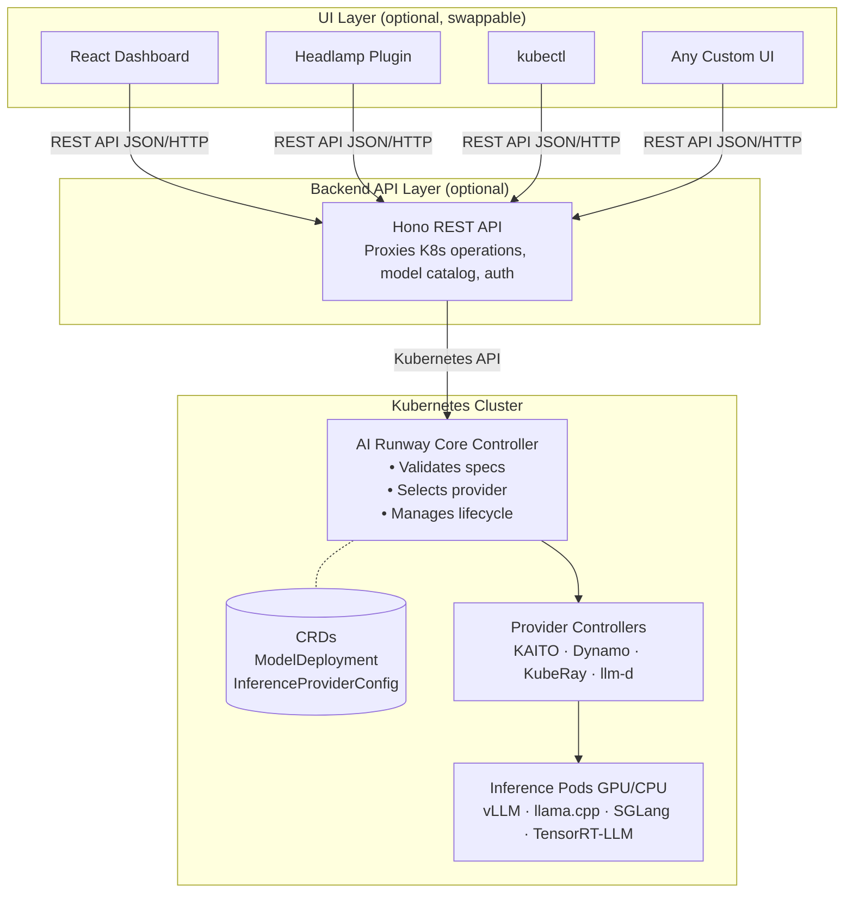
```mermaid
graph TD
    subgraph UI["UI Layer (optional, swappable)"]
        ReactUI[React Dashboard]
        Headlamp[Headlamp Plugin]
        Kubectl[kubectl]
        CustomUI[Any Custom UI]
    end

    subgraph Backend["Backend API Layer (optional)"]
        Hono[Hono REST API<br/>Proxies K8s operations, model catalog, auth]
    end

    subgraph Cluster["Kubernetes Cluster"]
        Core[AI Runway Core Controller<br/>• Validates specs<br/>• Selects provider<br/>• Manages lifecycle]
        CRDs[(CRDs<br/>ModelDeployment<br/>InferenceProviderConfig)]
        Providers[Provider Controllers<br/>KAITO · Dynamo · KubeRay · llm-d]
        Pods[Inference Pods GPU/CPU<br/>vLLM · llama.cpp · SGLang · TensorRT-LLM]
    end

    ReactUI & Headlamp & Kubectl & CustomUI -->|REST API JSON/HTTP| Hono
    Hono -->|Kubernetes API| Core
    Core --> Providers
    Providers --> Pods
    Core -.- CRDs
```

**Key design principles:**

| Principle                                | What it means                                                                                                         |
| ---------------------------------------- | --------------------------------------------------------------------------------------------------------------------- |
| **Core controller is minimal**           | It only validates specs, selects providers, and updates status - it never creates provider-specific resources         |
| **Provider controllers are out-of-tree** | Each provider (KAITO, Dynamo, etc.) has its own controller that can be versioned and released independently           |
| **UI is optional**                       | The platform works entirely via kubectl and CRDs. The web dashboard or Headlamp plugin are convenience layers         |
| **Two-tier reconciliation**              | Inspired by the Kubernetes Container Runtime Interface (CRI) - the core defines the interface, providers implement it |

> [!NOTE]
> Just as the kubelet talks to containerd via the CRI interface (and doesn't care whether you use containerd or CRI-O), the AI Runway core controller talks to providers via the InferenceProviderConfig interface. Swap providers without changing your ModelDeployment specs.

### The ModelDeployment CRD

**ModelDeployment** is the primary resource you interact with. At its simplest, you describe **what model** to deploy and **what resources** it needs.

Here is an example of what a ModelDeployment manifest can look like:

```yaml
apiVersion: airunway.ai/v1alpha1
kind: ModelDeployment
metadata:
  name: my-model
  namespace: default
spec:
  model:
    id: "Qwen/Qwen3-0.6B"
    source: huggingface
  resources:
    gpu:
      count: 1
```

That's it - just a model ID and a GPU resource requirement. The controller handles the rest: auto-selecting the best engine and provider, configuring serving mode, and creating gateway routes. You'll see additional fields like **engine**, **serving**, and **gateway** when we use them in Modules 3 and 4.

### The InferenceProviderConfig CRD

**InferenceProviderConfig** is a cluster-scoped resource that each provider controller registers at startup.

> [!NOTE]
> Think of it as a provider's resume - it tells the core controller what it can do so the controller can match deployments to the right provider automatically.

Here is what the KAITO inference provider configuration looks like:

```yaml
apiVersion: airunway.ai/v1alpha1
kind: InferenceProviderConfig
metadata:
  name: kaito
spec:
  capabilities:
    engines: [vllm, llamacpp]
    servingModes: [aggregated]
    cpuSupport: true
    gpuSupport: true
```

In addition to capabilities, each provider also declares **selectionRules** (omitted above) written as [CEL expressions](https://kubernetes.io/docs/reference/using-api/cel/) that control when it should be auto-selected. You'll see the results when you deploy models in Module 3. For the full spec, see [Appendix A](#appendix-a-provider-capability-matrix--selection-rules).

### What exactly is a Provider?

A **provider** is a separate Kubernetes controller that knows how to translate a ModelDeployment into the specific resources required by a particular inference backend. For example, the KAITO provider creates KAITO **Workspace** or **InferenceSet** resources, while the Dynamo provider creates **DynamoGraphDeployment** resources, and the KubeRay provider creates **RayService** resources.

Each provider runs independently, watches for ModelDeployments assigned to it, and reports status back through the shared CRD. This keeps the core controller simple and lets new inference backends be added without modifying the core.

### How Provider Selection Works

When you omit **spec.provider.name** in a ModelDeployment, the controller auto-selects a provider based on the rest of your spec. The two rules you'll see in action during this workshop:

- **CPU requested** -> KAITO (CPU-capable, uses **llamacpp** engine)
- **GPU requested** -> Dynamo (GPU-optimized, uses **vllm** engine)

The selection reason will always be recorded in **status.provider.selectedReason** for full observability. You'll see this first-hand when you deploy models in Module 3.

> [!TIP]
> For the full provider capability matrix and complete selection algorithm (including disaggregated mode, SGLang, and TensorRT-LLM rules), see [Appendix A](#appendix-a-provider-capability-matrix--selection-rules) at the end of this guide.

### Explore the CRDs in Your Cluster

Back in the VS Code new terminal, run the following commands to verify the CRDs are installed:

```bash
kubectl get crd | grep airunway
```

Expected output:

```text
inferenceproviderconfigs.airunway.ai                   2026-05-04T21:52:08Z
modeldeployments.airunway.ai                           2026-05-04T21:52:08Z
```

View the registered providers:

```bash
kubectl get inferenceproviderconfigs
```

Expected output:

```text
NAME      READY   VERSION                   AGE
dynamo    true    dynamo-provider:v0.2.0    1h
kaito     true    kaito-provider:v0.1.0     1h
kuberay   true    kuberay-provider:v0.1.0   1h
llmd      true    llmd-provider:v0.1.0      1h
```

> [!NOTE]
> For this workshop, all four supported providers are installed for you to explore (more on how they were installed in Module 5). When setting this up on your own cluster, you can choose which providers to install based on your needs.

You should see all four providers with **READY=true**. If so, you're good to go - the CRDs are installed and providers are registered.

To view the full spec of an InferenceProviderConfig, including capabilities and selection rules, run:

```bash
 kubectl get inferenceproviderconfig kaito -o yaml
```

Expected output:

```yaml
apiVersion: airunway.ai/v1alpha1
kind: InferenceProviderConfig
metadata:
  annotations:
    airunway.ai/documentation: https://github.com/kaito-project/airunway/tree/main/docs/providers/kaito.md
    airunway.ai/installation:
      '{"description":"Kubernetes AI Toolchain Operator for
      simplified model deployment","defaultNamespace":"kaito-workspace","helmRepos":[{"name":"kaito","url":"https://kaito-project.github.io/kaito/charts/kaito"}],"helmCharts":[{"name":"kaito-workspace","chart":"kaito/workspace","version":"0.10.0","namespace":"kaito-workspace","createNamespace":true}],"steps":[{"title":"Add
      KAITO Helm Repository","command":"helm repo add kaito https://kaito-project.github.io/kaito/charts/kaito","description":"Add
      the KAITO Helm repository."},{"title":"Update Helm Repositories","command":"helm
      repo update","description":"Update local Helm repository cache."},{"title":"Install
      KAITO Workspace Operator","command":"helm upgrade --install kaito-workspace
      kaito/workspace --version 0.10.0 -n kaito-workspace --create-namespace --set
      featureGates.disableNodeAutoProvisioning=true --set nvidiaDevicePlugin.enabled=false
      --set localCSIDriver.useLocalCSIDriver=false --set gpu-feature-discovery.gfd.enabled=false
      --set gpu-feature-discovery.nfd.master.deploy=false --set gpu-feature-discovery.nfd.worker.deploy=false
      --wait","description":"Install the KAITO workspace operator v0.10.0 with Node
      Auto-Provisioning disabled (BYO nodes mode), and sub-chart dependencies disabled."}]}'
  creationTimestamp: "2026-05-04T21:52:19Z"
  generation: 1
  name: kaito
  resourceVersion: "836003"
  uid: 503b526b-7427-483f-84fe-c8e3dc8c82af
spec:
  capabilities:
    cpuSupport: true
    engines:
      - vllm
      - llamacpp
    gpuSupport: true
    servingModes:
      - aggregated
  selectionRules:
    - condition: "!has(spec.resources.gpu) || spec.resources.gpu.count == 0"
      priority: 100
    - condition: spec.engine.type == 'llamacpp'
      priority: 100
status:
  lastHeartbeat: "2026-05-05T19:16:19Z"
  ready: true
  upstreamCRDVersion: kaito.sh/v1beta1
  version: kaito-provider:v0.1.0
```

> [!NOTE]
> Notice there's a lot of text in the **annotations** section. This is metadata for the downstream inference provider and includes information like links to documentation and to install.

**What you learned in this module:**

- AI Runway separates _what_ you want (**ModelDeployment**) from _how_ it's implemented (provider controllers)
- The core controller is minimal - it validates, selects a provider, and delegates. Provider controllers do the heavy lifting
- Auto-selection means you don't need to know provider internals - just describe what you want

**Next up:** Now that you understand the architecture conceptually, you'll verify these components are actually running in your cluster and explore the dashboard you'll use for deployments.

---

## Module 2: Environment Validation & UI Exploration

**Duration:** ~10 minutes

**Objectives:**
By the end of this module, you will be able to:

- Verify your AKS cluster and GPU node pool are healthy
- Launch the AI Runway web dashboard and navigate its features
- Explore the model catalog and provider settings

Now that you understand the architecture and CRDs, let's verify that all the pieces are running in your cluster, launch the dashboard, and explore its features before deploying any models.

### Verify AKS Cluster Status

Confirm your cluster connection and node pool status:

```bash
kubectl get nodes -o wide
```

You should see at least:

- 3 nodes in the **default** pool (Standard_D4d_v4 - CPU)
- 1 node in the **inference** pool (Standard_NC48ads_A100_v4 - GPU)

> [!NOTE]
> For this workshop, a GPU node pool with autoscaling has been enabled. When setting this up on your own cluster, you will need to provision the node pool and select the appropriate VM SKU based on your needs. See the [AKS docs](https://learn.microsoft.com/azure/aks/use-nvidia-gpu?tabs=add-ubuntu-gpu-node-pool) for additional information on using GPU node pools.

Check that the GPU node is ready and has GPU resources:

```bash
kubectl get node -l agentpool=inference -o yaml | yq '.items[0].status.allocatable'
```

Expected output:

```yaml
cpu: 47420m
ephemeral-storage: "478273627369"
hugepages-1Gi: "0"
hugepages-2Mi: "0"
memory: 448757328Ki
nvidia.com/gpu: "2"
pods: "250"
```

> [!NOTE]
> Notice how this particular node has 2 NVIDIA GPUs (A100) available.

### Verify Pre-installed Components

Run the following commands one at a time to confirm all infrastructure is healthy.

**Check the NVIDIA GPU Operator pods:**

```bash
kubectl get pods -n gpu-operator
```

> [!NOTE]
> For this workshop, the open-source NVIDIA GPU Operator has been enabled. See [Use NVIDIA GPU Operator on AKS](https://learn.microsoft.com/azure/aks/nvidia-gpu-operator) for installation guidance.

**Check the Istio control plane:**

```bash
kubectl get pods -n istio-system
```

> [!NOTE]
> For this workshop, the open-source Istio has been enabled for Gateway API capabilities. For a managed offering on AKS, see [Configure Istio ingress with the Kubernetes Gateway API (Preview)](https://learn.microsoft.com/en-us/azure/aks/istio-gateway-api) for installation guidance.

**Check Gateway API CRDs:**

```bash
kubectl get crd | grep networking.k8s.io
```

> [!NOTE]
> **Gateway API Inference Extension** extends the Kubernetes Gateway API with inference-specific resources like **InferencePool** (a group of model-serving pods) and an **Endpoint Picker Proxy** (EPP) for intelligent per-request routing. The **Body-Based Router** (BBR) is a component that reads the **model** field from the JSON request body and sets a routing header, allowing multiple models to share a single gateway endpoint. Together, these let AI Runway automatically wire up routing for each deployed model without manual Gateway configuration.

**Check the inference gateway:**

```bash
kubectl get gateway -n istio-system
```

The gateway should show **PROGRAMMED: True** with an external IP address - note this **ADDRESS**, it's the unified endpoint you'll use for all model inference calls later.

**Check the AI Runway controller and provider controllers:**

```bash
kubectl get pods -n airunway-system
```

All pods should be **Running**.

### Launch the AI Runway Dashboard

Clone the repository

```bash
git clone --branch v0.5.0 https://github.com/kaito-project/airunway.git
```

Navigate into the repo directory

```bash
cd airunway
```

Install project dependencies

```bash
bun install
```

Run the AI Runway dashboard

```bash
bun run dev
```

> [!WARNING]
> The `bun run dev` command occupies this terminal. In VS Code, open a **new terminal tab** (click the **+** button in the terminal panel) for all remaining CLI commands in this workshop.

This launches both the frontend dashboard and the backend API. The backend API runs on port 3000 and the frontend UI runs on port 5173. Open http://localhost:5173 in your browser. You should see the AI Runway home page

> [!WARNING]
> Keep this tab open throughout the workshop.

AI Runway also offers a [Headlamp plugin](https://github.com/kaito-project/airunway/tree/main/plugins/headlamp) for teams already using Headlamp as their Kubernetes dashboard. In this workshop, we'll use the React dashboard.

### Explore the Dashboard

The dashboard has three main pages accessible from the left sidebar: **Models**, **Deployments**, and **Settings**.

Let's take a few minutes to click through each one.

#### Model Catalog

This is the landing page. It shows a curated catalog of models organized by engine compatibility (vLLM, SGLang, TensorRT-LLM, Llama.cpp). You can filter by engine type using the tabs at the top, or switch to the **Hugging Face Hub** tab to search for any public model.

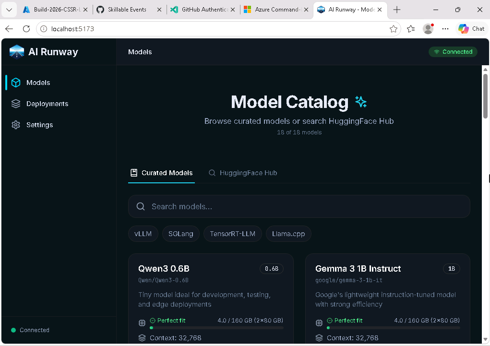

Each model card shows the model size, GPU memory requirements, supported engines, model fit for curated models, and a **Deploy →** button you'll use in the next module.

#### Deployments

Click **Deployments** in the sidebar. This page shows all active **ModelDeployment** resources in your cluster with their current status, provider, engine, and replica counts. It should be empty - you'll see it populate when you deploy your first model in Module 3.

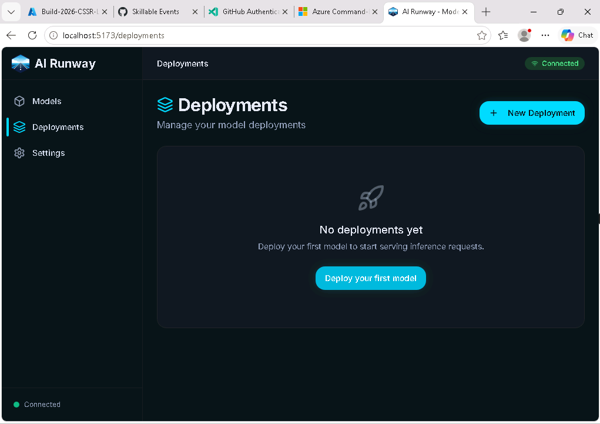

#### Settings

Click **Settings** in the sidebar and skim the three tabs:

- **General** - Verify it shows **Connected** and **4 of 4** runtimes installed
- **Runtimes** - Confirm **Dynamo**, **KAITO**, **KubeRay**, and **llm-d** are all marked as installed. We'll use KAITO and Dynamo in this workshop; KubeRay and llm-d are available for you to explore on your own
- **Integrations** - Check that the GPU Operator, Gateway API (with the gateway endpoint address), and Hugging Face Token sections are visible

> [!NOTE]
> The Runtimes tab also includes a Prerequisites section that checks whether tools like Helm CLI are available - these are needed when AI Runway installs components into your cluster. There's also a Cluster Autoscaling section that shows whether your cluster is optimally configured for hosting LLMs at scale, including cluster autoscaler enablement and GPU node pool availability.

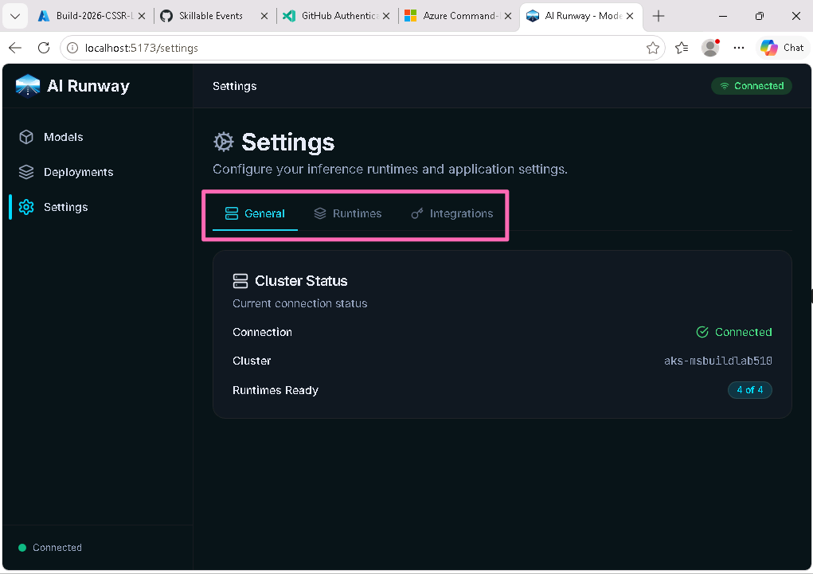

You'll revisit these tabs as we use each feature in later modules.

### (Recommended) Connect Hugging Face

Some models (e.g., Meta Llama) require accepting a license on Hugging Face before downloading. In the **Settings** page, click the **Integrations** tab, then click **Connect Hugging Face** and follow the OAuth flow. Once connected, you'll see your Hugging Face username and a **Connected** badge.


> [!TIP]
> Even if you don't plan to use gated models, connecting Hugging Face can improve download speeds - unauthenticated users are more likely to be rate-limited.

**What you learned in this module:**

- Your cluster has CPU and GPU node pools, with the GPU Operator, Istio, Gateway API, and all AI Runway components pre-installed
- The dashboard provides a visual layer over the same Kubernetes resources you can access via **kubectl**
- Four runtimes are available (KAITO, Dynamo, KubeRay, llm-d) - we'll use KAITO and Dynamo in this workshop

> [!TIP]
> All cluster components were bootstrapped using Argo CD and GitOps - you'll explore how that works in Module 5

**Next up:** With everything verified and the dashboard open, you'll deploy your first model and see auto-selection in action.

---

## Module 3: Core Deployment & Validation

**Duration:** ~20 minutes

**Objectives:**
By the end of this module, you will be able to:

- Deploy a model to CPU using KAITO with the **llamacpp** engine
- Deploy a model to GPU using Dynamo with the **vllm** engine
- Validate deployments using status conditions, logs, and OpenAI-compatible endpoints
- Observe how the Gateway automatically creates routing resources

Your cluster is healthy and the dashboard is running - time to deploy your first models.

> [!TIP]
> Model deployments take several minutes to become ready while container images pull and the model loads into memory. Use the wait time to read the explanations and inspect status conditions in the terminal.

### Deploy a Small Model to CPU via the Dashboard

Instead of writing YAML by hand, use the AI Runway dashboard to deploy your first model. This lets you see all the options visually and understand what each field controls.

#### Find the Model

In the dashboard, navigate to the **Models** page and search for Gemma 2 2B (GGUF). Click **Deploy** to open the deployment form.

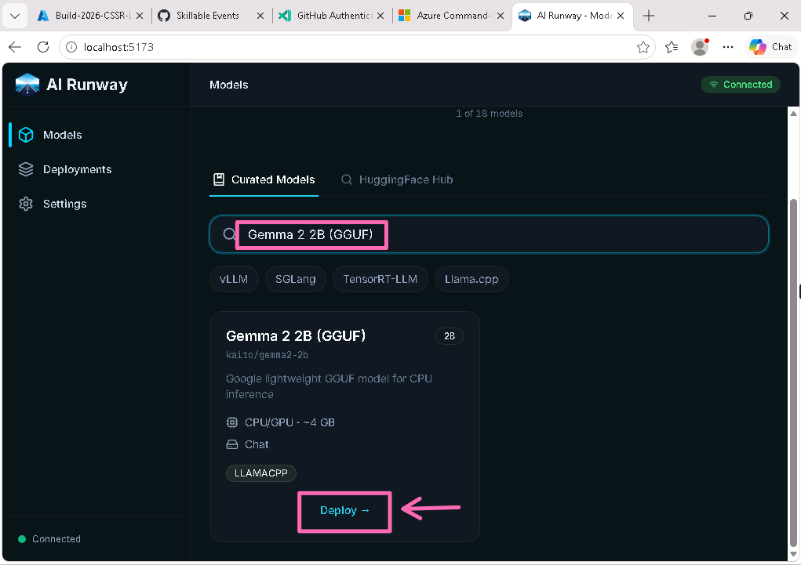

#### Configure the Deployment

In the deployment form, you'll see many of the options have been preselected for you. Make sure the following are set:

- **Runtime**: KAITO
- **Compute Type**: CPU
- **Resource Type**: Workspace

Below the form, you'll see the **Manifest Preview** section showing the generated YAML manifest based on your selections. This is what will be applied to the cluster when you click Deploy.

You'll also see the **Estimated Cost** section with an estimate of the hourly cost of running this model based on the resources it will consume.

Click **Deploy Model**.

> [!NOTE]
> Notice you selected a provider explicitly in the UI. The dashboard guides you through provider selection, but when deploying via kubectl, you can omit it entirely and let the controller auto-select based on your spec.
> You could have also deployed this model using the following manifest:
>
> ```yaml
> apiVersion: airunway.ai/v1alpha1
> kind: ModelDeployment
> metadata:
>   name: gemma2-2b-cpu
> spec:
>   image: ghcr.io/kaito-project/aikit/gemma2:2b
>   model:
>     id: gemma2:2b
>     source: huggingface
>   serving:
>     mode: aggregated
>   resources:
>     cpu: "1"
> ```
>
> The core controller validates it, auto-selects **engine=llamacpp** and **provider=kaito**, and the KAITO provider creates the inference pod.
>
> It is also important to know that CPU-based model deployments require a specific container image.

### Watch It Come to Life

You will be redirected to the **Deployments** page in the dashboard. Here, you'll see **gemma2-2b-\*** (followed by random characters) appear with its ready status showing **0/1** and updating in real time:


Now look behind the curtain. In VS Code, open a new terminal tab and run the following to check the Kubernetes resources that were created:

```bash
kubectl get modeldeployment -n kaito-workspace -o yaml | yq '.items[0].status'
```

You should see statuses like:

```yaml
conditions:
  - lastTransitionTime: "2026-05-06T14:52:27Z"
    message: Engine llamacpp auto-selected from provider kaito
    observedGeneration: 1
    reason: AutoSelected
    status: "True"
    type: EngineSelected
  - lastTransitionTime: "2026-05-06T14:52:27Z"
    message: Schema validation passed
    observedGeneration: 2
    reason: ValidationPassed
    status: "True"
    type: Validated
  - lastTransitionTime: "2026-05-06T14:52:27Z"
    message: Provider kaito auto-selected
    observedGeneration: 1
    reason: AutoSelected
    status: "True"
    type: ProviderSelected
  - lastTransitionTime: "2026-05-06T14:52:27Z"
    message: Configuration compatible with KAITO
    observedGeneration: 2
    reason: CompatibilityVerified
    status: "True"
    type: ProviderCompatible
  - lastTransitionTime: "2026-05-06T14:52:27Z"
    message: Workspace created successfully
    observedGeneration: 2
    reason: ResourceCreated
    status: "True"
    type: ResourceCreated
  - lastTransitionTime: "2026-05-06T14:52:58Z"
    message: All replicas are ready
    observedGeneration: 2
    reason: DeploymentReady
    status: "True"
    type: Ready
  - lastTransitionTime: "2026-05-06T15:25:18Z"
    message: InferencePool and HTTPRoute created
    observedGeneration: 2
    reason: GatewayConfigured
    status: "True"
    type: GatewayReady
endpoint:
  port: 80
  service: gemma2-2b-cpu
engine:
  selectedReason: auto-selected from provider kaito capabilities
  type: llamacpp
gateway:
  endpoint: 74.163.119.23
  gatewayNamespace: istio-system
  modelName: gemma-2-2b-instruct
message: Workspace created, waiting for pods to be ready
observedGeneration: 2
phase: Running
provider:
  name: kaito
  resourceKind: Workspace
  resourceName: gemma2-2b-cpu
  selectedReason: "matched capabilities: engine=llamacpp, gpu=false, mode=aggregated"
replicas:
  available: 1
  desired: 1
  ready: 1
```

> [!TIP]
> If you read the **status** and **status.conditions** from top-down - it tells the story of the deployment lifecycle, from validation to provider selection to resource creation and finally readiness. The last condition shows that the gateway resources were created successfully. So if you ever wonder why your model isn't serving traffic, the conditions are the first place to check for clues.

### Verify Gateway Resources Were Auto-Created

Back in the dashboard, click on the deployment that starts with **gemma2-2b-\*** to see its detail view. Notice the **Access Model** section showing the auto-created routing resources:

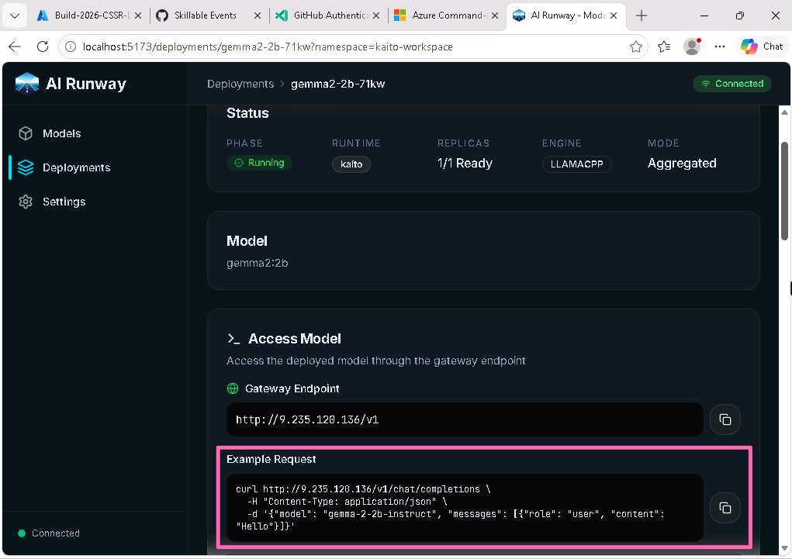

When Gateway API CRDs are detected, AI Runway automatically creates three resources to route traffic from the gateway to your model pods:

- An **InferencePool** - selects your model's pods using a label selector and points to the EPP for intelligent routing decisions
- An **HTTPRoute** - tells the Gateway which requests belong to this model and where to send them
- An **EPP (Endpoint Picker Proxy)** - a sidecar deployment that makes per-request routing decisions (e.g., KV-cache affinity) before forwarding to a model pod

Inspect each one:

```bash
kubectl describe inferencepool -n kaito-workspace
```

Expected output (key fields):

```text
Spec:
  Selector:
    Match Labels:
      airunway.ai/model-deployment: gemma2-2b-<suffix>  # selects your model pods
  Endpoint Picker Ref:
    Name: gemma2-2b-<suffix>-epp                        # delegates routing to the EPP
    Port: 9002
  Target Ports:
    Number: 5000                                         # the port your model server listens on
Status:
  Parents:
    Conditions:
      Type: Accepted   Status: True    # the Gateway accepted this pool
      Type: ResolvedRefs Status: True  # the EPP service reference resolved successfully
    Parent Ref:
      Kind: Gateway
      Name: inference-gateway          # attached to the shared inference gateway
```

Two **Status.Conditions** with **Status: True** confirm the pool is wired up correctly: the Gateway accepted it, and the EPP reference resolved. If either were **False**, traffic wouldn't reach your model pods.

```bash
kubectl describe httproute -n kaito-workspace
```

Expected output (key fields):

```text
Spec:
  Parent Refs:
    Name: inference-gateway            # attached to the same shared gateway
    Namespace: istio-system
  Rules:
    Matches:
      Headers:
        Name: X-Gateway-Model-Name
        Value: gemma-2-2b-instruct     # routes requests for this model name
    Backend Refs:
      Kind: InferencePool
      Name: gemma2-2b-<suffix>         # forwards to the InferencePool above
    Timeouts:
      Request: 300s                    # generous timeout for long LLM generations
Status:
  Parents:
    Conditions:
      Type: Accepted   Status: True    # route is valid
      Type: ResolvedRefs Status: True  # InferencePool reference resolved
    Controller Name: istio.io/gateway-controller
```

The HTTPRoute matches on the **X-Gateway-Model-Name** header (set by the Body-Based Router from the **model** field in your request JSON) and forwards to the InferencePool. Both conditions' status reports **True** which means traffic can flow end-to-end.

```bash
# Get the EPP deployment name
EPP_NAME=$(kubectl get deploy -n kaito-workspace | grep epp | awk '{print $1}')
kubectl describe deployment -n kaito-workspace $EPP_NAME
```

Expected output (key fields):

```text
Replicas: 1 desired | 1 updated | 1 total | 1 available | 0 unavailable
Containers:
  epp:
    Image: registry.k8s.io/gateway-api-inference-extension/epp:v1.3.1
    Args:
      --pool-name gemma2-2b-<suffix>   # watches this specific InferencePool
      --pool-namespace kaito-workspace
    Liveness/Readiness: grpc :9003     # health checks via gRPC
Conditions:
  Available: True                      # EPP is healthy and ready to route
```

The Endpoint Picker Proxy (EPP) is a Kubernetes Deployment managed by AI Runway (note **app.kubernetes.io/managed-by=airunway** in the labels). It runs a single replica, watches the **InferencePool** for pod membership changes, makes routing decisions, and forwards requests to model pods.

### Test the OpenAI-compatible endpoint

Once the deployment shows **PHASE=Running** and the Gateway Endpoint is available, copy the **Example Request** from the dashboard and run it in your terminal.

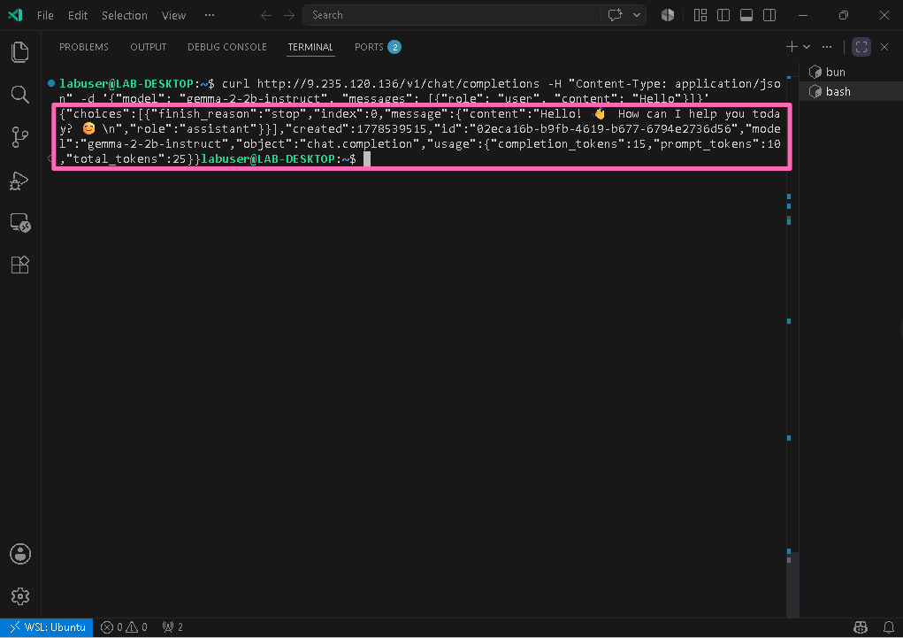

> [!TIP]
> Add a ` | jq` to the end of the request to see the response in formatted JSON.

The Body-Based Router (BBR) in the gateway reads the **model** field from the request body and routes to the correct InferencePool - this is how multiple models share a single gateway endpoint.

<details>
<summary>Optionally, you can test directly via the model's service (bypassing the gateway).</summary>

> [!WARNING]
> The following are optional steps and not necessary for the completion of the lab.

Get the deployment name and service from the ModelDeployment status:

```bash
MD_NAME=$(kubectl get modeldeployment -n kaito-workspace -o jsonpath='{.items[0].metadata.name}')
SVC_NAME=$(kubectl get modeldeployment $MD_NAME -n kaito-workspace -o jsonpath='{.status.endpoint.service}')
```

Port-forward to the model service (this will occupy the terminal):

```bash
kubectl port-forward -n kaito-workspace svc/$SVC_NAME 8080:80
```

In a **new terminal tab**, test the model directly via the service endpoint:

```bash
curl -s http://localhost:8080/v1/chat/completions \
  -H "Content-Type: application/json" \
  -d '{
    "model": "gemma-2-2b-instruct",
    "messages": [{"role": "user", "content": "When does model serving on Kubernetes make sense?"}],
    "max_tokens": 100
  }' | jq
```

When done, switch back to the port-forward terminal tab and press **Ctrl+C** to stop it.

</details>

### Deploy a Small GPU Model (Autoselect Provider & Engine)

Now deploy a small model to GPU - this time using **kubectl** directly, so you can see how the same result is achieved with YAML. By requesting a GPU (**spec.resources.gpu.count: 1**), the controller will auto-select **Dynamo** as the provider and **vLLM** as the engine (see [Appendix A](#appendix-a-provider-capability-matrix--selection-rules) for selection rules). We're using a small **0.6B** model here to keep deployment times short while demonstrating the GPU workflow. You'll deploy a much larger model in Module 4.

```bash
kubectl apply -f - <<EOF
apiVersion: airunway.ai/v1alpha1
kind: ModelDeployment
metadata:
  name: qwen3-gpu
spec:
  model:
    id: "Qwen/Qwen3-0.6B"
    source: huggingface
  serving:
    mode: aggregated
  scaling:
    replicas: 1
  resources:
    gpu:
      count: 1
EOF
```

In the dashboard UI, click on the **Deployments** page - you'll see **qwen3-gpu** appear, progressing through the same lifecycle phases:

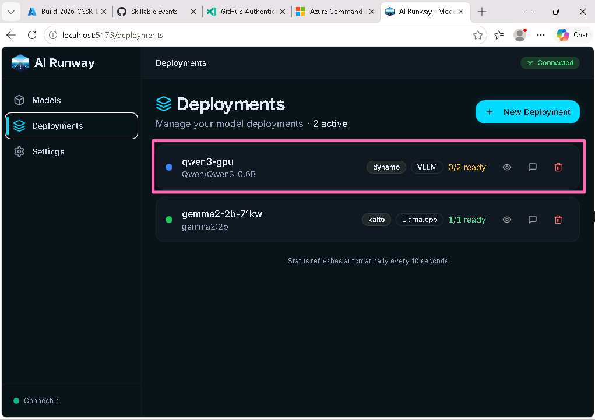

While you wait for the deployment to become ready, inspect the status in the terminal:

```bash
kubectl get modeldeployment qwen3-gpu -o yaml | yq '.status'
```

You might have to run the command a few times to get updated statuses. But you should start to see that the vLLM engine and Dynamo provider was auto-selected, then the DynamoGraphDeployment was created by the provider (more on this later).

Eventually you will start to see **All replicas are ready**, **InferencePool and HTTPRoute created** which means the gateway endpoint is ready.

Head back to the dashboard and click on the **qwen3-gpu** deployment to see its details.

Copy the example request and test the GPU model via the gateway endpoint - notice the faster response time due to GPU acceleration.

### Explore the Resource Ownership Chain

When you create a **ModelDeployment**, the core controller and provider controller each create child resources - and Kubernetes **owner references** link them all together. This is how cascading cleanup works: delete the ModelDeployment, and everything it owns gets garbage-collected automatically.

Let's trace what **qwen3-gpu** created, starting from the ModelDeployment status.

Discover what the provider created - the ModelDeployment status tells you the resource kind and name:

```bash
kubectl get modeldeployment qwen3-gpu -o yaml | yq '.status.provider'
```

Expected output:

```yaml
name: dynamo
resourceKind: DynamoGraphDeployment
resourceName: qwen3-gpu
selectedReason: "matched capabilities: engine=vllm, gpu=true, mode=aggregated"
```

You didn't ask for a **DynamoGraphDeployment** - but the status tells you the Dynamo provider was selected and the appropriate controller created it on your behalf.

Verify that resource exists and is owned by the **ModelDeployment**:

```bash
kubectl get dynamographdeployment qwen3-gpu -o yaml | yq '.metadata.ownerReferences'
```

Check the downstream pods and confirm they have been scheduled on GPU (inference) nodes.

```bash
kubectl get po -o wide | awk '{print $7}'
```

The pods also have owner references:

```bash
kubectl get po -o yaml | yq '.items[].metadata.ownerReferences'
```

> [!TIP]
> The pods can take up to 7-10 minutes to be ready. You can watch the pod rollout with the following command:
>
> ```bash
> watch kubectl get po
> ```
>
> Remember to press **Ctrl+C** to exit the watch command.

Once you see the **qwen3-gpu-epp-\*** pod running, check the gateway resources the core controller created - **InferencePool**:

```bash
kubectl get inferencepool qwen3-gpu -o yaml | yq '.metadata.ownerReferences'
```

And the **HTTPRoute**:

```bash
kubectl get httproute qwen3-gpu -o yaml | yq '.metadata.ownerReferences'
```

Each of these should show an owner reference pointing back to the **ModelDeployment**:

```yaml
- apiVersion: airunway.ai/v1alpha1
  blockOwnerDeletion: true
  controller: true
  kind: ModelDeployment
  name: qwen3-gpu
  uid: <some-uuid>
```

This demonstrates the two-tier architecture in action: the **core controller** creates gateway resources (InferencePool, HTTPRoute, EPP) while the **provider controller** creates the inference resources (DynamoGraphDeployment, which in turn creates the pods and services). Both set owner references back to the ModelDeployment, so deleting it triggers a full cascading cleanup.

### Clean Up the GPU Deployment

Delete the GPU deployment to free resources for the next module:

```bash
kubectl delete modeldeployment qwen3-gpu
```

Refresh the **Deployments** page in the dashboard - **qwen3-gpu** disappears. Behind the scenes, Kubernetes **owner references** automatically garbage-collected the provider resource (DynamoGraphDeployment and downstream pods) and all gateway resources (InferencePool, HTTPRoute, EPP).

**What you learned in this module:**

- Deploying from the dashboard and **kubectl** produce identical **ModelDeployment** resources
- The controller auto-selects provider and engine based on your spec. No GPU -> KAITO + llamacpp; Need GPU -> Dynamo + vLLM
- Gateway resources (InferencePool, HTTPRoute, EPP) are auto-created and auto-cleaned via owner references
- The core controller and provider controllers use server-side apply to own separate parts of the status

**Next up:** You've seen the basics work - now you'll unlock production patterns like disaggregated serving for independent scaling, model caching for fast cold starts, and multi-model gateway routing.

---

## Module 4: Advanced Inference Patterns

**Duration:** ~15 minutes

**Objectives:**
By the end of this module, you will be able to:

- Configure disaggregated prefill/decode scaling with Dynamo
- Set up model caching with Azure Managed Lustre for fast cold starts (avoid downloading large models multiple times)
- Validate body-based routing across multiple models through a single gateway
- Understand how disaggregated serving improves scaling under load
  You've seen how easy it is to deploy models with basic settings. Now let's unlock more powerful patterns - disaggregated serving for independent scaling and high-throughput model caching for faster cold starts.

### Understanding Disaggregated Prefill/Decode

Before diving into disaggregation, it helps to understand what happens when you send a prompt to an LLM. Inference happens in two distinct phases:

1. **Prefill** - The model processes your entire input prompt in parallel, computing attention across all input tokens at once. This is compute-intensive but highly parallelizable - more GPU cores means faster prefill.
2. **Decode** - The model generates output tokens one at a time, each depending on all previous tokens. This is memory-bandwidth-intensive and inherently sequential - it needs fast access to the KV-cache (a per-request memory structure that stores intermediate attention state).

In standard (aggregated) LLM inference, a single GPU handles both:

- **Prefill** - processing the input prompt (compute-intensive, parallelizable)
- **Decode** - generating output tokens one at a time (memory-bandwidth-intensive, sequential)

**Disaggregated serving** separates these into independent scaling groups:


```mermaid
graph LR
    Request([Request]) --> Prefill[Prefill Workers<br/>2× GPU]
    Prefill -->|KV cache| Decode[Decode Workers<br/>4× GPU]
    Decode --> Response([Response])
```

**Why disaggregate?**

- **Independent scaling** - Scale prefill and decode workers separately based on workload
- **Better GPU utilization** - Prefill workers can use larger GPUs; decode workers benefit from more memory bandwidth
- **Lower latency** - Decode workers aren't blocked by long prompt processing
- **KV-cache routing** - Route decode requests to workers that already have the conversation's KV cache in memory

### Verify Pre-provisioned Model Cache

Large models can take significant time to download from Hugging Face on first deployment. Your lab environment has an Azure Managed Lustre filesystem with a StorageClass and PVC pre-provisioned to solve this.

[Azure Managed Lustre](https://learn.microsoft.com/azure/azure-managed-lustre/amlfs-overview) is a fully managed, high-performance parallel file system built on the open-source Lustre technology. It delivers throughput of up to 500 MB/s per TiB of storage, making it ideal for workloads that need to read large files fast - like loading multi-gigabyte model weights into GPU memory. Because it supports **ReadWriteMany (RWX)** access, multiple pods across different nodes can mount the same filesystem simultaneously, so you only download a model once and every replica reads from the shared cache.

Verify the StorageClass is available:

```bash
kubectl get sc azurelustre-static
```

Verify the CSI driver pods for Azure Lustre are running:

```bash
kubectl get po -n kube-system -l app=csi-azurelustre-controller
kubectl get po -n kube-system -l app=csi-azurelustre-node
```

> [!NOTE]
> The Lustre CSI driver runs a controller on the master node and a daemonset on all nodes to manage volume attachments. This allows any pod in the cluster to mount the Lustre filesystem, which is ideal for sharing large model weights across multiple inference pods. See the [Use Azure Lustre CSI driver for Kubernetes](https://learn.microsoft.com/azure/azure-managed-lustre/use-csi-driver-kubernetes) documentation for more details.

Finally, check the PVC that will be used as the model cache:

```bash
kubectl get pvc -n dynamo-system dynamo-pvc
```

You should see a **Bound** PVC with **RWX** access mode - this means it can be mounted by multiple pods simultaneously. The Azure Managed Lustre backing this PVC delivers up to 500 MB/s per TiB of throughput, which means:

- Multiple pods across nodes read the same cached model simultaneously
- Cold starts are near-instant after the first download
- No redundant downloads when scaling replicas

### Deploy with Disaggregated Serving and Model Caching

Let's deploy a [Qwen/Qwen3-Coder-30B-A3B-Instruct](https://huggingface.co/Qwen/Qwen3-Coder-30B-A3B-Instruct) model from Hugging Face using Dynamo with disaggregated prefill/decode and Lustre-backed model caching.

```bash
kubectl apply -f - <<EOF
apiVersion: airunway.ai/v1alpha1
kind: ModelDeployment
metadata:
  name: qwen3-coder-30b
  namespace: dynamo-system
spec:
  model:
    id: Qwen/Qwen3-Coder-30B-A3B-Instruct
    source: huggingface
    storage:
      volumes:
        - name: model-cache
          claimName: dynamo-pvc
          purpose: modelCache
  provider:
    name: dynamo
  engine:
    type: vllm
    contextLength: 131072
    args:
      dyn-tool-call-parser: "qwen3_coder"
  serving:
    mode: disaggregated
  scaling:
    prefill:
      replicas: 1
      gpu:
        count: 1
    decode:
      replicas: 1
      gpu:
        count: 1
  gateway:
    enabled: true
  secrets:
    huggingFaceToken: hf-token-secret
EOF
```

> [!WARNING]
> If you did not authenticate to Hugging Face in the dashboard, you will need to remove the **secrets** block in the YAML manifest.

The disaggregated deployment creates 2 pods (1 prefill + 1 decode) and may take 3-5 minutes. While you wait, run the following command to inspect the different pods created by this deployment:

```bash
watch kubectl get pods -n dynamo-system
```

This deployment can take a bit longer to become ready due to the larger model size and the initial download time. You should see a pod with a name that starts with **qwen3-coder-30b-model-download-\***. This pod is responsible for downloading the model to a device on the node. In this case, it will download the model onto the PVC that is backed by Azure Managed Lustre. When the download is done, you'll see the pod report **0/1** READY and **Completed** as the STATUS.

While you wait, let's break down the manifest and understand what each section does, especially the new fields related to disaggregation and model caching.

This model deployment manifest includes several advanced configurations:

- **model.storage.volumes** - This section defines a volume that uses the pre-provisioned Azure Managed Lustre PVC; named **dynamo-pvc**, for model caching. Here, you're telling the provider to use this volume for storing downloaded model weights. This allows multiple pods to share the same cache, significantly reducing cold start times when scaling replicas. When a new node comes up, it mounts the PVC and the model is immediately loaded into the inference engine - loading into the inference can take some time, there's no way around that.
- **provider.name: dynamo** - This explicitly selects the Dynamo provider, which supports disaggregated serving and has built-in optimizations for tool call parsing and reasoning with vLLM.
- **engine.type: vllm** - This selects the vLLM engine, which is optimized for high-performance LLM inference and supports features like KV-cache routing.
- **engine.contextLength: 131072** - This configures vLLM to use a larger context window size, which is beneficial for models that can take advantage of it (i.e., models that can perform reasoning or tool calling). The optimal context length depends on the model architecture and your specific workload, so refer to the engine documentation for guidance on tuning this parameter.
- **engine.args** - This passes arguments to the downstream engine for further customization/optimization. In this case, since we are using Dynamo, the **--dyn-tool-call-parser: "qwen3_coder"** configures vLLM to use the qwen3-specific tool call parser so that the model can make use of tools effectively. Different models have different optimal settings here, and different engines will have different flag names so refer to their respective documentation for details. With Dynamo, you can pass [tool calling](https://docs.nvidia.com/dynamo/user-guides/tool-calling) and [reasoning](https://docs.nvidia.com/dynamo/user-guides/reasoning) related flags to optimize for specific workloads.
- **serving.mode: disaggregated** - This tells the controller that the prefill and decode components should be deployed separately, allowing for independent scaling and optimized resource allocation.
- **scaling.prefill** and **scaling.decode** - These configure the number of replicas and GPU resources for the prefill and decode components independently. Since we are deploying to a node with 2 GPUs we are allocating 1 for prefill and 1 for decode.

> [!TIP]
> To keep cost manageable in the lab environment, we're using 1 GPU for prefill and 1 GPU for decode. In production, you'd typically run more decode workers than prefill workers. Here's why: a prefill worker processes an entire input prompt in a single parallel forward pass - it finishes fast and is free again almost immediately. A decode worker, on the other hand, is occupied for the entire duration of the response because it generates tokens one at a time (500-token response = 500 sequential forward passes). So under load, decode workers get tied up much longer per request, and you need more of them to handle concurrent users.

Continue to watch the deployment progress in the terminal and you'll eventually start to see separate prefill and decode pods come online:


Once you see the status of the **qwen3-coder-30b-epp-\*** pod is **Running**, stop the watch command and let's move on to test the model via the gateway - you should see similar response times to the previous GPU deployment, but now with the benefits of disaggregation and caching.

> [!NOTE]
> Our example is small in scale, so you won't see immediate benefits of disaggregation. Disaggregated serving will start to pay dividends when you start to get high volume of inference request traffic.

### Test Body-Based Routing

With two models running in our cluster we can see how the Body-Based Router (BBR) extracts the **model** field from the JSON request body and routes to the correct InferencePool. Let's test with both models deployed (the CPU-based gemma model and GPU-based qwen3 model) using the gateway endpoint.

Get the inference gateway IP address:

```bash
GATEWAY_IP=$(kubectl get gateway -n istio-system inference-gateway -o jsonpath='{.status.addresses[0].value}')
```

Route to the CPU-based model by passing **gemma-2-2b-instruct** in the **model** field of the request:

```bash
curl -s http://$GATEWAY_IP/v1/chat/completions \
  -H "Content-Type: application/json" \
  -d '{
    "model": "gemma-2-2b-instruct",
    "messages": [{"role": "user", "content": "Say hello"}],
    "max_tokens": 50
  }' | jq
```

Now, route to the GPU-based model by passing **Qwen/Qwen3-Coder-30B-A3B-Instruct** as the requested model:

```bash
curl -s http://$GATEWAY_IP/v1/chat/completions \
  -H "Content-Type: application/json" \
  -d '{
    "model": "Qwen/Qwen3-Coder-30B-A3B-Instruct",
    "messages": [{"role": "user", "content": "Say hello"}],
    "max_tokens": 50
  }' | jq
```

Both requests hit the **same gateway IP** but the BBR component routes them to different InferencePools based on the **model** field.

This is the Gateway API Inference Extension in action 😎

### How Gateway Routing Works

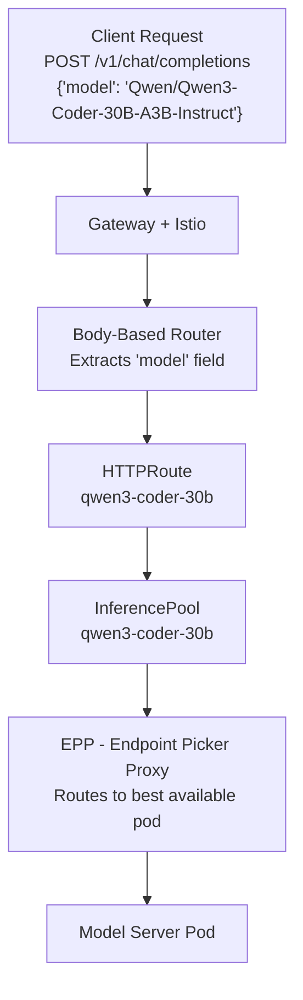
```mermaid
graph TD
    Client["Client Request<br/>POST /v1/chat/completions<br/>{'model': 'Qwen/Qwen3-Coder-30B-A3B-Instruct'}"] --> Gateway[Gateway + Istio]
    Gateway --> BBR[Body-Based Router<br/>Extracts 'model' field]
    BBR --> Route[HTTPRoute<br/>qwen3-coder-30b]
    Route --> Pool[InferencePool<br/>qwen3-coder-30b]
    Pool --> EPP[EPP - Endpoint Picker Proxy<br/>Routes to best available pod]
    EPP --> Pod[Model Server Pod]
```

**What you learned in this module:**

- Disaggregated serving separates prefill (compute-heavy) and decode (memory-heavy) into independently scalable components
- Azure Managed Lustre provides high-throughput shared model caching - no redundant downloads when scaling
- Body-based routing lets multiple models share a single gateway endpoint, with the **model** field in the request body determining which InferencePool receives the request

<details>
<summary>Going further: NVIDIA AI Configurator</summary>

You manually chose inference engine, deployment mode (aggregated vs disaggregated), GPU counts, and router mode. For production deployments, [NVIDIA AI Configurator](https://github.com/ai-dynamo/aiconfigurator) is a CLI utility that can automate this by evaluating aggregated vs disaggregated modes, sweeping tensor parallel configurations, and returning optimal settings that you can apply to your deployment form in one click. If you have the CLI installed locally, AI Runway's dashboard detects it and adds an **Optimize** button to the Dynamo deployment form. It also surfaces issues early - unsupported model architectures, GPU/backend constraints, gated model auth requirements - so you catch problems before deploying, not after.

</details>

**Next up:** You'll put these models to practical use - connecting developer tools for private inference, reviewing production metrics, and seeing how GitOps patterns bring this all to production.

---

## Module 5: Real-World Integration & Cleanup

**Duration:** ~15 minutes

**Objectives:**
By the end of this module, you will be able to:

- Configure GitHub Copilot in the terminal, VS Code Insiders, or any OpenAI-compatible client to use your self-hosted models
- Review Prometheus metrics and deployment logs for GPU utilization and latency
- Understand how GitOps patterns enable production platform engineering for AI inference
- Clean up all resources and describe next steps for production adoption

With advanced inference patterns running in your cluster, let's put them to practical use - connecting developer tools to your self-hosted models, reviewing production observability, and seeing how this all scales to production with GitOps.

### Integrate with Developer Tooling

One of the most powerful use cases for self-hosted LLMs is providing **private, low-latency inference** for developer tools. Both [GitHub Copilot CLI](https://docs.github.com/en/copilot/how-tos/copilot-cli/customize-copilot/use-byok-models#model-requirements) and [VS Code Insiders](https://code.visualstudio.com/docs/copilot/customization/language-models) support bring-your-own-model (BYOM) configurations, letting you point them at any OpenAI-compatible endpoint. This addresses real-world scenarios where:

- External model access is blocked by geographic or organizational policies
- API quota limits are reached
- Data sovereignty requires models to run within your own infrastructure
- You need predictable latency without internet round-trips

Since AI Runway exposes **OpenAI-compatible endpoints**, any tool that supports OpenAI API can use your self-hosted models.

> [!WARNING]
> **Choose ONE of the two options below** - both achieve the same result. Pick whichever workflow you prefer and skip the other to stay on time.

<details>
<summary><strong>Option A: GitHub Copilot CLI</strong></summary>

In the terminal, make sure you are in the root of the AI Runway repository. If not, run:

```bash
cd ~/airunway
```

GitHub Copilot CLI supports custom model providers through environment variables. This lets you route Copilot completions through your AKS-hosted model instead of the public API, giving you similar quality (depending on the model) but with privacy and network locality.

Get the inference gateway IP address:

```bash
GATEWAY_IP=$(kubectl get gateway -n istio-system inference-gateway -o jsonpath='{.status.addresses[0].value}')
```

Environment variables for custom model provider configuration:

```bash
export COPILOT_PROVIDER_BASE_URL=http://$GATEWAY_IP/v1
export COPILOT_PROVIDER_TYPE=openai
export COPILOT_MODEL=Qwen/Qwen3-Coder-30B-A3B-Instruct
export COPILOT_PROVIDER_MAX_PROMPT_TOKENS=128000
export COPILOT_PROVIDER_MAX_OUTPUT_TOKENS=16000
```

This routes Copilot completions through your AKS-hosted model instead of the public API - similar quality (ultimately depends on the model), but private and within your network.

> [!TIP]
> You can run `copilot help providers` to see a full list of available options.

Then use Copilot with your local model:

```bash
copilot
```

When GitHub Copilot CLI loads, grant it permissions to access files in the current folder (**~/airunway**).

You should see that the Copilot CLI is connected to agent instructions within the AI Runway repo and has a few skills loaded. It should be able to answer any questions you have on AI Runway.

Enter the following prompt: `Tell me everything I need to know about AI Runway`

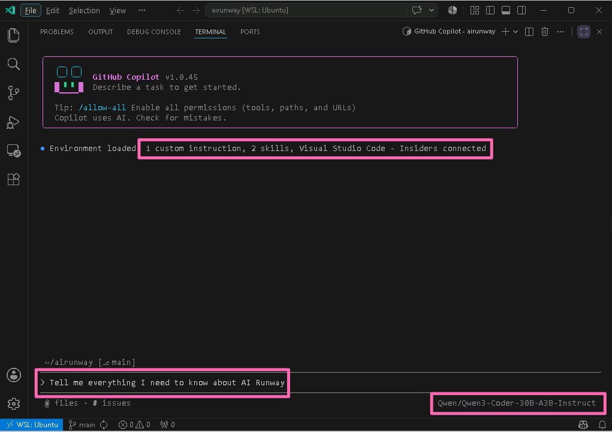

You can either spend time here and ask it more questions or move on to the metrics section below.

</details>

<details>
<summary><strong>Option B: VS Code Insiders</strong></summary>

If you prefer a graphical interface, VS Code Insiders supports [custom language model configurations](https://code.visualstudio.com/docs/copilot/customization/language-models) that let Copilot use your self-hosted models.

In VS Code Insiders, make sure you have the AI Runway repository open by clicking **File --> Open Folder...**, type `/home/labuser/airunway` in the path, then click the **OK** button.


Open VS Code Insiders, open the **Command Palette** (Ctrl+Shift+P), and search for **Chat: Open Language Models (JSON)**. This opens the settings file where you can add your custom model configuration.

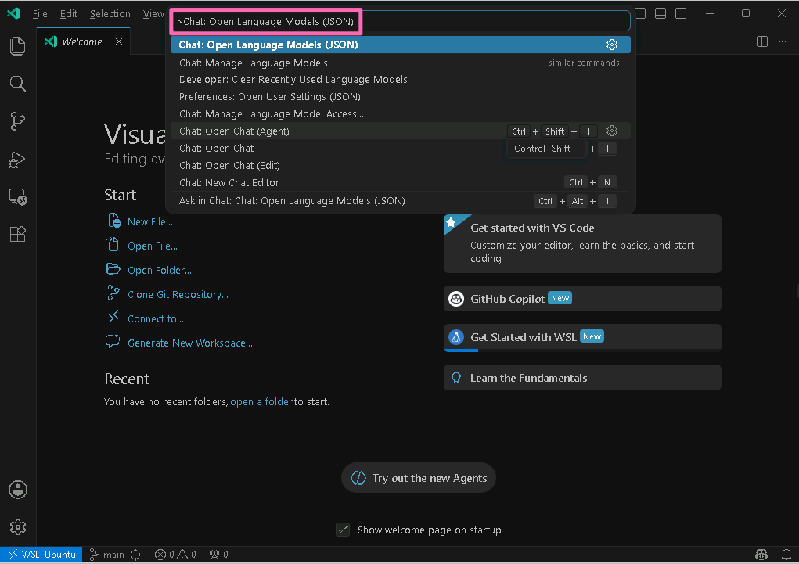

Replace the JSON with the following:

```json
[
  {
    "name": "OpenAI Compatible",
    "vendor": "customoai",
    "models": [
      {
        "id": "Qwen/Qwen3-Coder-30B-A3B-Instruct",
        "name": "Qwen/Qwen3-Coder-30B-A3B-Instruct",
        "url": "http://<REPLACE_THIS_WITH_YOUR_GATEWAY_IP>/v1",
        "toolCalling": true,
        "vision": true,
        "maxInputTokens": 128000,
        "maxOutputTokens": 16000
      }
    ]
  }
]
```

Replace **<REPLACE_THIS_WITH_YOUR_GATEWAY_IP>** with your gateway's external IP:

```bash
echo "Gateway IP: $(kubectl get gateway -n istio-system inference-gateway -o jsonpath='{.status.addresses[0].value}')"
```

Save the file.

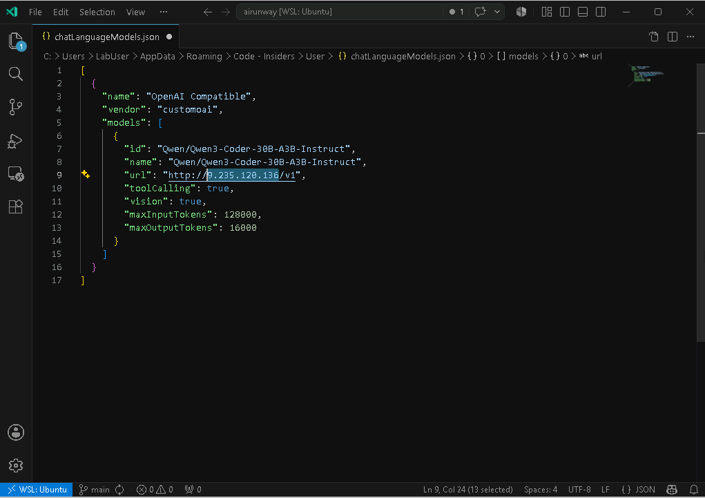

Click the Copilot icon in the editor to toggle open the Copilot pane. Click on **Auto** to open the model selector.

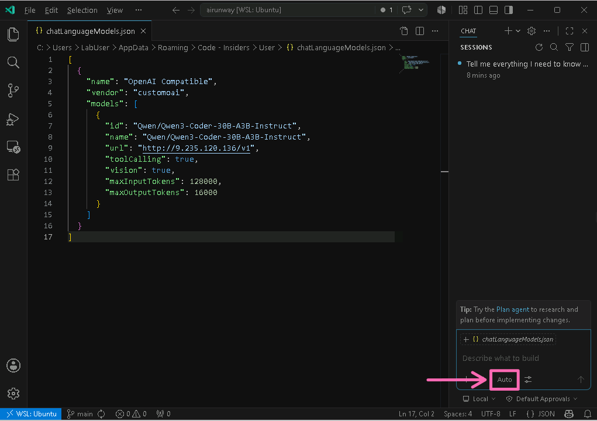

Click on the model selector and select **Other Models** to expand the options.

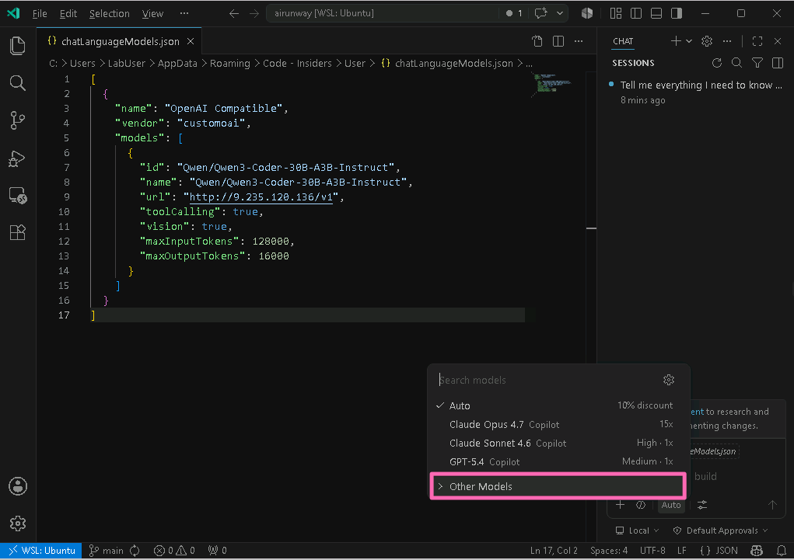

You should see your custom model (**Qwen/Qwen3-Coder-30B-A3B-Instruct**) listed under the **OpenAI Compatible** provider. Click it.

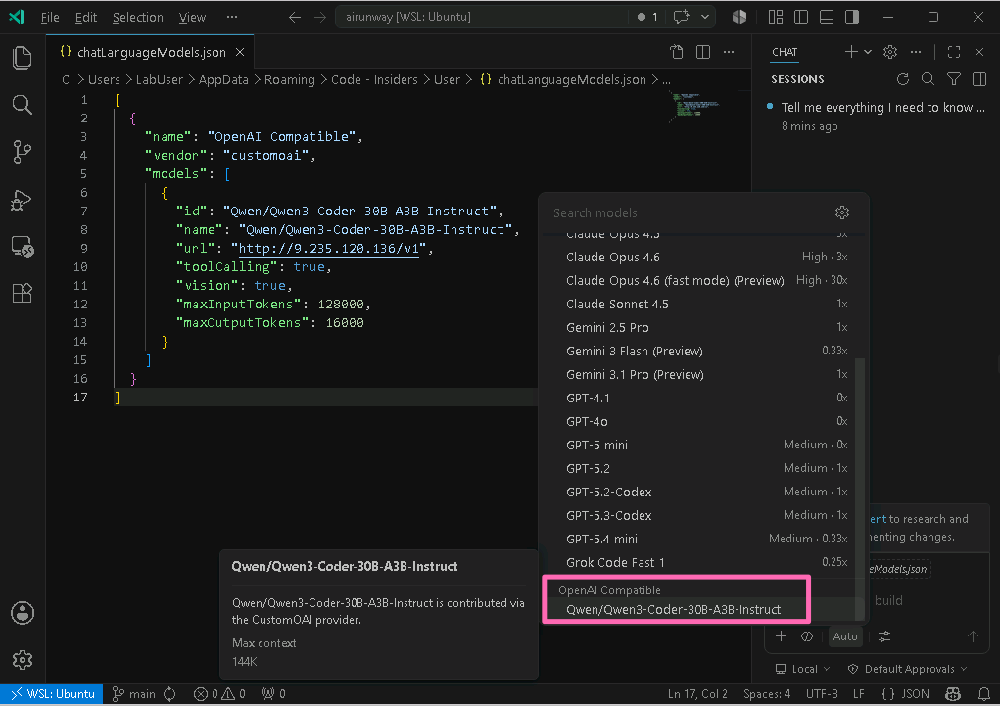

Now you can use Copilot in VS Code Insiders, and all completions will be served by your self-hosted model running in AKS instead of the public API.

Enter the following prompt: `Tell me everything I need to know about AI Runway`

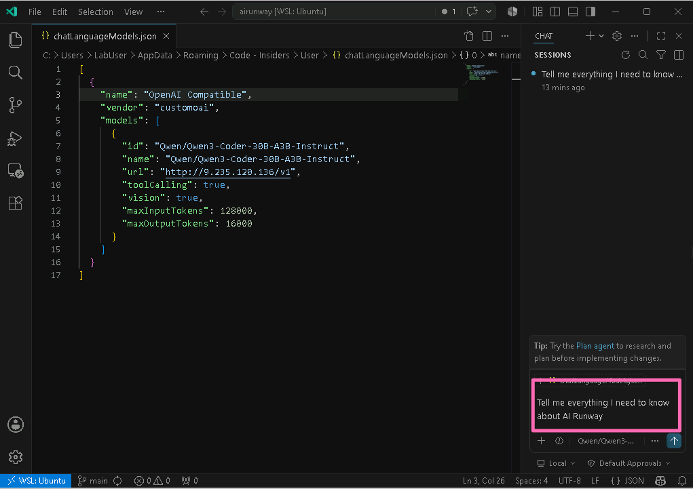

</details>

### Review Prometheus Metrics

AI Runway exposes Prometheus metrics for observability. The lab environment includes the [kube-prometheus-stack](https://github.com/prometheus-community/helm-charts/tree/main/charts/kube-prometheus-stack) for collecting and visualizing metrics, and the [NVIDIA DCGM Exporter](https://docs.nvidia.com/datacenter/dcgm/latest/gpu-telemetry/dcgm-exporter.html) (bundled with the GPU Operator) for GPU-level telemetry. DCGM (Data Center GPU Manager) exposes per-GPU metrics like utilization, memory usage, and temperature that Prometheus scrapes automatically.

The airunway controller provides the following metrics:

**Controller metrics:**

| Metric                                          | Description                                                                         |
| ----------------------------------------------- | ----------------------------------------------------------------------------------- |
| airunway_deployment_phase                       | Current phase of each deployment (Pending, Deploying, Running, Failed, Terminating) |
| airunway_deployment_replicas                    | Replica count by state (desired, ready, available)                                  |
| airunway_modeldeployment_total                  | Total number of model deployments by namespace and phase                            |
| airunway_provider_selection_total               | Provider selection events by provider and reason                                    |
| airunway_reconciliation_duration_seconds_bucket | Reconciliation latency distribution by provider                                     |
| airunway_reconciliation_duration_seconds_count  | Number of reconciliations observed by provider                                      |
| airunway_reconciliation_duration_seconds_sum    | Total reconciliation time in seconds by provider                                    |
| airunway_reconciliation_errors_total            | Reconciliation error count by provider and error type                               |

> [!NOTE]
> **How these metrics shape DORA metrics for platform engineering**
>
> If your platform engineering team tracks [DORA metrics](https://dora.dev/guides/dora-metrics-four-keys/) to measure developer experience, the metrics above feed directly into all four:
>
> - **Deployment Frequency**: airunway_modeldeployment_total and airunway_provider_selection_total tell you how often teams are shipping new model deployments. A healthy platform should see this number growing as adoption increases.
> - **Lead Time for Changes**: airunway*reconciliation_duration_seconds*\* measures how long the platform takes to reconcile a ModelDeployment from spec change to running state. Combined with airunway_deployment_phase transition timestamps, you can track the full time from "developer commits a ModelDeployment YAML" to "model is serving traffic": especially powerful when paired with GitOps (Argo CD sync time + reconciliation time + pod readiness).
> - **Change Failure Rate**: airunway_reconciliation_errors_total and airunway_deployment_phase (count of transitions to **Failed**) reveal what percentage of model deployments fail. Breaking this down by provider and error type helps identify whether failures are platform issues or user spec errors.
> - **Mean Time to Recovery (MTTR)**: airunway_deployment_replicas (tracking ready vs. desired) combined with airunway_deployment_phase transitions from **Failed** back to **Running** show how quickly the platform self-heals. The reconciliation loop is designed to continuously drive toward desired state, so MTTR should be low for transient failures.
>
> For platform teams, these metrics answer the question: _"Is our AI inference platform making it easier and faster for developers to ship models to production?"_ - which is ultimately what platform engineering is about.

**Access Grafana to view pre-built dashboards:**

Port-forward Grafana (this will occupy the terminal):

```bash
kubectl port-forward svc/prometheus-grafana -n monitoring 3000:80
```

Open a **new terminal tab** for the remaining commands. In a new browser tab navigate to http://localhost:3000.

Get Grafana admin password:

```bash
kubectl get secret --namespace prometheus -l app.kubernetes.io/component=admin-secret -o jsonpath="{.items[0].data.admin-password}" | base64 --decode ; echo
```

Log in using admin as the username and copy/paste the password that was printed in the terminal.

To explore AI Runway controller metrics, navigate to the **Metrics Drilldown** page in Grafana: http://127.0.0.1:3000/a/grafana-metricsdrilldown-app/drilldown.

Use the filter to select namespace = airunway-system and you'll see the controller metrics listed above.

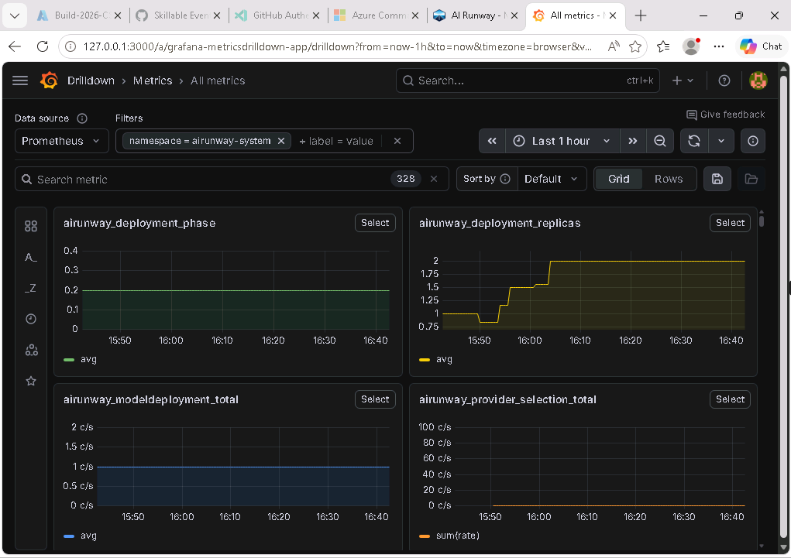

Next, import the [NVIDIA DCGM Exporter Dashboard](https://grafana.com/grafana/dashboards/12219-nvidia-dcgm-exporter-dashboard/) to visualize GPU metrics.

In Grafana, go to the Dashboards page: http://127.0.0.1:3000/.

Click **New → Import**, enter dashboard ID 12219 then click **Load**.

Select the **Prometheus** data source, and click **Import**.


#### Import the AI Runway Platform Overview Dashboard

Next, import the AI Runway Platform Overview dashboard. This custom dashboard ties together everything you've seen in this workshop - controller metrics, DORA indicators, provider activity, and inference engine telemetry - into a single pane of glass.

The dashboard is organized into five rows, each focusing on a different layer of the platform:

1. **Deployment Status** - Six stat tiles show you the total number of ModelDeployments and their current phase (Running, Deploying, Pending, Failed, Terminating) at a glance. Below them, a time series tracks phase transitions over time so you can spot rollout waves or stuck deployments, a pie chart breaks down which providers are handling your workloads, and a stacked area chart compares ready vs desired replicas across all deployments.

2. **Reconciliation Performance** - This is where you'd investigate a slow or misbehaving provider. Three panels show reconciliation duration percentiles (p50/p95/p99) broken out by provider, the reconciliation rate (how many reconcile loops per second each provider is processing), and the error rate. If a provider's p99 latency spikes or errors start climbing, you know exactly where to look.

3. **DORA - Platform Engineering Indicators** - Four stat panels map directly to the [DORA metrics](https://dora.dev/guides/dora-metrics-four-keys/) discussed earlier: Deployment Frequency (active deployments in the last 24h), Lead Time (average reconciliation duration - the platform's processing time from spec change to running), Change Failure Rate (reconciliation errors as a percentage of total reconciliations), and Currently Failed Deployments (a live count of deployments in the Failed phase). These answer the question: _"Is our AI inference platform getting better or worse over time?"_

4. **Provider Activity** - A bar chart shows reconciliation throughput by provider over time, and a color-coded table lists every active deployment with its namespace and current phase. This is useful for multi-tenant clusters where different teams deploy to different namespaces.

5. **Inference Engine Metrics** - This row shows what's happening inside the inference engines themselves: active vs queued requests, time to first token percentiles (p50/p95/p99), KV-cache GPU utilisation per pod, and token throughput (prompt tokens/s and generation tokens/s). These metrics come from the `vllm:*` Prometheus metrics exposed by vLLM-based inference pods.

The inference engine panels require **PodMonitors** to tell Prometheus where to scrape metrics from your inference pods. Each provider deploys pods with different labels and ports, so there's a separate PodMonitor for each provider. These have already been pre-installed via the Argo CD bootstrap - you can verify they're running:

```bash
kubectl get podmonitors -A -l app.kubernetes.io/part-of=airunway
```

You should see monitors for each provider namespace. Each one uses provider-specific pod label selectors and port names to target the right pods.

Now import the dashboard. Download the JSON from this gist:

```bash
curl -sL https://gist.github.com/pauldotyu/fd5f1f95d246371e505c7217ad3ea271/raw -o /tmp/airunway-platform-overview.json
```

In Grafana, go to **Dashboards → New → Import**, click **Upload dashboard JSON file**, select `/tmp/airunway-platform-overview.json`, choose the **Prometheus** data source, and click **Import**.

> [!NOTE]
> The DORA row is especially useful for platform engineering teams. If your **Change Failure Rate** is climbing, it might indicate spec validation gaps. If **Lead Time** is increasing, you may need to investigate provider-side bottlenecks or image pull latency. These are the same signals SRE teams use for traditional microservices - applied to AI inference workloads.

### From Prototype to Production

Here's the key insight: everything you've deployed in this workshop is **declarative Kubernetes YAML**. **ModelDeployment** resources are no different from any other Kubernetes manifest - which means you can build platform engineering capabilities around them using the same tools your team already knows.

The pattern is straightforward:

1. Store **ModelDeployment** YAMLs in a Git repository alongside your application code
2. Use a GitOps tool like Argo CD to continuously reconcile them against your cluster
3. Get pull-request-based review, rollback, and audit trails - for free

**This is exactly how this lab was built.** The AKS cluster and Azure Managed Lustre storage were provisioned with Terraform, and every component running in the cluster - the AI Runway controller, provider controllers, Gateway API, GPU Operator - was deployed via Argo CD using the **App of Apps** pattern with sync waves to control ordering.

Verify for yourself:

```bash
kubectl get applications -n argocd -o custom-columns=NAME:.metadata.name,SYNC:.status.sync.status,HEALTH:.status.health.status
```

All applications should show **Synced** and **Healthy**. In production, you'd commit your **ModelDeployment** manifests to the same repo - Argo CD continuously reconciles them, and your AI inference platform becomes as manageable as any other Kubernetes workload.

> [!TIP]
> See [Appendix B](#appendix-b-argocd-app-of-apps-deep-dive) for the complete App of Apps pattern, sync wave ordering, and root Application YAML.

### Clean Up All Deployments

Before wrapping up, delete all remaining **ModelDeployment** resources across all namespaces. This triggers automatic cleanup of all provider resources, gateway resources (InferencePool, HTTPRoute, EPP), and pods via Kubernetes owner references:

```bash
kubectl delete modeldeployment --all -n kaito-workspace
kubectl delete modeldeployment --all -n dynamo-system
kubectl delete modeldeployment --all
```

Verify everything is cleaned up:

```bash
# No ModelDeployments should remain in any namespace
kubectl get modeldeployment -A

# InferencePools and HTTPRoutes should also be gone
kubectl get inferencepool -A
kubectl get httproute -A
```

Refresh the **Deployments** page in the dashboard - it should be empty. This demonstrates how Kubernetes owner references provide automatic, cascading cleanup - you only need to delete the top-level resource.

### Where to Go from Here

You've covered the core workflow end-to-end. Here are paths to explore next:

- **Custom provider shims** - Write your own provider controller to integrate a new inference backend. The **InferenceProviderConfig** CRD is the contract your provider needs to implement. See the [provider documentation](https://github.com/kaito-project/airunway/tree/main/providers) for examples.
- **Production hardening** - Add network policies, Pod Security Standards, resource quotas, and RBAC scoping for multi-tenant clusters. The controller already supports namespace-scoped deployments.
- **GitOps with Argo CD** - Store **ModelDeployment** manifests in Git and let Argo CD continuously reconcile them. Use sync waves to control rollout ordering (infrastructure → models → canary configs).
- **Headlamp plugin** - Try the [Headlamp dashboard plugin](https://github.com/kaito-project/airunway/tree/main/plugins/headlamp) if your team uses Headlamp for Kubernetes management.

### What You Learned

In this workshop, you:

1. **Understood** AI Runway's decoupled architecture - core controller + out-of-tree providers + optional UI
2. **Explored** the **ModelDeployment** and **InferenceProviderConfig** CRDs and provider auto-selection
3. **Deployed** models to both CPU (KAITO + llama.cpp) and GPU (Dynamo + vLLM) with zero provider-specific configuration
4. **Configured** advanced patterns - disaggregated prefill/decode and Lustre-backed model caching
5. **Validated** Gateway API Inference Extension with body-based routing across multiple models through a single endpoint
6. **Integrated** self-hosted models with developer tooling (VS Code, Copilot CLI, OpenAI SDK) for private, low-latency inference
7. **Monitored** deployments with Prometheus metrics and Kubernetes events
8. **Connected the dots** from prototype to production - declarative CRDs, Git-committed manifests, and GitOps with Argo CD and Terraform for full platform engineering

**You just built a production-grade AI inference platform on Kubernetes. 🎉**

From a single ModelDeployment CRD, you deployed models across CPU and GPU, configured disaggregated serving for production-scale throughput, wired up automatic gateway routing across multiple models, connected real developer tools to self-hosted inference, and monitored everything with Prometheus - all using declarative, Kubernetes-native resources that fit into any GitOps workflow. This is AI platform engineering.

### Additional Resources

- [AI Runway GitHub Repository](https://github.com/kaito-project/airunway)
- [KAITO Project (CNCF Sandbox)](https://github.com/kaito-project/kaito)
- [Gateway API Inference Extension](https://gateway-api-inference-extension.sigs.k8s.io/)
- [Deploy AI models on AKS with KAITO](https://learn.microsoft.com/azure/aks/ai-toolchain-operator)
- [Use GPU-based workloads on AKS](https://learn.microsoft.com/azure/architecture/reference-architectures/containers/aks-gpu/gpu-aks)
- [Azure Managed Lustre CSI Driver](https://learn.microsoft.com/azure/azure-managed-lustre/use-csi-driver-kubernetes)
- [Argo CD Documentation](https://argo-cd.readthedocs.io/en/stable/)

---

## Appendix A: Provider Capability Matrix & Selection Rules

This reference covers the full provider capability matrix and auto-selection algorithm. During the workshop, we focused on the two most common rules (no GPU → KAITO, GPU → Dynamo). Here's the complete picture.

### Provider Capability Matrix

| Capability                   | KAITO   | Dynamo            | KubeRay       | llm-d         |
| ---------------------------- | ------- | ----------------- | ------------- | ------------- |
| CPU inference                | Yes     | No                | No            | No            |
| GPU inference                | Yes     | **Yes**           | Yes           | Yes           |
| vLLM engine                  | Yes     | **Yes**           | Yes           | Yes           |
| SGLang engine                | No      | **Yes**           | No            | No            |
| TensorRT-LLM engine          | No      | **Yes**           | No            | No            |
| llama.cpp engine             | **Yes** | No                | No            | No            |
| Disaggregated prefill/decode | No      | **Yes**           | Yes           | Yes           |
| Auto-selection               | Yes     | Yes (default GPU) | No (explicit) | No (explicit) |

### Complete Auto-Selection Algorithm

When you omit **spec.provider.name**, the controller evaluates these rules in order:

1. **No GPU requested** → KAITO (only CPU-capable provider), engine auto-selected to **llamacpp**
2. **Engine is trtllm or SGLang** → Dynamo (only provider supporting these)
3. **Engine is llamacpp** → KAITO (only llamacpp provider)
4. **Disaggregated mode** → Dynamo (best disaggregated support)
5. **Default (GPU + vllm + aggregated)** → Dynamo (GPU inference default)

The selection reason is always recorded in **status.provider.selectedReason** for full observability.

---

## Appendix B: Argo CD App of Apps Deep Dive

This appendix explains the GitOps pattern used to bootstrap this lab environment. The same approach works for production AI inference platforms.

### The App of Apps Pattern

Instead of deploying each component individually, a single "root" Argo CD Application points to a directory of child Application manifests. Argo CD discovers and syncs all of them automatically:

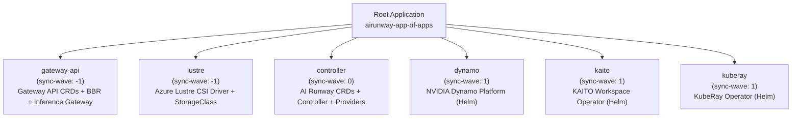
```mermaid
graph TD
    Root["Root Application<br/>airunway-app-of-apps"] --> Gateway["gateway-api<br/>(sync-wave: -1)<br/>Gateway API CRDs + BBR + Inference Gateway"]
    Root --> Lustre["lustre<br/>(sync-wave: -1)<br/>Azure Lustre CSI Driver + StorageClass"]
    Root --> Controller["controller<br/>(sync-wave: 0)<br/>AI Runway CRDs + Controller + Providers"]
    Root --> Dynamo["dynamo<br/>(sync-wave: 1)<br/>NVIDIA Dynamo Platform (Helm)"]
    Root --> KAITO["kaito<br/>(sync-wave: 1)<br/>KAITO Workspace Operator (Helm)"]
    Root --> KubeRay["kuberay<br/>(sync-wave: 1)<br/>KubeRay Operator (Helm)"]
```

### Root Application

The root Application just points Argo CD at a directory of child manifests:

```yaml
apiVersion: argoproj.io/v1alpha1
kind: Application
metadata:
  name: airunway-app-of-apps
  namespace: argocd
spec:
  project: default
  source:
    repoURL: https://github.com/pauldotyu/Build26-LAB510.git
    targetRevision: HEAD
    path: src/manifests/argocd/apps # Directory of child Application YAMLs
  destination:
    server: https://kubernetes.default.svc
    namespace: argocd
  syncPolicy:
    automated:
      prune: true
      selfHeal: true
```

### Sync Waves Control Ordering

Argo CD **sync waves** ensure components deploy in the right order:

| Wave   | Components                                           | Why first?                                                  |
| ------ | ---------------------------------------------------- | ----------------------------------------------------------- |
| **-1** | Gateway API CRDs, Lustre CSI driver, StorageClass    | CRDs and storage must exist before anything references them |
| **0**  | AI Runway controller + CRDs + provider registrations | The controller must be running before providers register    |
| **1**  | Dynamo, KAITO, KubeRay operators                     | Provider operators depend on AI Runway CRDs being available |

This means you can bootstrap an entire AI inference platform on a fresh cluster by applying a single manifest:

```bash
kubectl apply -f app-of-apps.yaml
```

Argo CD takes care of the rest - installing CRDs first, then the controller, then the provider operators - all in the correct order.

Each child Application can pull from a different source type - plain YAML in a Git repo for custom manifests, or upstream Helm charts for third-party operators like Dynamo, KAITO, and KubeRay. Argo CD unifies them into a single reconciliation loop.

---

## Appendix C: Troubleshooting Tips

### No Gateway Endpoint?

If your deployment is running but the Gateway Endpoint isn't showing up, the gateway resources (InferencePool, HTTPRoute) may have failed to create. You can check the Argo CD application status and health to confirm.

Retrieve Argo CD password:

```bash
ARGOCD_PWD=$(kubectl -n argocd get secret argocd-initial-admin-secret -o jsonpath="{.data.password}" | base64 -d)
```

Port-forward to the Argo CD API server (this will occupy the terminal):

```bash
kubectl port-forward svc/argo-cd-argocd-server -n argocd 9000:80
```

Open a **new terminal tab** and log in to the Argo CD dashboard:

```bash
argocd login localhost:9000 --username admin --password "$ARGOCD_PWD" --insecure
```

> [!TIP]
> You can also open a web browser and navigate to <http://localhost:9000> to access the Argo CD dashboard with the same credentials.

Check the gateway-api application:

```bash
argocd app get gateway-api
```

If it's not Synced and Healthy, check the application events for errors:

```bash
argocd app sync gateway-api --prune
```

Run the following command to confirm the app is healthy and synced:

```bash
argocd app get gateway-api
```

If you have a model that needs to be updated with a gateway endpoint, you can run the following command:

```bash
MD_NAME=$(kubectl get modeldeployment -n kaito-workspace -o jsonpath='{.items[0].metadata.name}')
kubectl patch modeldeployment $MD_NAME -n kaito-workspace \
--type='merge' \
-p '{"spec":{"gateway":{"enabled":true}}}'
```
