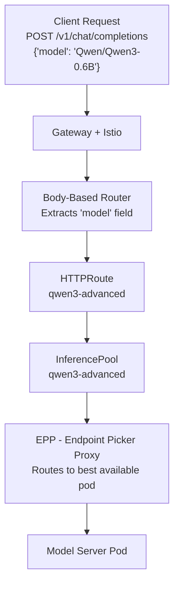
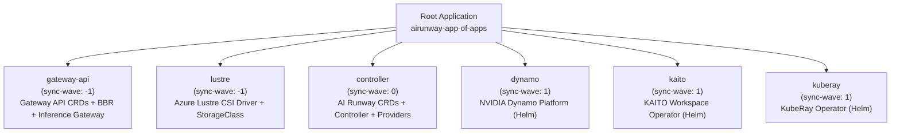

## Overview

AI Runway is an open-source accelerator that simplifies deploying LLMs on Kubernetes. By treating models as native Kubernetes resources, AI Runway offers a single interface that adapts to multiple inference backends. In this workshop, you will deploy LLMs on Azure Kubernetes Service (AKS) CPU nodes and GPU nodes, implement custom resources for scaling and networking, configure GPU and latency monitoring, and integrate it into CI/CD pipelines.

## Prerequisites

This workshop assumes you have:

- **Foundational Kubernetes knowledge** — You're comfortable with concepts like pods, deployments, services, namespaces, and `kubectl` commands
- **Basic AKS familiarity** — You've worked with Azure Kubernetes Service before (provisioning, connecting, node pools)
- **A HuggingFace account** (optional) — Required only if you want to deploy gated models (e.g., Meta Llama). You can create one at [huggingface.co/join](https://huggingface.co/join)

Everything else — GPU operators, inference engines, Gateway API, ArgoCD — will be explained as you encounter it.

### Required Tools

The lab VM has these pre-installed. If you're running outside the lab environment, ensure you have:

| Tool | Purpose | Install |
|------|---------|---------|
| [Azure CLI](https://learn.microsoft.com/cli/azure/install-azure-cli) | Manage Azure resources and AKS credentials | `curl -sL https://aka.ms/InstallAzureCLIDeb \| sudo bash` |
| [kubectl](https://kubernetes.io/docs/tasks/tools/) | Interact with Kubernetes clusters | Installed via Azure CLI: `az aks install-cli` |
| [Bun](https://bun.sh) | Run the AI Runway dashboard (frontend + backend) | `curl -fsSL https://bun.sh/install \| bash` |
| [Helm](https://helm.sh/docs/intro/install/) | Used by the dashboard for runtime installation | `curl https://raw.githubusercontent.com/helm/helm/main/scripts/get-helm-3 \| bash` |
| [jq](https://jqlang.org/) | Parse JSON output from `kubectl` and `curl` | `sudo apt-get install jq` |
| [Git](https://git-scm.com/) | Clone the AI Runway repository | `sudo apt-get install git` |

### Self-Provisioning (Outside the Lab)

If you're not using the Skillable lab environment, you can provision the infrastructure yourself using the Terraform configuration in this repository:

```bash
cd src/infra/terraform
az login
terraform init
terraform apply
```

This creates an AKS cluster with CPU and GPU node pools, Azure Managed Lustre storage, and bootstraps all components via ArgoCD. Once complete, grab the outputs and connect:

```bash
RG_NAME=$(terraform output -raw rg_name)
AKS_NAME=$(terraform output -raw aks_name)

az aks get-credentials \
  --resource-group $RG_NAME \
  --name $AKS_NAME \
  --overwrite
```

> **Note:** The Terraform configuration requires an Azure subscription with GPU quota (Standard_NC48ads_A100_v4). Request quota increases in advance — GPU quota approvals can take time.

## Module 0: Setup

**Duration:** ~10 minutes

In this module, you'll sign into the services you'll use throughout the workshop and provision your lab infrastructure. By the end, you'll have a running AKS cluster with GPU nodes and the AI Runway dashboard open in your browser.

### Sign Into Services

You'll need to authenticate with three services before starting. Complete each step below before moving on.

#### Log into Azure

Open the Azure portal using the credentials provided by the lab environment. You'll use this subscription for the AKS cluster and supporting resources.


#### Log into GitHub

Navigate to `https://github.com/enterprises/skillable-events/sso` and authenticate with your lab-provided GitHub Enterprise account. This gives you access to the workshop repository and enables GitHub Copilot features.


#### Open VS Code Insiders

Launch VS Code Insiders from the taskbar and sign in when prompted. This connects your GitHub account so you can use Copilot with your self-hosted models later in Module 5.


#### Open a Terminal

In VS Code Insiders, open a terminal (`Ctrl+``). It should automatically connect to WSL. All CLI commands for the rest of the workshop will run here.


### Connect to Your Cluster

The lab environment comes with an AKS cluster already provisioned — including GPU node pools, networking, Azure Managed Lustre storage, and all pre-installed components (GPU Operator, Istio, ArgoCD (more on this at the end), AI Runway controller, and provider controllers).

**Log into the Azure CLI:**

```bash
az login
```

**Connect to the AKS cluster:**

```bash
az aks get-credentials \
--resource-group rg-msbuildlab510 \
--name aks-msbuildlab510 \
--overwrite
```

**Verify the connection** — confirm you can reach the cluster:

```bash
kubectl get nodes
```

You should see nodes listed — you'll inspect them more closely in Module 2.

### Launch the AI Runway Dashboard

**Clone the AI Runway repository** and install dependencies:

```bash
git clone https://github.com/kaito-project/airunway.git
cd airunway
bun install
```

**Start the development server** — this launches both the frontend dashboard and the backend API:

```bash
bun run dev
```

**Open the dashboard** — navigate to [http://localhost:5173](http://localhost:5173) in your browser. You should see the AI Runway home page. Keep this tab open — you'll use it throughout the workshop.

---

## Module 1: Architecture & Core Concepts

**Duration:** ~10 minutes

**Objectives:**
By the end of this module, you will be able to:

- Describe AI Runway's decoupled architecture and how each component communicates
- Explain the role of the core controller, provider controllers, and the optional UI layer
- Identify the purpose of `ModelDeployment` and `InferenceProviderConfig` CRDs

With your environment provisioned and the dashboard running, let's explore how AI Runway works under the hood.

### What is AI Runway?

AI Runway is an open-source platform that lets you deploy and manage machine learning models on Kubernetes using a single, unified interface. Instead of learning the specifics of each inference provider (KAITO, Dynamo, KubeRay, llm-d), you describe **what** you want to deploy — the model, engine, and resources — and AI Runway handles the **how**.

Think of it like a universal remote: one set of buttons (the `ModelDeployment` CRD) controls many different devices (inference providers) behind the scenes.

### Architecture Overview

AI Runway follows a **fully decoupled** design with three layers:


**Key design principles:**

| Principle                                | What it means                                                                                                         |
| ---------------------------------------- | --------------------------------------------------------------------------------------------------------------------- |
| **Core controller is minimal**           | It only validates specs, selects providers, and updates status — it never creates provider-specific resources         |
| **Provider controllers are out-of-tree** | Each provider (KAITO, Dynamo, etc.) has its own controller that can be versioned and released independently           |
| **UI is optional**                       | The platform works entirely via `kubectl` and CRDs. The web dashboard or Headlamp plugin are convenience layers       |
| **Two-tier reconciliation**              | Inspired by the Kubernetes Container Runtime Interface (CRI) — the core defines the interface, providers implement it |

> **Analogy:** Just as the `kubelet` talks to containerd via the CRI interface (and doesn't care whether you use containerd or CRI-O), the AI Runway core controller talks to providers via the `InferenceProviderConfig` interface. Swap providers without changing your `ModelDeployment` specs.

### The ModelDeployment CRD

`ModelDeployment` is the primary resource you interact with. It describes:

- **What model** to deploy (HuggingFace ID or custom)
- **Which engine** to use (vLLM, llama.cpp, sglang, TRT-LLM — or let the controller auto-select)
- **How to serve** (aggregated or disaggregated prefill/decode)
- **Resource requirements** (GPU count, memory)
- **Gateway integration** (auto-detected when Gateway API CRDs are present)

```yaml
apiVersion: airunway.ai/v1alpha1
kind: ModelDeployment
metadata:
  name: my-model
  namespace: default
spec:
  model:
    id: "Qwen/Qwen3-0.6B"
    source: huggingface
  engine:
    type: vllm # Optional — auto-selected if omitted
  serving:
    mode: aggregated # aggregated or disaggregated
  resources:
    gpu:
      count: 1
  scaling:
    replicas: 1
  gateway:
    enabled: true # Auto-creates InferencePool + HTTPRoute
```

### The InferenceProviderConfig CRD

`InferenceProviderConfig` is a cluster-scoped resource that each provider controller registers at startup. It declares:

- **Capabilities** — supported engines, serving modes, GPU/CPU support
- **Selection rules** — CEL expressions that determine when this provider should be auto-selected
- **Installation metadata** — Helm charts and steps (used by the UI for runtime installation)

```yaml
apiVersion: airunway.ai/v1alpha1
kind: InferenceProviderConfig
metadata:
  name: kaito
spec:
  capabilities:
    engines: [vllm, llamacpp]
    servingModes: [aggregated]
    cpuSupport: true
    gpuSupport: true
  selectionRules:
    - condition: "!has(spec.resources.gpu) || spec.resources.gpu.count == 0"
      priority: 100
    - condition: "spec.engine.type == 'llamacpp'"
      priority: 100
```

### Provider Capability Matrix

| Capability                   | KAITO   | Dynamo            | KubeRay       | llm-d         |
| ---------------------------- | ------- | ----------------- | ------------- | ------------- |
| CPU inference                | Yes     | No                | No            | No            |
| GPU inference                | Yes     | **Yes**           | Yes           | Yes           |
| vLLM engine                  | Yes     | **Yes**           | Yes           | Yes           |
| sglang engine                | No      | **Yes**           | No            | No            |
| TRT-LLM engine               | No      | **Yes**           | No            | No            |
| llama.cpp engine             | **Yes** | No                | No            | No            |
| Disaggregated prefill/decode | No      | **Yes**           | Yes           | Yes           |
| Auto-selection               | Yes     | Yes (default GPU) | No (explicit) | No (explicit) |

### How Provider Selection Works

When you omit `spec.provider.name`, the controller auto-selects using this logic:

1. **No GPU requested** → KAITO (only CPU-capable provider), engine auto-selected to `llamacpp`
2. **Engine is `trtllm` or `sglang`** → Dynamo (only provider supporting these)
3. **Engine is `llamacpp`** → KAITO (only llamacpp provider)
4. **Disaggregated mode** → Dynamo (best disaggregated support)
5. **Default (GPU + vllm + aggregated)** → Dynamo (GPU inference default)

The selection reason is always recorded in `status.provider.selectedReason` for full observability.

### Explore the CRDs in Your Cluster

Verify the CRDs are installed:

```bash
kubectl get crd | grep airunway
```

Expected output:

```text
modeldeployments.airunway.ai              2025-05-01T00:00:00Z
inferenceproviderconfigs.airunway.ai      2025-05-01T00:00:00Z
```

View the registered providers:

```bash
kubectl get inferenceproviderconfigs
```

Expected output:

```text
NAME     READY   VERSION
dynamo   True    dynamo-provider:v0.2.0
kaito    True    kaito-provider:v0.3.0
```

Inspect provider capabilities:

```bash
kubectl get inferenceproviderconfig kaito -o yaml
kubectl get inferenceproviderconfig dynamo -o yaml
```

> **Key Takeaway:** AI Runway separates _what_ you want (ModelDeployment) from _how_ it's implemented (provider controllers). This means you can switch providers, add new ones, or upgrade them independently — without changing your deployment specs.

---

## Module 2: Environment Validation & UI Exploration

**Duration:** ~10 minutes

**Objectives:**
By the end of this module, you will be able to:

- Verify your AKS cluster and GPU node pool are healthy
- Launch the AI Runway web dashboard and navigate its features
- Explore the model catalog and provider settings

Now that you understand the architecture and CRDs, let's verify that all the pieces are running in your cluster before we deploy any models.

### Verify AKS Cluster Status

Confirm your cluster connection and node pool status:

```bash
kubectl get nodes -o wide
```

You should see at least:

- 3 nodes in the `default` pool (Standard_D4d_v4 — CPU)
- 1 node in the `inference` pool (Standard_NC48ads_A100_v4 — GPU)

Check that the GPU node is ready and has GPU resources:

```bash
kubectl describe node -l agentpool=inference | grep -A 5 "Allocatable"
```

Look for `nvidia.com/gpu` in the allocatable resources.

### Verify Pre-installed Components

Check that all infrastructure components are running:

```bash
# NVIDIA GPU Operator
kubectl get pods -n gpu-operator --no-headers | head -5

# Istio control plane
kubectl get pods -n istio-system

# AI Runway controller
kubectl get pods -l app.kubernetes.io/name=airunway

# Provider controllers
kubectl get pods -l app.kubernetes.io/component=provider
```

Verify Gateway API CRDs are installed:

```bash
kubectl get crd | grep -E "gateways|httproutes|inferencepools"
```

Expected output:

```text
gateways.gateway.networking.k8s.io           ...
httproutes.gateway.networking.k8s.io         ...
inferencepools.inference.networking.x-k8s.io ...
```

### Verify the Gateway Resource

A Gateway resource should already be deployed for inference routing:

```bash
kubectl get gateways.gateway.networking.k8s.io
```

Expected output:

```text
NAME                CLASS   ADDRESS         PROGRAMMED   AGE
inference-gateway   istio   <EXTERNAL-IP>   True         ...
```

Note the `ADDRESS` — this is the unified endpoint you'll use for all model inference calls later.

### Launch the AI Runway Dashboard

If not already running, start the dashboard:

```bash
cd airunway
bun install
bun run dev
```

Open [http://localhost:5173](http://localhost:5173) in your browser.

### Explore the Dashboard

The dashboard has three main pages accessible from the left sidebar: **Models**, **Deployments**, and **Settings**. Take a few minutes to click through each one.

#### Models Page

This is the landing page. It shows a curated catalog of models organized by engine compatibility (vLLM, SGLang, TensorRT-LLM, Llama.cpp). You can filter by engine type using the tabs at the top, or switch to the **HuggingFace Hub** tab to search for any public model.


Each model card shows the model size, GPU memory requirements, supported engines, and a **Deploy →** button you'll use in the next module.

#### Deployments Page

Click **Deployments** in the sidebar. This page shows all active `ModelDeployment` resources in your cluster with their current status, provider, engine, and replica counts. It should be empty (or show any existing deployments) — you'll see it populate when you deploy your first model in Module 3.


#### Settings Page

Click **Settings** in the sidebar. This page has three tabs — **General**, **Runtimes**, and **Integrations** — that give you a full view of your cluster's inference capabilities.

**General tab** — Shows your cluster connection status and a summary of how many runtimes are installed. Verify it shows **Connected** and **4 of 4** runtimes installed.


**Runtimes tab** — Click the **Runtimes** tab to see all available inference runtimes. Each card shows whether the operator's CRD is installed and the operator is running. You should see **Dynamo**, **KAITO**, **KubeRay**, and **llm-d** all marked as installed. Click on any runtime card to expand its installation details and manual installation steps.


This tab also shows your cluster's **autoscaling** status — whether AKS-managed autoscaling or the Cluster Autoscaler is detected, and how many node pools are configured for autoscaling.

**Integrations tab** — Click the **Integrations** tab. This shows three components that work alongside the runtimes:

- **NVIDIA GPU Operator** — Whether GPUs are enabled and the operator is installed
- **Gateway API** — Whether Gateway API CRDs, the Inference Extension, and the inference gateway are detected (including the gateway endpoint address)
- **HuggingFace Token** — Connection status for accessing gated models


### (Optional) Connect HuggingFace

Some models (e.g., Meta Llama) require accepting a license on HuggingFace before downloading. If you want to deploy gated models later:

In the **Settings** page, click the **Integrations** tab. Under **HuggingFace Token**, click **Connect HuggingFace** and follow the OAuth flow to authorize access.


Once connected, you'll see your HuggingFace username and a **Connected** badge.

### Verify ArgoCD Sync Status

The lab environment uses ArgoCD for GitOps-based deployment of AI Runway components. Verify everything is synced:

```bash
kubectl get applications -n argocd
```

All applications should show `Synced` and `Healthy`.

> **Key Takeaway:** Your environment has a GPU-enabled AKS cluster with all the infrastructure pre-installed — NVIDIA GPU Operator, Istio with Gateway API Inference Extension, AI Runway controller, and provider controllers. You can manage everything via `kubectl`, the web dashboard, or both.

---

## Module 3: Core Deployment & Validation

**Duration:** ~10 minutes

**Objectives:**
By the end of this module, you will be able to:

- Deploy a model to CPU using KAITO with the `llamacpp` engine
- Deploy a model to GPU using Dynamo with the `vllm` engine
- Validate deployments using status conditions, logs, and OpenAI-compatible endpoints
- Observe how the Gateway automatically creates routing resources

Your cluster is healthy and the dashboard is running — time to deploy your first models and see the auto-selection logic in action.

### Deploy a Small Model to CPU via the Dashboard

Instead of writing YAML by hand, use the AI Runway dashboard to deploy your first model. This lets you see all the options visually and understand what each field controls.

#### Find the Model

In the dashboard, navigate to the **Models** page and search for `google/gemma-3-1b-it-qat-q8_0-gguf`. Click **Deploy**.


#### Configure the Deployment

In the deployment form, set the following:

- **Serving mode**: Aggregated
- **CPU**: 8
- **Memory**: 16Gi
- Leave GPU empty (this is a CPU-only deployment)


#### Create the Deployment

Click **Create Deployment**.

Notice you didn't select a provider or engine — the dashboard shows these will be auto-selected. Since no GPU is requested, the controller will choose KAITO as the provider and `llamacpp` as the engine.

> **What happens behind the scenes:**
> The dashboard sends this to the Kubernetes API as a `ModelDeployment` resource:
>
> ```yaml
> apiVersion: airunway.ai/v1alpha1
> kind: ModelDeployment
> metadata:
>   name: gemma-cpu
>   namespace: default
> spec:
>   model:
>     id: "google/gemma-3-1b-it-qat-q8_0-gguf"
>     source: huggingface
>   serving:
>     mode: aggregated
>   scaling:
>     replicas: 1
>   resources:
>     memory: "16Gi"
>     cpu: "8"
> ```
>
> The core controller validates it, auto-selects engine=`llamacpp` and provider=`kaito`, and the KAITO provider creates the inference pod.

### Watch It Come to Life

Switch to the **Deployments** page in the dashboard. You'll see `gemma-cpu` appear with its status updating in real time:


Now look behind the curtain — in your terminal, check the Kubernetes resources that were created:

```bash
kubectl get modeldeployment gemma-cpu -o yaml | grep -A 30 "status:"
```

You should see conditions like:

```yaml
conditions:
  - type: Validated
    status: "True"
  - type: EngineSelected
    status: "True"
    message: "Auto-selected engine: llamacpp"
  - type: ProviderSelected
    status: "True"
    message: "Selected provider 'kaito': matched rule - no GPU requested"
  - type: ResourceCreated
    status: "True"
  - type: GatewayReady
    status: "True"
  - type: Ready
    status: "True"
```

The same status you see in the dashboard maps directly to these Kubernetes conditions — the UI is just a friendlier view of the same data.

### Verify Gateway Resources Were Auto-Created

Back in the dashboard, click on the `gemma-cpu` deployment to see its detail view. Notice the **Gateway** section showing the auto-created routing resources:


When `gateway.enabled` is true (the default) and Gateway API CRDs are detected, AI Runway automatically creates:

- An **InferencePool** — selects pods labeled with `airunway.ai/model-deployment: gemma-cpu`
- An **HTTPRoute** — routes from the Gateway to the InferencePool
- An **EPP (Endpoint Picker Proxy)** — handles intelligent routing to model server pods

```bash
# Check the InferencePool
kubectl get inferencepool

# Check the HTTPRoute
kubectl get httproute

# Check the EPP deployment
kubectl get deployment -l airunway.ai/component=epp
```

### Test the OpenAI-Compatible Endpoint

Once the deployment shows `Ready=True`, test it via the Gateway:

```bash
# Get the gateway address
GATEWAY_IP=$(kubectl get gateway inference-gateway -o jsonpath='{.status.addresses[0].value}')

# Send a chat completion request
curl -s http://$GATEWAY_IP/v1/chat/completions \
  -H "Content-Type: application/json" \
  -d '{
    "model": "google/gemma-3-1b-it-qat-q8_0-gguf",
    "messages": [{"role": "user", "content": "Hello, who are you?"}],
    "max_tokens": 100
  }' | jq .
```

The Body-Based Router (BBR) in the gateway reads the `model` field from the request body and routes to the correct InferencePool — this is how multiple models share a single gateway endpoint.

You can also test directly via the model's service (bypassing the gateway):

```bash
# Port-forward to the model service
kubectl port-forward svc/gemma-cpu 8080:80 &

curl -s http://localhost:8080/v1/chat/completions \
  -H "Content-Type: application/json" \
  -d '{
    "model": "google/gemma-3-1b-it-qat-q8_0-gguf",
    "messages": [{"role": "user", "content": "Explain Kubernetes in one sentence."}],
    "max_tokens": 100
  }' | jq .

# Stop the port-forward
kill %1
```

### Deploy a GPU Model (Dynamo + vLLM)

Now deploy a GPU model — this time using `kubectl` directly, so you can see how the same result is achieved with YAML. The controller will auto-select Dynamo and vLLM:

```bash
cat <<EOF | kubectl apply -f -
apiVersion: airunway.ai/v1alpha1
kind: ModelDeployment
metadata:
  name: qwen3-gpu
  namespace: default
spec:
  model:
    id: "Qwen/Qwen3-0.6B"
    source: huggingface
  serving:
    mode: aggregated
  scaling:
    replicas: 1
  resources:
    gpu:
      count: 1
    memory: "16Gi"
EOF
```

Switch to the dashboard's **Deployments** page — you'll see `qwen3-gpu` appear alongside `gemma-cpu`, progressing through the same lifecycle phases:


Click on `qwen3-gpu` to see how the controller auto-selected a different provider and engine this time (Dynamo + vLLM instead of KAITO + llamacpp):


Verify the auto-selection in the terminal:

```bash
kubectl get modeldeployment qwen3-gpu -o jsonpath='{.status.engine}' | jq .
kubectl get modeldeployment qwen3-gpu -o jsonpath='{.status.provider}' | jq .
```

Test via the gateway:

```bash
curl -s http://$GATEWAY_IP/v1/chat/completions \
  -H "Content-Type: application/json" \
  -d '{
    "model": "Qwen/Qwen3-0.6B",
    "messages": [{"role": "user", "content": "What is vLLM?"}],
    "max_tokens": 150
  }' | jq .
```

### Clean Up the GPU Deployment

Delete the GPU deployment to free resources for the next module:

```bash
kubectl delete modeldeployment qwen3-gpu
```

Refresh the **Deployments** page in the dashboard — `qwen3-gpu` disappears. Behind the scenes, Kubernetes **owner references** automatically garbage-collected the provider resource (DynamoGraphDeployment) and all gateway resources (InferencePool, HTTPRoute, EPP).

> **Key Takeaway:** Whether you deploy from the dashboard or with `kubectl`, the result is identical — a `ModelDeployment` resource in the cluster. The controller automatically selects the right provider and engine, creates gateway routing resources, and provides OpenAI-compatible endpoints. The UI and CLI are interchangeable views of the same Kubernetes-native workflow.

---

## Module 4: Advanced Inference Patterns

**Duration:** ~20 minutes

**Objectives:**
By the end of this module, you will be able to:

- Configure disaggregated prefill/decode scaling with Dynamo
- Set up model caching with Azure Managed Lustre for fast cold starts
- Validate body-based routing across multiple models through a single gateway
- Understand KV-cache routing for optimized token generation

You've seen how easy it is to deploy models with basic settings. Now let's unlock more powerful patterns — disaggregated serving for independent scaling and high-throughput model caching for faster cold starts.

### Understanding Disaggregated Prefill/Decode

In standard (aggregated) LLM inference, a single GPU handles both:

- **Prefill** — processing the input prompt (compute-intensive, parallelizable)
- **Decode** — generating output tokens one at a time (memory-bandwidth-intensive, sequential)

**Disaggregated serving** separates these into independent scaling groups:


**Why disaggregate?**

- **Independent scaling** — Scale prefill and decode workers separately based on workload
- **Better GPU utilization** — Prefill workers can use larger GPUs; decode workers benefit from more memory bandwidth
- **Lower latency** — Decode workers aren't blocked by long prompt processing
- **KV-cache routing** — Route decode requests to workers that already have the conversation's KV cache in memory

### Verify Pre-provisioned Model Cache

Large models (7B+ parameters) can take significant time to download from HuggingFace on first deployment. Your lab environment has an Azure Managed Lustre filesystem with a StorageClass and PVC pre-provisioned to solve this. Verify the PVC is available:

```bash
kubectl get pvc pvc-model-cache
```

You should see a `Bound` PVC with `ReadWriteMany` access mode. Azure Managed Lustre delivers up to 500 MB/s per TiB of throughput, which means:

- Multiple pods across nodes read the same cached model simultaneously
- Cold starts are near-instant after the first download
- No redundant downloads when scaling replicas

### Deploy with Disaggregated Serving and Model Caching

Combine both advanced patterns — disaggregated prefill/decode and Lustre-backed model caching — in a single deployment:

```bash
cat <<EOF | kubectl apply -f -
apiVersion: airunway.ai/v1alpha1
kind: ModelDeployment
metadata:
  name: qwen3-advanced
  namespace: default
spec:
  model:
    id: "Qwen/Qwen3-0.6B"
    source: huggingface
    storage:
      volumes:
        - name: model-cache
          claimName: pvc-model-cache
          purpose: modelCache
  provider:
    name: dynamo
    overrides:
      routerMode: "kv"
  engine:
    type: vllm
  serving:
    mode: disaggregated
  scaling:
    prefill:
      replicas: 1
      gpu:
        count: 1
      memory: "32Gi"
    decode:
      replicas: 2
      gpu:
        count: 1
      memory: "32Gi"
EOF
```

> **What happens behind the scenes:**
>
> - `serving.mode: disaggregated` tells the controller this needs separate prefill/decode components
> - `spec.model.storage.volumes` attaches the pre-provisioned Lustre PVC as a model cache — downloaded weights are stored here and shared across all pods
> - `provider.name: dynamo` is specified explicitly (Dynamo is also the auto-selection for disaggregated)
> - `provider.overrides.routerMode: "kv"` enables KV-cache-aware routing between components
> - The `scaling.prefill` and `scaling.decode` blocks configure each component independently

Watch the deployment progress in the dashboard — the **Deployments** page now shows `qwen3-advanced` with separate prefill and decode component status:


You can also monitor from the terminal:

```bash
kubectl get modeldeployment qwen3-advanced -w
```

### Validate Gateway Routing

With the advanced deployment running, verify the gateway resources:

```bash
# Verify InferencePool was created
kubectl get inferencepool qwen3-advanced

# Verify HTTPRoute was created
kubectl get httproute qwen3-advanced

# Check gateway status on the ModelDeployment
kubectl get modeldeployment qwen3-advanced -o jsonpath='{.status.gateway}' | jq .
```

### Test Body-Based Routing

The Body-Based Router (BBR) extracts the `model` field from the JSON request body and routes to the correct InferencePool. Test with both models deployed (gemma-cpu and qwen3-advanced):

```bash
GATEWAY_IP=$(kubectl get gateway inference-gateway -o jsonpath='{.status.addresses[0].value}')

# Route to the CPU model (gemma)
curl -s http://$GATEWAY_IP/v1/chat/completions \
  -H "Content-Type: application/json" \
  -d '{
    "model": "google/gemma-3-1b-it-qat-q8_0-gguf",
    "messages": [{"role": "user", "content": "Say hello"}],
    "max_tokens": 50
  }' | jq .choices[0].message.content

# Route to the GPU model (qwen3 disaggregated)
curl -s http://$GATEWAY_IP/v1/chat/completions \
  -H "Content-Type: application/json" \
  -d '{
    "model": "Qwen/Qwen3-0.6B",
    "messages": [{"role": "user", "content": "Say hello"}],
    "max_tokens": 50
  }' | jq .choices[0].message.content
```

Both requests hit the **same gateway IP** — the BBR component routes them to different InferencePools based on the `model` field. This is the Gateway API Inference Extension in action.

### How Gateway Routing Works



> **Key Takeaway:** Disaggregated serving lets you scale prefill and decode independently for optimized resource usage. Azure Managed Lustre eliminates redundant model downloads with high-throughput shared caching. The Gateway API Inference Extension provides unified routing across all models through a single endpoint using body-based routing.

---

## Module 5: Real-World Integration & Cleanup

**Duration:** ~20 minutes

**Objectives:**
By the end of this module, you will be able to:

- Configure VS Code Insiders or GitHub Copilot CLI to use your locally-hosted model
- Review Prometheus metrics and deployment logs for GPU utilization and latency
- Explain how this lab environment was bootstrapped using ArgoCD and the App of Apps pattern
- Describe how to adopt GitOps for managing AI Runway deployments in production

With advanced inference patterns running in your cluster, let's put them to practical use — connecting developer tools to your self-hosted models and reviewing production observability.

### Integrate with Developer Tooling

One of the most powerful use cases for self-hosted LLMs is providing **private, low-latency inference** for developer tools. This addresses real-world scenarios where:

- External model access is blocked by geographic or organizational policies
- API quota limits are reached or plans change
- Data sovereignty requires models to run within your own infrastructure
- You need predictable latency without internet round-trips

Since AI Runway exposes **OpenAI-compatible endpoints**, any tool that supports custom OpenAI API endpoints can use your self-hosted models.

#### Option A: Configure VS Code Insiders

Open VS Code Insiders, go to Settings (`Ctrl+,`), and search for "copilot". Add a custom model endpoint:


```json
{
  "github.copilot.chat.models": [
    {
      "vendor": "copilot",
      "family": "custom",
      "id": "qwen3-local",
      "name": "Qwen3 (Local AKS)",
      "url": "http://<GATEWAY_IP>/v1/chat/completions",
      "modelId": "Qwen/Qwen3-0.6B"
    }
  ]
}
```

Replace `<GATEWAY_IP>` with your gateway's external IP:

```bash
echo "Gateway IP: $(kubectl get gateway inference-gateway -o jsonpath='{.status.addresses[0].value}')"
```

#### Option B: Use with Any OpenAI-Compatible Client

Any tool or SDK that accepts a custom base URL works:

```bash
# Python OpenAI SDK
export OPENAI_API_BASE=http://$GATEWAY_IP/v1
export OPENAI_API_KEY=not-needed  # No auth required for in-cluster

python3 -c "
from openai import OpenAI
client = OpenAI(base_url='http://$GATEWAY_IP/v1', api_key='not-needed')
response = client.chat.completions.create(
    model='Qwen/Qwen3-0.6B',
    messages=[{'role': 'user', 'content': 'Write a haiku about Kubernetes'}],
    max_tokens=100
)
print(response.choices[0].message.content)
"
```

### Review Prometheus Metrics

AI Runway exposes Prometheus metrics for observability. The controller and inference engines provide:

**Controller metrics:**

| Metric                                     | Description                                 |
| ------------------------------------------ | ------------------------------------------- |
| `airunway_modeldeployment_total`           | Count of deployments by namespace and phase |
| `airunway_reconciliation_duration_seconds` | Reconciliation latency by provider          |
| `airunway_reconciliation_errors_total`     | Error count by provider and error type      |
| `airunway_provider_selection`              | Provider selection events with reasons      |

**Inference engine metrics (vLLM):**

| Metric                                      | Description                     |
| ------------------------------------------- | ------------------------------- |
| `vllm:num_requests_running`                 | Currently processing requests   |
| `vllm:num_requests_waiting`                 | Queued requests                 |
| `vllm:gpu_cache_usage_perc`                 | KV-cache GPU memory utilization |
| `vllm:avg_generation_throughput_toks_per_s` | Token generation throughput     |
| `vllm:e2e_request_latency_seconds`          | End-to-end request latency      |

Access Grafana to view pre-built dashboards:

```bash
# Port-forward Grafana
kubectl port-forward svc/grafana 3000:80 -n monitoring &

echo "Open http://localhost:3000 (admin/admin)"
```

Navigate to the **AI Runway** dashboard to see:

- GPU utilization per model
- Request latency (p50, p95, p99)
- Token throughput
- Queue depth and scaling events


### Review Deployment Logs

Stream logs from a running model to observe inference activity:

```bash
# Get pods for the advanced deployment
kubectl get pods -l airunway.ai/model-deployment=qwen3-advanced

# Stream logs from a model server pod
kubectl logs -l airunway.ai/model-deployment=qwen3-advanced --tail=50 -f
```

Check Kubernetes events for the deployment:

```bash
kubectl get events --field-selector involvedObject.name=qwen3-advanced --sort-by='.lastTimestamp'
```

You should see events like:

```text
Normal  ProviderSelected  Selected provider 'dynamo': disaggregated mode
Normal  ResourceCreated   Created DynamoGraphDeployment 'qwen3-advanced'
Normal  GatewayReady      InferencePool and HTTPRoute created successfully
Normal  Ready             Deployment is serving traffic
```

### How This Lab Was Built: GitOps with ArgoCD

Everything you've been using in this lab — the AI Runway controller, provider controllers, Gateway API CRDs, Lustre storage, and even the inference gateway — was deployed and kept in sync automatically using **ArgoCD** and the **App of Apps** pattern. No manual `kubectl apply` or Helm commands were run to set up the infrastructure.

This is the same approach you'd use in production to manage AI Runway deployments declaratively.

#### The App of Apps Pattern

Instead of deploying each component individually, a single "root" ArgoCD Application points to a directory of child Application manifests. ArgoCD discovers and syncs all of them automatically:



The root Application is straightforward — it just points ArgoCD at a directory of child manifests:

```yaml
apiVersion: argoproj.io/v1alpha1
kind: Application
metadata:
  name: airunway-app-of-apps
  namespace: argocd
spec:
  project: default
  source:
    repoURL: https://github.com/pauldotyu/Build26-LAB510.git
    targetRevision: HEAD
    path: src/manifests/argocd/apps # Directory of child Application YAMLs
  destination:
    server: https://kubernetes.default.svc
    namespace: argocd
  syncPolicy:
    automated:
      prune: true
      selfHeal: true
```

#### Sync Waves Control Ordering

ArgoCD **sync waves** ensure components deploy in the right order:

| Wave   | Components                                           | Why first?                                                  |
| ------ | ---------------------------------------------------- | ----------------------------------------------------------- |
| **-1** | Gateway API CRDs, Lustre CSI driver, StorageClass    | CRDs and storage must exist before anything references them |
| **0**  | AI Runway controller + CRDs + provider registrations | The controller must be running before providers register    |
| **1**  | Dynamo, KAITO, KubeRay operators                     | Provider operators depend on AI Runway CRDs being available |

This means you can bootstrap an entire AI inference platform on a fresh cluster by applying a single manifest:

```bash
kubectl apply -f app-of-apps.yaml
```

ArgoCD takes care of the rest — installing CRDs first, then the controller, then the provider operators — all in the correct order.

Each child Application can pull from a different source type — plain YAML in a Git repo for custom manifests, or upstream Helm charts for third-party operators like Dynamo, KAITO, and KubeRay. ArgoCD unifies them into a single reconciliation loop.

#### Explore ArgoCD in Your Cluster

See all the applications that bootstrapped this lab:

```bash
kubectl get applications -n argocd
```

Check the sync status of a specific component:

```bash
kubectl get application controller -n argocd -o jsonpath='{.status.sync.status}'
```

View the app-of-apps hierarchy:

```bash
kubectl get applications -n argocd -o custom-columns=NAME:.metadata.name,SYNC:.status.sync.status,HEALTH:.status.health.status,WAVE:.metadata.annotations.argocd\\.argoproj\\.io/sync-wave
```

#### From Lab to Production

The same pattern powers production AI inference platforms. To adopt this for your own environment, fork the manifests repo, add your `ModelDeployment` YAMLs alongside the infrastructure manifests, and let ArgoCD continuously reconcile your desired state. Use sync waves to control rollout ordering — infrastructure at wave 0, models at wave 1, canary configs at wave 2. Commit, push, and ArgoCD deploys it — no `kubectl apply` needed.

### What You Learned

In this workshop, you:

1. **Understood** AI Runway's decoupled architecture — core controller + out-of-tree providers + optional UI
2. **Explored** the `ModelDeployment` and `InferenceProviderConfig` CRDs and provider auto-selection
3. **Deployed** models to both CPU (KAITO + llama.cpp) and GPU (Dynamo + vLLM) with zero provider-specific configuration
4. **Configured** advanced patterns — disaggregated prefill/decode, KV-cache routing, and Lustre-backed model caching
5. **Validated** Gateway API Inference Extension with body-based routing across multiple models through a single endpoint
6. **Integrated** self-hosted models with developer tooling (VS Code / OpenAI SDK) for private, low-latency inference
7. **Monitored** deployments with Prometheus metrics and Kubernetes events
8. **Discovered** how GitOps with ArgoCD and the App of Apps pattern can bootstrap and manage an entire AI inference platform declaratively

### Additional Resources

- [AI Runway GitHub Repository](https://github.com/kaito-project/airunway)
- [KAITO Project (CNCF Sandbox)](https://github.com/kaito-project/kaito)
- [Gateway API Inference Extension](https://gateway-api-inference-extension.sigs.k8s.io/)
- [Deploy AI models on AKS with KAITO](https://learn.microsoft.com/azure/aks/ai-toolchain-operator)
- [Use GPU-based workloads on AKS](https://learn.microsoft.com/azure/architecture/reference-architectures/containers/aks-gpu/gpu-aks)
- [Azure Managed Lustre CSI Driver](https://learn.microsoft.com/azure/azure-managed-lustre/use-csi-driver-kubernetes)
- [ArgoCD Documentation](https://argo-cd.readthedocs.io/en/stable/)