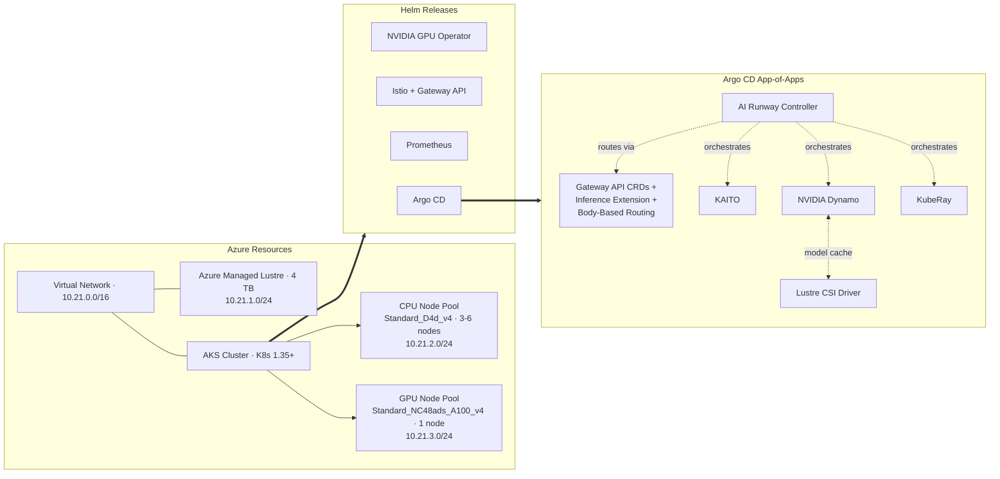
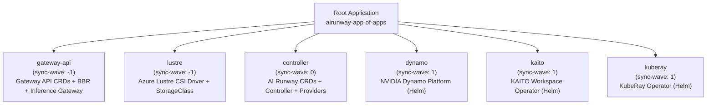

## Appendix B: Reproduce This Lab in Your Own Environment

This lab was pre-provisioned so you could focus on AI Runway rather than infrastructure setup. This appendix walks through what was provisioned and how, so you can reproduce the pattern in your own environment. The workshop source code lives in the [`demos/workshop/`](https://github.com/kaito-project/airunway/tree/main/demos/workshop) directory of the AI Runway repository.

### What the Infrastructure Looks Like

The Terraform code in `demos/workshop/infra/main.tf` bootstraps the underlying Azure infrastructure and platform services. Here is a high-level architecture diagram of what it creates:



| Resource                               | Purpose                                                                                                                   |
| -------------------------------------- | ------------------------------------------------------------------------------------------------------------------------- |
| **Resource group**                     | Contains all lab resources                                                                                                |
| **Virtual network** with three subnets | Separates Lustre storage (`10.21.1.0/24`), default CPU nodes (`10.21.2.0/24`), and GPU inference nodes (`10.21.3.0/24`)   |
| **AKS cluster**                        | Kubernetes 1.35+, system-assigned identity, default CPU node pool (Standard_D4d_v4, 3-6 nodes with autoscaling)           |
| **GPU node pool**                      | Standard_NC48ads_A100_v4 (2x A100 GPUs), GPU driver set to `None` because the NVIDIA GPU Operator manages drivers instead |
| **Azure Managed Lustre**               | 4 TiB `AMLFS-Durable-Premium-500` filesystem for shared model caching                                                     |

Terraform also installs the base platform services directly via Helm releases before Argo CD takes over:

| Helm Release            | Chart                     | Purpose                                                                                                                   |
| ----------------------- | ------------------------- | ------------------------------------------------------------------------------------------------------------------------- |
| **NVIDIA GPU Operator** | `gpu-operator` v26.3.1    | Manages GPU drivers, device plugins, and monitoring on GPU nodes                                                          |
| **Istio**               | `base` + `istiod` v1.29.2 | Gateway implementation for the inference gateway. Istiod is configured with `ENABLE_GATEWAY_API_INFERENCE_EXTENSION=true` |
| **Argo CD**             | `argo-cd` v9.5.4          | GitOps engine that reconciles all remaining components from Git                                                           |

Once Argo CD is running, Terraform applies the root App of Apps manifest, which hands control to GitOps for everything else.

### How GitOps Bootstraps the Platform

Instead of deploying each component individually, a single "root" Argo CD Application points to a directory of child Application manifests. Argo CD discovers and syncs all of them automatically:



Each child Application can pull from a different source: plain YAML in a Git repo for custom manifests, or upstream Helm charts for third-party operators like Dynamo, KAITO, and KubeRay. Argo CD unifies them into a single reconciliation loop.

The root Application is defined in [`demos/workshop/manifests/app-of-apps.yaml`](https://github.com/kaito-project/airunway/tree/main/demos/workshop/manifests/app-of-apps.yaml). It points at the `demos/workshop/manifests/argocd/apps/` directory, where each child Application YAML lives. Terraform applies this manifest automatically after installing Argo CD (see `kubectl_manifest.argo_cd_app` in `main.tf`).

This means you can bootstrap an entire inference platform on a fresh cluster with a single manifest:

```bash
kubectl apply -f app-of-apps.yaml
```

Argo CD handles the rest, using **sync waves** to control deployment order so dependencies are satisfied before anything references them. Each child Application is defined in [`demos/workshop/manifests/argocd/apps/`](https://github.com/kaito-project/airunway/tree/main/demos/workshop/manifests/argocd/apps):

| Wave   | Application  | What It Deploys                                                                                                                                                                                       |
| ------ | ------------ | ----------------------------------------------------------------------------------------------------------------------------------------------------------------------------------------------------- |
| **-1** | `gateway`    | Gateway API CRDs, GAIE CRDs, and the Body-Based Router Helm chart for Istio. These must exist before anything references them                                                                         |
| **-1** | `lustre`     | Azure Lustre CSI driver, RBAC, and DaemonSets so Lustre-backed PVCs can be mounted                                                                                                                    |
| **-1** | `prometheus` | `kube-prometheus-stack` Helm chart with Prometheus, Grafana, and monitoring CRDs. Configured to discover monitors from all namespaces                                                                 |
| **0**  | `airunway`   | The AI Runway core controller, all four provider controllers (Dynamo, KAITO, KubeRay, llm-d), the shared inference Gateway, ServiceMonitors, PodMonitors, and the Lustre-backed PVC for model caching |
| **1**  | `dynamo`     | NVIDIA Dynamo operator and its CRDs                                                                                                                                                                   |
| **1**  | `kaito`      | KAITO workspace operator (with node auto-provisioning, NFD, and local CSI disabled since the GPU Operator handles those)                                                                              |
| **1**  | `kuberay`    | KubeRay operator for Ray-based inference workloads                                                                                                                                                    |

Chart names, versions, and Helm values are specified in each child Application YAML. Review the files directly for the most current configuration.

### What the AI Runway Manifests Include

The [`demos/workshop/manifests/airunway/`](https://github.com/kaito-project/airunway/tree/main/demos/workshop/manifests/airunway) directory contains three subdirectories that the `airunway` Argo CD Application deploys together:

- **`controller/`**: The core AI Runway controller, including namespace (`airunway-system`), RBAC, Deployment, Kustomize overlay for image pinning, and ServiceMonitors for Prometheus scraping
- **`providers/`**: Out-of-tree provider controllers (Dynamo, KAITO, KubeRay, llm-d), each with its own namespace, RBAC, and Deployment. Also includes PodMonitors for inference engine metrics and a Lustre-backed PVC (`dynamo-pvc`) for shared model weight caching
- **`gateway/`**: The shared inference Gateway resource in `istio-system`, configured for all-namespace HTTPRoute discovery

### Adapting This for Your Environment

Use these files as a starting point, not a production baseline. Before deploying outside the lab:

- **Azure region and quotas**: The Terraform defaults to `brazilsouth`. Update `var.location` and confirm you have quota for the GPU VM SKU you need. The list of supported regions is constrained by Azure Managed Lustre availability.
- **GPU node pool sizing**: The lab uses a single Standard_NC48ads_A100_v4 node (2x A100). Adjust the VM SKU, node count, and autoscaling range for your workload.
- **Repository URLs**: The Argo CD applications currently point at a separate repository. Update `repoURL` and `path` in `app-of-apps.yaml` and each child Application in `argocd/apps/` to point at your own fork or repository.
- **Secrets strategy**: The lab uses a GitHub App for Argo CD repository access. Replace with your organization's Git authentication method.
- **Provider selection**: Install only the inference providers your teams need. Remove unused provider manifests and their Argo CD applications.
- **Image tags**: The Kustomize overlays pin specific image tags. Update these to released versions from `ghcr.io/kaito-project/airunway/`.
- **Lustre storage**: If you don't need high-throughput shared model caching, replace the Lustre PVC with a standard Azure Disk or Azure Files PVC.

### Suggested Rollout Path

1. **Provision infrastructure with Terraform.** This creates the resource group, virtual network, AKS cluster, GPU node pool, Azure Managed Lustre, and installs the GPU Operator, Istio, and Argo CD.
2. **Apply the App of Apps manifest.** Argo CD discovers and syncs all child applications in wave order: CRDs and storage first (wave -1), then the AI Runway controller and providers (wave 0), then inference operators (wave 1).
3. **Verify the platform is healthy.** Check that all Argo CD applications show Synced and Healthy, all provider controllers are Running in the `airunway-system` namespace, and `kubectl get inferenceproviderconfigs` shows your providers as Ready.
4. **Commit your first ModelDeployment to Git.** Let Argo CD reconcile it. Watch `status.conditions` progress through ProviderSelected, EngineSelected, ResourceCreated, Ready, and GatewayReady.
5. **Validate the endpoint.** Confirm the gateway IP is reachable and send an OpenAI-compatible `/v1/chat/completions` request before handing the platform to application teams.

---
